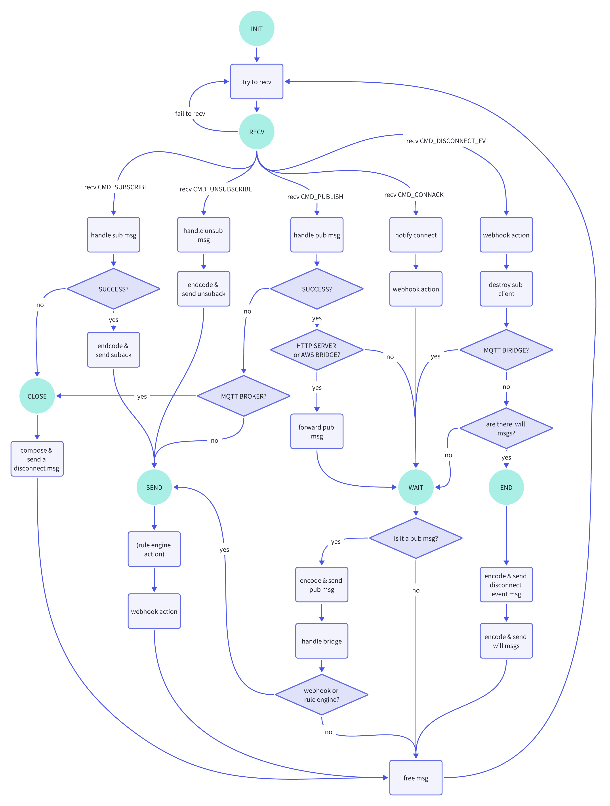

# Code Guidance

This guide covers code structure, state machine, important data structure and commom nng interface that you may need to know before you make code changes.

## Code Structure

This is a brief introduction for NanoMQ project, note that code structure presented here could be invalidated due to updates and modifications. 

```shell
├── deploy
├── docs
│   ├── en_US            
│   └── zh_CN            
├── etc                    // example configuration files, certs and idl files
├── extern                 // submodules
├── nanomq
│   ├── acl_handler.c    
│   ├── apps
│   │   └── broker.c       // core src code of broker including the state machine
│   ├── aws_bridge.c     
│   ├── bridge.c         
│   ├── cmd_proc.c         // ipc server for receving commands like reload
│   ├── conf_api.c         // APIs to handle configuration
│   ├── db_cli.c           // handle foundation db, only when SUPP_RULE_ENGINE is on
│   ├── mqtt_api.c         // APIs to handle commom mqtt msg and logs
│   ├── nanomq.c           // user interface of NanoMQ
│   ├── nanomq_rule.c      // handle sqlite and mysql db, only when SUPP_RULE_ENGINE is on
│   ├── process.c          // APIs for process
│   ├── pub_handler.c    
│   ├── rest_api.c       
│   ├── sub_handler.c    
│   ├── tests            
│   ├── unsub_handler.c  
│   ├── webhook_inproc.c   // webhook server
│   ├── webhook_post.c   
│   └── web_server.c       // web server to handle web request
├── nanomq_cli             // mqtt client 
└── nng                   
    ├── demo              
    ├── docs             
    ├── etc              
    ├── extern             // submodules of nanonng
    ├── src              
    │   ├── compat       
    │   ├── core           // core src code of nng
    │   ├── mqtt           // nng extension for mqtt
    │   ├── nng.c          // public APIs for applications to use directly
    │   ├── nng_legacy.c   // legacy APIs provided for compatibility for now
    │   ├── platform     
    │   ├── sp             // sp protocal
    │   ├── supplemental   // supplemental APIs for developers to use
    │   ├── testing        // test framework
    │   └── tools        
    └── tests            
```

## State Machine

`nano_work` is the bottom worker of NanoMQ project, it can be used for broker, http server and bridge. All these protos work in the same state machine. `nano_work` has 6 states, namely `INIT`, `RECV`, `SEND`, `WAIT`, `END`, `CLOSE`. `nano_work` start with `INIT` after initialization, then try to recv msgs and transform state to `RECV`. `RECV` is the major state where `nano_work` takes various actions according to the msg type then transform into another state. If `nano_work` fails to handle msgs, then it will transform into the `CLOSE` state to compose and send a disconnect msg. If it succeeds to handle msgs, then it may go to the `SEND`  state to check whether the optional rule engine or webhook actions should be taken. When receiving pub msgs, connack msgs, or disconnect events, it will take corresponding action and go to the `WAIT` state to encode and send the pub msg. `END` state is mainly for will msgs. All these states `CLOSE`, `SEND`, `WAIT`, `END` will end with a action to free msgs and try to receive msgs again, then transform into the `RECV` state forming a closed loop. You can check the diagram blow for more information.



<!-- 
## Data Structure

## NanoNNG Interface

TODO: list commom nanonng interface 
check nanomq/nng/src/nng.c to get all. 
-->