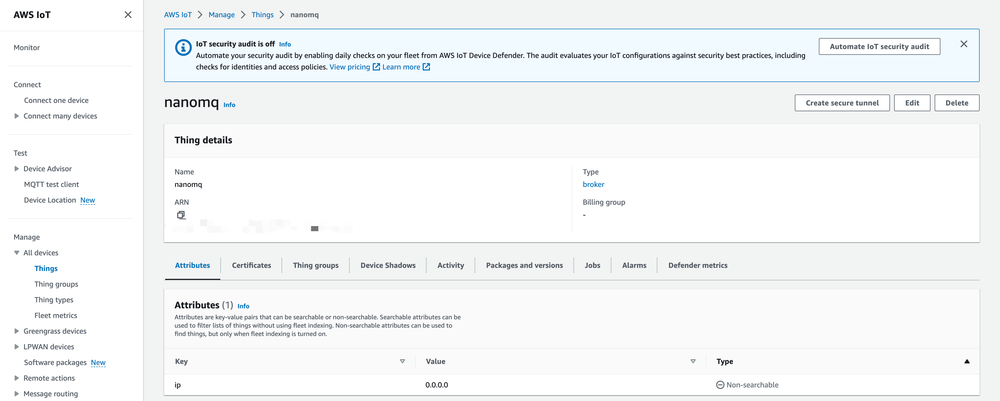
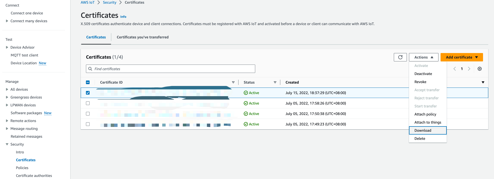
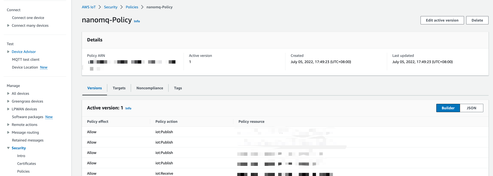
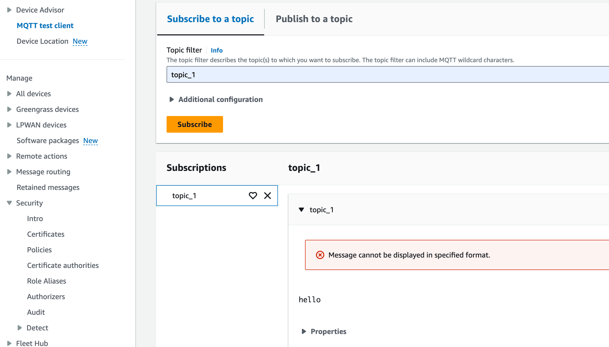

# AWS IoT Core Bridging

[AWS IoT Core](https://docs.aws.amazon.com/zh_cn/iot/latest/developerguide/protocols.html) is one of the widely used public cloud IoT services in Europe and the United States. However, because it is not fully aligned with the standard MQTT protocol and does not support QoS 2 messages, standard MQTT SDKs are not seamlessly compatible.

AWS IoT Core bridging is now built into NanoMQ to help users address compatibility issues. **NanoMQ** is responsible for forwarding the received data of the specified *topic* to the remote **AWS IoT MQTT Broker**, and also subscribes to a specific *topic* from the broker in order to receive the data and forward it locally.

Due to the conflict between the AWS IoT SDK and NanoMQ's QUIC dependency - MsQUIC on the OpenSSL reference version, NanoMQ does not enable and build this bridging feature into the standard distribution by default. To enable AWS IoT Core bridging, compile & install NanoMQ from source code is required. This document section describes how to enable AWS IoT Core bridging and configure it via the configuration file `nanomq.conf`, and test the new bridge channel.

## Compile & Install AWS IoT Core bridging Feature

First step, install AWS IoT Device SDK on your building environment.

### Install AWS SDK

```awk

wget https://github.com/aws/aws-iot-device-sdk-embedded-C/releases/download/202108.00/aws-iot-device-sdk-embedded-C-202108.00.zip

unzip aws-iot-device-sdk-embedded-C-202108.00.zip
cd aws-iot-device-sdk-embedded-C

mkdir build && cd build
cmake -G Ninja -DBUILD_DEMOS=OFF -DCMAKE_C_STANDARD=99 -DINSTALL_TO_SYSTEM=ON ..
ninja

sudo ninja install 
sudo cp ../demos/logging-stack/logging_*.h  /usr/local/include/aws/
sudo ldconfig
```

Find more information about AWS IoT Device SDK on the [GitHub page](https://github.com/aws/aws-iot-device-sdk-embedded-C)

### Build NanoMQ from Source Code

```bash
git clone https://github.com/emqx/nanomq.git 
## need to fetch NanoNNG submodule，MsQUIC is not needed in this case
cd nanomq git submodule update --init --recursive
mkdir build && cd build 
## Enable AWS_BRIDGE option(but disable QUIC)
cmake -G Ninja -DENABLE_AWS_BRIDGE=ON -DNNG_ENABLE_QUIC=OFF .. 
sudo ninja install
```


## Configure AWS IoT Core

Here's how to configure it on the AWS IoT Core side. Note: The Configuration presented in this doc could be invalidated due to updates and modifications to AWS services. For details about how to configure it, see docs from the [official website](https://aws.amazon.com/cn/iot-core/resources/).


1. At **Manage** -> **All devices** -> **Things** page, You can create new objects and groups, with corresponding Certification/Topics/Device Shadows etc.

   

   

2. Download your Certificates at **Security** -> **Certificates** page. Attach Policy to Certificates and attach Certificates to Things.

   


3. Create a corresponding MQTT client behavior authentication policy at  **Security**-> **Policies**  page. And defines the client identifier, publish/subscribe topics, these parameters will be used in NanoMQ Bridge.

   


## Configure NanoMQ Bridge

After you successfully installed NanoMQ with AWS IoT Core Bridge enabled, you need to modify the bridge functionality and corresponding parameters and topics in the configuration file; for example, in the following configuration file, we define the server domain URL, connection credentials, connection parameters, message forwarding Topics, subscription Topics, and queue length for the AWS IoT Core bridge. Note: The MQTT ClientID, certificate file, and subscription/publication topic in the configuration file must match the policy definition defined on the AWS IoT Core side, otherwise, data will not be available and the connection will be rejected.

Note: The MQTT ClientID, certificate file, and subscription/publication topic in the configuration file need to match the policy definition defined on the AWS IoT Core side, otherwise data will not be available and the connection will be rejected.

:::: tabs type:card

::: tab HOCON Configuration

Users who wish to use the HOCON configuration format can refer to the following format to write the configuration to the `nanomq.conf` file, and the relevant settings will take effect after the NanoMQ restart.

- Full details of Configuration，refer to [Configurations](../config-description/bridges.md)

- NanoMQ 0.14 ~ 0.18 ，refer to [Configuration - v0.14](../config-description/v014.md)

```bash
# # c1 is the node name, you can setup multiple bridging targer with different node name
bridges.aws.c1 {
	server = "$HOST_URL:8883"
	proto_ver = 4
	clientid = "aws_bridge_client"
	keepalive = 60s
	clean_start = true
	
	ssl {
	# # Ssl key password
	# # String containing the user's password. Only used if the private keyfile
	# # is password-protected.
	# #
	# # Value: String
	# key_password = "yourpass"
	# # Ssl keyfile
	# # Path of the file containing the client's private key.
	keyfile = "/etc/certs/key.pem"
	# # Ssl cert file
	# # Path of the file containing the client certificate.
	certfile = "/etc/certs/cert.pem"
	# # Ssl ca cert file
	# # Path of the file containing the server's root CA certificate.  
	# # This certificate is used to identify the AWS IoT server and is publicly
	# # available.
	cacertfile = "/etc/certs/cacert.pem"
	}
	forwards = [
		{
			remote_topic = "fwd/topic1"
			local_topic = "topic1"
		},
		{
			remote_topic = "fwd/topic2"
			local_topic = "topic2"
		}
	]

	subscription = [
		{
			remote_topic = "cmd/topic1"
			local_topic = "topic3"
			qos = 0
		},
		{
			remote_topic = "cmd/topic2"
			local_topic = "topic4"
			qos = 1
		}
	]
	max_parallel_processes = 2
}
```

:::

::: tab Classic KV configuration

If you want to use the KV configuration format, you can refer to the following format to write the configuration to the `nanomq_old.conf` file, and the relevant settings will take effect after NanoMQ is restarted.

Full details of Configurations，refer to [Configurations - v013](../config-description/v013.md)

```bash
aws.bridge.mqtt.aws.host=$YOUR_HOST_URL
aws.bridge.mqtt.aws.port=8883
aws.bridge.mqtt.aws.proto_ver=4
aws.bridge.mqtt.aws.bridge_mode=true
aws.bridge.mqtt.aws.clientid=aws_bridge_client
aws.bridge.mqtt.aws.keepalive=60
aws.bridge.mqtt.aws.clean_start=true
aws.bridge.mqtt.aws.forwards.1.remote_topic=fwd/topic1
aws.bridge.mqtt.aws.forwards.1.local_topic=topic1
aws.bridge.mqtt.aws.subscription.1.remote_topic=cmd/topic1
aws.bridge.mqtt.aws.subscription.1.local_topic=topic1
aws.bridge.mqtt.aws.parallel=2
aws.bridge.mqtt.aws.tls.enable=true
## aws.bridge.mqtt.aws.tls.key_password=yourpass
aws.bridge.mqtt.aws.tls.keyfile=$PATH_TO_YOUR_KEY.pem.key
aws.bridge.mqtt.aws.tls.certfile=$PATH_TO_YOUR_CERT.pem.crt
aws.bridge.mqtt.aws.tls.cacertfile=$PATH_TO_YOUR_CA.pem
aws.bridge.mqtt.aws.tls.verify_peer=false
aws.bridge.mqtt.aws.tls.fail_if_no_peer_cert=false
```

:::

::::

::: tip 

Unlike standard MQTT Broker, SSL/TLS is compulsory in AWS IoT Core, Client's Certificates and ID must match Cloud settings.

:::

**Key configuration items：**

- `aws.bridge.mqtt.aws.host`：Remote AWS IoT Core URL，You can get it from AWS IoT Core Dashboard.

- `aws.bridge.mqtt.aws.clientid`：Client Identifier，Must mathc the Client setting in ` iot:Connect`  of Security->Policies

- When you set up publish/subscribe topics and QoS in NanoMQ, make sure they match the ones you set in your AWS IoT security policies: `iot:Subscribe`，`iot:Publish`，`iot:Receive`，`iot:RetainPublish`. Otherwise，messages will not be accepted due to authorization failure. 
  
  Related configuration items:
  
  - Publishing Topics：`aws.bridge.mqtt.aws.forwards.1.remote_topic`
  - Publishing Topics(local topic with reflection)：`aws.bridge.mqtt.aws.forwards.1.local_topic`
  - Subscription Topics：`aws.bridge.mqtt.aws.subscription.1.remote_topic`
  - Subscription Topics(local topic with reflection)：`aws.bridge.mqtt.aws.subscription.1.local_topic`
  - Message QoS：`aws.bridge.mqtt.aws.subscription.1.qos`
  
- When you configure SSL/TLS certificates in NanoMQ, you need to ensure that these certificate files match the certificates required for the type of item created in the AWS IoT Core Dashboard. Related configuration items:
  
  - `aws.bridge.mqtt.aws.tls.keyfile`
  - `aws.bridge.mqtt.aws.tls.certfile`
  - `aws.bridge.mqtt.aws.tls.cacertfile`


### Start NanoMQ Bridging

You can start NanoMQ with `--conf` to specify a path of your own configuration file.（Not necessary if the config file is located in `etc` folder).

:::: tabs type:card

::: tab Hocon Config

```bash
$ nanomq start --conf nanomq.conf
```

:::

::: tab Classic KV config

```bash
$ nanomq start --old_conf nanomq.conf
```

:::

::::

## Testing Bridge

Now you can verify whether the bridging channel is working by publishing a message to NanoMQ. Then check on the MQTT test client tool in AWS IoT Core.

For example, publish a message `hello` locally to the bridge topic `topic1` of NanoMQ,

```bash
$ ./nanomq_cli pub -h "local.broker.address"  -t "topic1" -m "hello" -q 1
```

On AWS MQTT test client menu：



NanoMQ Log：

```bash
establish_mqtt_session: MQTT connection successfully established with broker.
subscribe_to_topic: SUBSCRIBE to broker successfully.
event_cb: Subscribed to the topic successfully.

```

