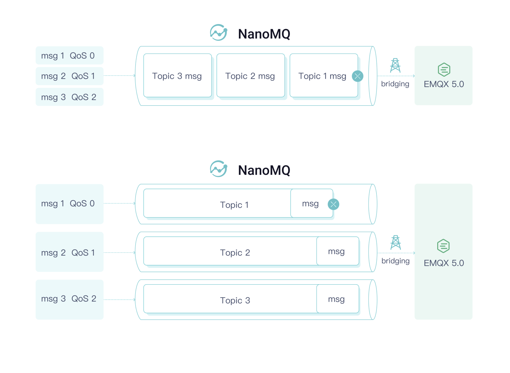

# MQTT over QUIC Bridge

NanoMQ has supported MQTT over QUIC bridging, users can use QUIC as the transport layer of the MQTT protocol to establish a bridge with the EMQX 5.0 message service for data synchronization. This provides a shortcut for end-user devices that cannot integrate or find a suitable MQTT over QUIC SDK, as well as embedded devices that are difficult to modify the firmware, to take advantage of the advantages of the QUIC protocol in IoT scenarios. 

The combined cloud-edge message architecture of EMQX and NanoMQ provides a cost-effective solution for IoT scenarios, allowing users to efficiently gather and synchronize data across different regions. 

**Feature List**

QUIC bridging shares following exclusive features and special advantages

- Multi-stream: Topic-Stream pair, avoid head of line blocking problem
- Hybrid bridging: automatically downgrade to TCP if QUIC is not available
- Message prioritization: Assign High priority for QoS (1|2) messages to ensure bandwidth usage
- O-RTT Quick reconnect: 0 RTT（Round Trip Time）estimate time

## Enable MQTT over QUIC

By default, the QUIC module in NanoMQ is deactivated. If you wish to utilize MQTT over QUIC bridging, you need to install NanoMQ via [build options](../installation/build-options.md) and enable the QUIC module during the process.

```bash
$ git clone https://github.com/emqx/nanomq.git
$ cd nanomq 
$ git submodule update --init --recursive
$ mkdir build && cd build
$ cmake -G Ninja -DNNG_ENABLE_QUIC=ON ..
$ sudo ninja install
```

::: tip

For macOS users, you must compile with `make` + single thread:

```bash
$ git clone https://github.com/emqx/nanomq.git
$ cd nanomq 
$ git submodule update --init --recursive
$ mkdir build && cd build
$ cmake -DNNG_ENABLE_QUIC=ON ..
$ make -j1
```

:::

### Configure MQTT over QUIC

### Prerequisites

Before setting up MQTT over QUIC bridging, you should install EMQX 5, which provides the MQTT over QUIC messaging services. For instructions on enabling QUIC bridging in EMQX, refer to the [EMQX - MQTT over QUIC tutorial](https://docs.emqx.com/en/enterprise/v5.0/mqtt-over-quic/getting-started.html).

### Bridge Configuration

Once the QUIC module is enabled, you need to configure the MQTT over QUIC bridging feature and related topics in the configuration file. The following configuration file, for example, defines the server address for MQTT over QUIC bridging, connection credentials, connection parameters, message forwarding rules, subscription topics, and queue length.

:::: tabs type:card

::: tab HOCON

Users wishing to use the HOCON configuration format can refer to the following structure and write their configurations into the `nanomq.conf` file. The relevant settings will take effect after NanoMQ is restarted.

- For a complete list of configuration options, refer to [Configuration Description](../config-description/bridges.md)
- For users of NanoMQ versions 0.14 ~ 0.18, please refer to [Configuration Description - v0.14](../config-description/v014.md)

```bash
bridges.mqtt.name {
	## TCP URL format:  mqtt-tcp://host:port
	## TLS URL format:  tls+mqtt-tcp://host:port
	## QUIC URL format: mqtt-quic://host:port
	server = "mqtt-quic://remote.broker.address"
	proto_ver = 4
	username = emqx
	password = emqx123
	clean_start = true
	keepalive = 60s
	forwards = [
		{
			remote_topic = "fwd/topic1"
			local_topic = "topic1"
		},
		{
			remote_topic = "fwd/topic2"
			local_topic = "topic2"
		}
	]
    ## Uncomment if you need TLS
    ## ssl {
    ##     keyfile = "/etc/certs/key.pem"
    ##     certfile = "/etc/certs/cert.pem"
    ##     cacertfile = "/etc/certs/cacert.pem"
    ## }
	quic_keepalive = 120s
	quic_idle_timeout = 120s
	quic_discon_timeout = 20s
	quic_handshake_timeout = 60s
	hybrid_bridging = false
	subscription = [
		{
			remote_topic = "cmd/topic1"
			local_topic = "topic3"
			qos = 1
		},
		{
			remote_topic = "cmd/topic2"
			local_topic = "topic4"
			qos = 2
		}
	]
	max_parallel_processes = 2 
	max_send_queue_len = 1024
	max_recv_queue_len = 1024
}
```
:::

::: tab KV format

Users wishing to use the KV configuration format can refer to the following structure and write their configurations into the `nanomq_old.conf` file. The relevant settings will take effect after NanoMQ is restarted.

- For a complete list of configuration options, refer to [Configuration Description - v013](../config-description/v013.md)

```bash
bridge.mqtt.emqx.bridge_mode=true
bridge.mqtt.emqx.address=mqtt-quic://your_server_address:port
bridge.mqtt.emqx.proto_ver=4
bridge.mqtt.emqx.quic_keepalive=120
bridge.mqtt.emqx.quic_idle_timeout=120
bridge.mqtt.emqx.hybrid_bridging=false
bridge.mqtt.emqx.quic_multi_stream=false
bridge.mqtt.emqx.clientid=bridge_client
bridge.mqtt.emqx.clean_start=false
bridge.mqtt.emqx.forwards=topic1/#,topic2/#
bridge.mqtt.emqx.subscription.1.topic=cmd/topic1
bridge.mqtt.emqx.subscription.1.qos=1
bridge.mqtt.emqx.parallel=2
bridge.mqtt.emqx.max_send_queue_len=32
bridge.mqtt.emqx.max_recv_queue_len=128
```

:::

::::

::: tip 

Using `mqtt-quic` as the URL prefix indicates the use of QUIC as the transport layer for MQTT.

:::

Tips: If you enabled SQLite feature, NanoMQ will automatically flush cached messages into disk when network is disconnected. Unlike TCP, NanoMQ will resend cached messages immediately once bridging connection is restored. Without any delaying, message will be send one by one.

**Key Configuration Items**

- Remote broker address: `bridges.mqtt.name.server`
- Array of Topics to forward to remote (supports MQTT wildcard): bridges.mqtt.name.forwards`
- Array of Topics to subscribe from remote (supports MQTT wildcard): bridges.mqtt.name.subscription`

**QUIC-Specific Configurations**

- Switch for hybrid bridging mode: `bridges.mqtt.name.hybrid_bridging` <!--add a link or section about the hybrid bridging contents are ready-->
- [Switch for multi-stream bridging](#quic-multi-stream-bridging): `bridges.mqtt.name.multi_stream`

If you choose to use HOCON configuration format and NanoMQ version >= 0.19, apart from writing the related configurations directly into `nanomq.conf`, you can also define a separate configuration file for bridging, such as `nanomq_bridge.conf`. You can then include this file in `nanomq.conf` using HOCON's `include` syntax.

Example:

```shell
include "path/to/nanomq_bridge.conf" 
```

To get detailed log data during operation, you can set the log level `log.level` in the configuration file.

## Start NanoMQ

In the installation directory of NanoMQ, execute the following command to launch NanoMQ:

:::: tabs type:card

::: tab Hocon

```bash
$ nanomq start --conf nanomq.conf
```

:::

::: tab Old version

```bash
$ nanomq start --old_conf nanomq.conf
```

:::

::::

## Test the Bridge

This section uses NanoMQ's built-in client tool to test the newly built MQTT over QUIC bridge. Two connections will be created to connect to NanoMQ and the MQTT over QUIC data bridge respectively, to verify the messaging service.

### Test Message Forwarding

1. Subscribe to the message topic for the remote EMQX Broker:

   Subscribe to the forwarding topic "`forward1/#`" for **EMQX** to receive data forwarded by **NanoMQ**.

   Open a new command line window, navigate to the `nanomq_cli` folder under the `build` folder, and execute the following command to subscribe:

   ```bash
   ## -h {host} 
   ## -p {port number, if unspecified, will use 1883 for MQTT or 14567 for QUIC connection}
   ## -t {topic}
   ## --quic {enable quic}
   ## --q {message QoS, values: 0, 1, 2}
   ## --m {message payload}
   ## -u {username} 
   ## -P {password}
   $ ./nanomq_cli sub --quic -h "remote.broker.address" -p 14567 -t "forward1/#" -q 2
   ```

2. Open another command line window and publish a message to the **NanoMQ** Broker with the topic "`forward1/msg`":

   ```bash
   ./nanomq_cli pub -h "local.broker.address" -t "forward1/msg" -m "forward_msg" -q 2
   ```

3. Go back to the first command line window, you will see the message forwarded by the NanoMQ Broker, for example:

   ```bash
   quic_msg_recv_cb: forward1/#: forward_msg
   ```

### Test Message Receiving

1. Subscribe to the message topic for the local NanoMQ Broker:

   Subscribe to the topic `cmd/topic1` for **NanoMQ** to receive data published by **EMQX**:

   In the second command line window, navigate to the `nanomq_cli` folder under the `build` folder, and execute the following command to subscribe:

   ```bash
   ./nanomq_cli sub -h "local.broker.address" -t "recv/topic1" -q 2
   ```

2. In the first command line window, publish a message to the remote **EMQX** Broker with the topic "`cmd/topic1`":

   ```bash
   $ ./nanomq_cli pub --quic -h "remote.broker.address" -p 14567 -t "recv/topic1" -m "cmd_msg" -q 2 -u emqx -P emqx123
   ```

3. Go back to the second command line window, you will see the message sent by the remote **EMQX** Broker, for example:

   ```bash
   quic_msg_recv_cb: recv/topic1: cmd_msg
   ```

If you're interested in evaluating the performance of MQTT over QUIC bridging, you can conduct a benchmark test. Please refer to the guide available at [Toolkit - Bench](../toolkit/bench.md) for detailed instructions.

## QUIC Multi-Stream Bridging

One of the significant advantages of the QUIC protocol over TCP is that it solves the problem of head-of-line blocking. This advantage relies on the multi-stream feature of a single QUIC connection. To address situations like network congestion or network jitter, NanoMQ and EMQX 5.0 have jointly designed and introduced the Mutli-stream QUIC protocol standard for improved message transmission experience.



### Enable Multi-Stream Bridging + QoS Prioritization

To use multi-stream bridging, you simply need to activate the corresponding configuration option:

:::: tabs type:card

::: tab Hocon

```bash
## multi-stream: enable or disable the multi-stream bridging mode
## Value: true/false
## Default: false
quic_multi_stream = true
# # quic_qos_priority: send QoS 1/2 msg in high prority
# # QoS 0 messages remain as same
## Value: true/false
## Default: true
quic_qos_priority = true
```

:::

::: tab KV format

```bash
bridge.mqtt.emqx.quic_multi_stream=false
bridge.mqtt.emqx.quic_qos_priority=true
```

:::

::::

NanoMQ will then create topics for specific Pub/Sub topics. You can check the effectiveness of this function in the log, for example, when subscribing to the `nanomq/1` topic, a data stream will be automatically created:

```bash
quic_ack_cb: Quic bridge client subscribe to topic (QoS 1)nanomq/1.
mqtt_sub_stream: topic nanomq/1 qos 1
bridge client is connected!
quic_pipe_open: [strm][0x618000020080] Starting...
quic_pipe_open: [strm][0x618000020080] Done...
quic_strm_cb: quic_strm_cb triggered! 0
decode_pub_message: topic: [$SYS/brokers/connected], qos: 0
mqtt_sub_stream: create new pipe 0x61c000020080 for topic nanomq/1
quic_strm_cb: QUIC_STREAM_EVENT_START_COMPLETE [0x618000020080] ID: 4 Status: 0
```

Afterward, NanoMQ will automatically route the data packets to different streams based on the topic for transmission. Through internal testing conducted in a simulated weak network environment with 2s latency and 40% packet loss, a significant reduction in latency proportional to the number of streams was observed. 

In the meantime, QoS 1/2 packets shares higher priority than QoS 0, which means NanoMQ can assure the more important messages get first seat in limited network bandwidth situation. Therefore users can get best usage of ther network capacity and prevent non-critical messages causing congestion.
