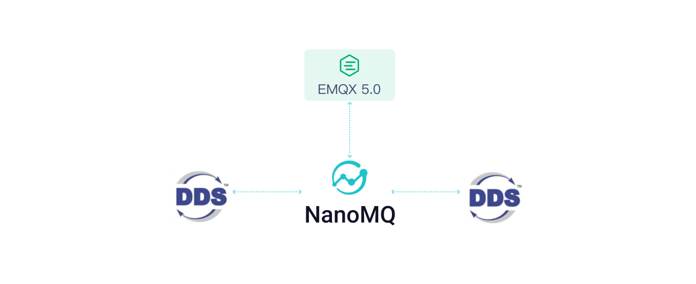

# DDS Proxy


The Data Distribution Service (DDS) is a real-time, distributed, data-centric communication middleware protocol. It uses a publisher/subscriber architecture and offers a rich Quality of Service (QoS) policy to ensure real-time, efficient, and flexible data distribution. This makes it ideal for various decentralized real-time communication applications.

[Cyclone DDS](https://cyclonedds.io/), an open-source DDS implementation compliant with the Object Management Group (OMG) DDS specification, is used for real-time systems that publish/subscribe to messages. From version v0.16, NanoMQ introduced a DDS Proxy plugin developed based on Cyclone DDS. This plugin can convert DDS messages into MQTT messages and bridge them to the cloud, allowing users to transmit DDS data across domains through NanoMQ and communicate with the cloud through MQTT.

The integration of both MQTT and DDS protocols allows the DDS gateway to perfectly merge broker and brokerless messaging models, effectively implementing scenarios of unified cloud-edge messaging.




## Prerequisites


Before initiating the DDS gateway, it is necessary to install CycloneDDS and Iceoryx. CycloneDDS is a core dependency for the DDS gateway, while Iceoryx is required for CycloneDDS to communicate via shared memory.

### CycloneDDS

To install CycloneDDS, replace `DDS_LIBRARY_PATH` with the actual installation path of the DDS library.

```bash
$ git clone https://github.com/eclipse-cyclonedds/cyclonedds.git
$ cd cyclonedds
$ mkdir build && cd build
$ cmake -G Ninja -DCMAKE_INSTALL_PREFIX={DDS_LIBRARY_PATH} -DCMAKE_PREFIX_PATH={DDS_LIBRARY_PATH} -DBUILD_EXAMPLES=ON ..
$ ninja 
$ sudo ninja install
```

### Iceoryx

:::tip

This step can be skipped if shared memory IPC is not required.

:::

```bash
$ git clone https://github.com/eclipse-iceoryx/iceoryx.git
$ cd iceoryx
$ git checkout release_2.0
$ mkdir build && cd build
$ cmake -G Ninja -DCMAKE_INSTALL_PREFIX={USER_LIBRARY_PATH} ../iceoryx_meta
$ ninja
$ sudo ninja install
```

## Enabling NanoMQ DDS Proxy

### Compile IDL Code Generator 

To facilitate quick and easy utilization of the DDS Proxy, NanoMQ provides an IDL code generator called [idl-serial-code-gen](https://github.com/nanomq/idl-serial). It automatically generates JSON serialization and deserialization code based on the user's DDS IDL files.

Execute the following code to compile the `IDL` code generator `idl-serial`

```bash
$ git clone https://github.com/nanomq/idl-serial.git
$ cd idl-serial
$ mkdir build && cd build
$ cmake -G Ninja -DCMAKE_INSTALL_PREFIX={DDS_LIBRARY_PATH} ..
$ ninja 
$ sudo ninja install
```

After compiling, an executable file `idl-serial-code-gen` will be generated.

### Compile NanoMQ DDS Proxy

1. Specify the `idl` file path through the cmake parameter `IDL_FILE_PATH` (If not specified, it defaults to the `etc/idl/dds_type.idl` in the project path)

   ```bash
   $ git clone https://github.com/emqx/nanomq.git
   $ cd nanomq
   $ git submodule update --init --recursive
   $ mkdir build && cd build
   $ cmake -G Ninja -DIDL_FILE_PATH={IDL_PATH} -DCMAKE_PREFIX_PATH={DDS_LIBRARY_PATH} -DBUILD_DDS_PROXY=ON ..
   $ ninja
   $ sudo ninja install
   ```

3. Execute the following command to check if `dds` has been compiled.

   ```
   $ ./nanomq_cli/nanomq_cli
   nanomq_cli { pub | sub | conn | nngproxy | nngcat | dds } [--help]
   
   available tools:
      * pub
      * sub
      * conn
      * nngproxy
      * nngcat
      * dds
   Copyright 2023 EMQ Edge Computing Team
   ```

## Configure DDS Proxy

Before starting, you need to configure the MQTT and DDS topics that will be bridged and forwarded. This is done through the `/etc/nanomq_dds_gateway.conf` configuration file. 

```bash
## Forwarding rules
forward_rules = {
	  ## DDS to MQTT
    dds_to_mqtt = {
        from_dds = "MQTTCMD/topic1"
        to_mqtt = "DDS/topic1"
        struct_name = "remote_control_result_t"
    }
    ## MQTT to DDS
    mqtt_to_dds = {
        from_mqtt = "DDSCMD/topic1"
        to_dds = "MQTT/topic1"
        struct_name = "remote_control_req_t"
    }
}

## DDS Configuration
dds {
    domain_id = 0
    
    shared_memory = {
        enable = false
        log_level = info
    }
}

## MQTT client Configuration
mqtt {
	connector {
        server = "mqtt-tcp://127.0.0.1:1883"
        proto_ver = 4
        keepalive = 60s
        clean_start = false
        username = username
        password = passwd
        
        ssl {
            enable = false
            key_password = "yourpass"
            keyfile = "/etc/certs/key.pem"
            certfile = "/etc/certs/cert.pem"
            cacertfile = "/etc/certs/cacert.pem"
        }
    }
}
```

Key configuration items include:

**DDS Subscription and MQTT Publish**

- DDS Subscription Topic: `forward_rules.dds_to_mqtt.from_dds = "MQTTCMD/topic1"`
- MQTT Publishing Topic: `forward_rules.dds_to_mqtt.to_mqtt = "DDS/topic1"`
- Specify dds structure name for subscribe: `forward_rules.dds_to_mqtt.struct_name = "remote_control_result_t"`

**MQTT Subscription and DDS Publishing**

- MQTT Subscription Topic: `forward_rules.mqtt_to_dds.from_mqtt = "DDSCMD/topic1"`
- DDS Publishing Topic: `forward_rules.mqtt_to_dds.to_dds = "MQTT/topic1"`
- Specify dds structure name for publish: `forward_rules.mqtt_to_dds.struct_name = "remote_control_req_t"`

**Note: The `struct_name` must be included in the `IDL` file .**


If you wish to dynamically update configuration or control the gateway's restart or shutdown through an HTTP API, you can add the following configuration to `nanomq_dds_gateway.conf` and start the HTTP service:

```bash
# #============================================================
# # Http server
# #============================================================
http_server {
	# # http server port
	# #
	# # Value: 0 - 65535
	port = 8082
	# # parallel for http server
	# # Handle a specified maximum number of outstanding requests
	# #
	# # Value: 1-infinity
	parallel = 2
	# # username
	# #
    # # Basic authorization 
    # #
	# # Value: String
	username = admin
	# # password
	# #
    # # Basic authorization
    # #
	# # Value: String
	password = public
}
```
## HTTP API
The HTTP API provides the following interfaces:

- Get configuration file:
```shell
$ curl --basic -u admin:public 'http://127.0.0.1:8082/api/v4/proxy/configuration/dds' --output nanomq_dds_gateway.conf
```

- Update configuration file:
```shell
$ curl --basic -u admin:public 'http://127.0.0.1:8082/api/v4/proxy/configuration/dds' --header 'Content-Type: text/plain'  --data-binary '@nanomq_dds_gateway.conf'
```

- Stop gateway:
```shell
$ curl --basic -u admin:public 'http://127.0.0.1:8082/api/v4/proxy/ctrl/stop' \
--header 'Content-Type: application/json' \
--data '{
    "req": 10,
    "action": "stop",
    "seq": 1234
}'
```
- Restart gateway：
```shell
$ curl --basic -u admin:public 'http://127.0.0.1:8082/api/v4/proxy/ctrl/restart' \
--header 'Content-Type: application/json' \
--data '{
    "req": 10,
    "action": "restart",
    "seq": 1234
}'
```


### Test DDS Proxy

1. Start MQTT Broker

   ```bash
   $ nanomq start
   ```

   Or

   ```
   $ emqx start
   ```


2. Start DDS Proxy

   ```bash
   $ ./nanomq_cli dds proxy --conf PATH/TO/nanomq_dds_gateway.conf
   ```

3. Start MQTT client and subscribe to the topic `DDS/topic1`

   ```bash
   $ ./nanomq_cli sub -h "127.0.0.1" -p 1883 -t "DDS/topic1"
   ```

4. Start DDS client, specify the structure name `remote_control_result_t`, and publish messages (command line parameters in JSON format) to the DDS topic `MQTTCMD/topic1`.

   ```bash
   $ ./nanomq_cli dds pub -t "MQTTCMD/topic1" --struct "remote_control_result_t"  -m '{
    "req_result_code": 1,
    "req_token": [1,2,3,4,5,6],
    "req_result_msg": [7,8,9,10,11],
    "req_id": [12,13,14],
    "req_token_len": 6,
    "req_id_len": 3
   }'
   ```

5. Start DDS client and subscribe to DDS topic `MQTT/topic1` and specify the received structure name `remote_control_req_t`

   ```bash
   $ ./nanomq_cli dds sub -t "MQTT/topic1" --struct "remote_control_req_t"
   ```

6. Start MQTT client and publish messages (in JSON format) to the MQTT topic `DDSCMD/topic1`.

   ```bash
   $ ./nanomq_cli pub -h "127.0.0.1" -p 1883 -t "DDSCMD/topic1" -m '{
    "req": 1,         
    "req_id": [15,16],
    "req_id_len": 2
    }'
   ```

::: tip

Remember to adjust your configurations according to your specific requirements and replace placeholders in the commands with actual paths or values.

:::