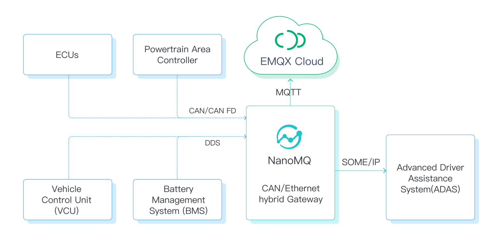
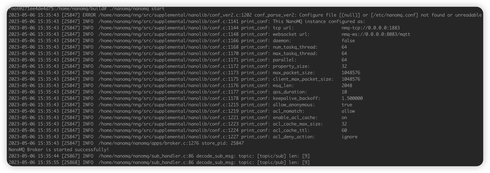
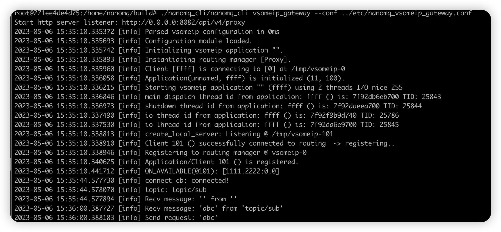
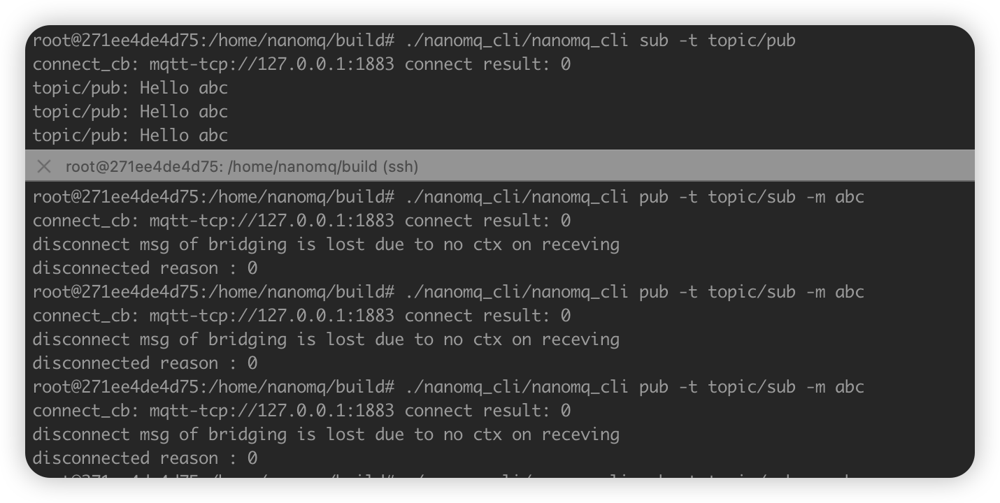

# SOME/IP Gateway

Developed by the German company BMW, SOME/IP (**Scalable service-Oriented MiddlewarE over IP**) is a service-oriented vehicle Ethernet communication protocol that supports a Service-Oriented Architecture (SOA). Unlike traditional vehicular buses, according to the SOME/IP protocol, data is only transmitted when at least one recipient in the network needs the relevant data, thus greatly improving the utilization rate of network bandwidth.

Under the trend of software-defined cars, SOME/IP shows high efficiency and security in handling data from various sources within the car. It can interface with traditional TSP platforms and offload computations to new-generation application services like ADAS.

NanoMQ now supports SOME-IP data communication based on the AUTOSAR standard via the SOME/IP Gateway. It can be deployed in the central gateway of the vehicle to aggregate data and interface with the TSP platform. The security of the gateway is ensured through MQTT over QUIC/TCP + TLS encrypted connection.



## Prerequisites

The SOME/IP Gateway function of NanoMQ depends on [vSOMEIP](https://github.com/COVESA/vsomeip). Run the following commands to install vSOMEIP.

::: tip

Check the installation dependencies of vSOMEIP on the [vSOMEIP GitHub page](https://github.com/COVESA/vsomeip)

:::

```shell
git clone https://github.com/COVESA/vsomeip.git
cd vsomeip
mkdir build
cd build
cmake -DCMAKE_INSTALL_PREFIX:PATH=$YOUR_PATH
make -j8
make install
```

### Compile the Sample Service

1. Compile the hello_world_service sample service in vSOMEIP, which will be subsequently used to test the NanoMQ's SOME/IP Gateway.

```shell
cd vsomeip/examples/hello_world
mkdir build
cd build
cmake ..
make -j8
```
2. Compile the notify-sample in vsomeip，which is used to test SOME/IP Sub event.

- Fix service-id and other parameters of notify-sample.

```shell
diff --git a/examples/sample-ids.hpp b/examples/sample-ids.hpp
index 6d31131..078df71 100644
--- a/examples/sample-ids.hpp
+++ b/examples/sample-ids.hpp
@@ -6,9 +6,9 @@
 #ifndef VSOMEIP_EXAMPLES_SAMPLE_IDS_HPP
 #define VSOMEIP_EXAMPLES_SAMPLE_IDS_HPP
 
-#define SAMPLE_SERVICE_ID       0x1234
-#define SAMPLE_INSTANCE_ID      0x5678
-#define SAMPLE_METHOD_ID        0x0421
+#define SAMPLE_SERVICE_ID       0x1111
+#define SAMPLE_INSTANCE_ID      0x2222
+#define SAMPLE_METHOD_ID        0x3333
 
 #define SAMPLE_EVENT_ID         0x8778
 #define SAMPLE_GET_METHOD_ID    0x0001
```

- Compile notify-sample
```
$ cd vsomeip/build/examples
$ make -j8
```

## Enable SOME/IP Gateway

You can enable the SOME/IP gateway feature during the compilation process using the `-DBUILD_VSOMEIP_GATEWAY=ON` switch. For further details on the compilation, refer to [this guide on installing NanoMQ via compilation](../installation/build-options.md).

Example command:

```shell
cmake -G Ninja -DBUILD_VSOMEIP_GATEWAY=ON ..
ninja
```

After the compilation is complete, you can navigate to the build -> nanomq_cli directory, and execute the `nanomq_cli` command to verify if the ZMQ gateway is correctly installed:

```bash
$ ./nanomq_cli
nanomq_cli { pub | sub | conn | nngproxy | nngcat | vsomeip_gateway } [--help]

available tools:
   * pub
   * sub
   * conn
   * nngproxy
   * nngcat
   * vsomeip_gateway

Copyright 2022 EMQ Edge Computing Team
```

Then run the command `nanomq_cli vsomeip_gateway --help` and you will get:

```
Usage: nanomq_cli vsomeip_gateway [--conf <path>]

  --conf <path>  The path of a specified nanomq_vsomeip_gateway.conf file
```

The output indicates that you should first specify a configuration file for this gateway.

## Configure the SOME/IP Gateway

The configuration file `etc/nanomq_vsomeip_gateway.conf` allows you to specify the topics and service addresses for bridging.

Suppose you wish to route the data received from the SOME/IP service to your local MQTT Broker's `topic/pub` topic. Moreover, you want to channel the MQTT messages received through the `topic/sub` topic to the SOME/IP service. You can accomplish this through the following configuration:

```bash
gateway.mqtt {
    address = "mqtt-tcp://localhost:1883"
    sub_topic = "topic/sub" # message from mqtt
    sub_qos = 0
    proto_ver = 4
    keepalive = 60
    clean_start = true
    username = "username"
    password = "passwd"
    clientid = "vsomeip_gateway"
    forward = "topic/pub" # message to mqtt
    parallel = 2
}

gateway.vsomeip {
    service_id = "0x1111"
    service_instance_id = "0x2222"
    service_method_id = "0x3333"
	service_event_id = "0x8778"
	service_eventgroup_id = "0x4465"
    # conf_path = "/etc/vsomeip.json"
}

```

If you wish to dynamically update configuration or control the gateway's restart or shutdown through an HTTP API, you can add the following configuration to `nanomq_vsomeip_gateway.conf` and start the HTTP service:

```bash
# #============================================================
# # Http server
# #============================================================
http_server {
	# # http server port
	# #
	# # Value: 0 - 65535
	port = 8082
	# # parallel for http server
	# # Handle a specified maximum number of outstanding requests
	# #
	# # Value: 1-infinity
	parallel = 2
	# # username
	# #
    # # Basic authorization 
    # #
	# # Value: String
	username = admin
	# # password
	# #
    # # Basic authorization
    # #
	# # Value: String
	password = public
}
```
## HTTP API
The HTTP API provides the following interfaces:

- Get configuration file:
```shell
$ curl --basic -u admin:public 'http://127.0.0.1:8082/api/v4/proxy/configuration/someip' --output nanomq_vsomeip_gateway.conf
```

- Update configuration file:
```shell
$ curl --basic -u admin:public 'http://127.0.0.1:8082/api/v4/proxy/configuration/someip' --header 'Content-Type: text/plain'  --data-binary '@nanomq_vsomeip_gateway.conf'
```

- Stop gateway:
```shell
$ curl --basic -u admin:public 'http://127.0.0.1:8082/api/v4/proxy/ctrl/stop' \
--header 'Content-Type: application/json' \
--data '{
    "req": 10,
    "action": "stop",
    "seq": 1234
}'
```

- Restart gateway:
```shell
$ curl --basic -u admin:public 'http://127.0.0.1:8082/api/v4/proxy/ctrl/restart' \
--header 'Content-Type: application/json' \
--data '{
    "req": 10,
    "action": "restart",
    "seq": 1234
}'
```

## Test the SOME/IP Gateway

1. This section uses the `hello_world_service` sample service provided by the vSOMEIP project to connect and forward the SOME/IP service, and integrate it with NanoMQ via the SOME/IP gateway.

::: tip

This service can also be replaced with other SOME/IP-compatible services.

:::

Use the following commands to initiate `hello_world_service`:

``` bash
$ ldconfig
$ ./hello_world_service // Launch SOME/IP Server
$ nanomq start // Launch NanoMQ MQTT Broker
$ nanomq_cli vsomeip_gateway --conf path/to/nanomq_vsomeip_gateway.conf // Launch SOME/IP proxy
```

Once the SOME/IP Gateway is configured, when you send a message to the `topic/sub` topic via your MQTT client, the SOME/IP Gateway will forward this message to the pre-specified SOME/IP service, namely `hello_world_service`. Upon receipt, the SOME/IP service will generate a response and route it back to the `topic/pub` topic via the SOME/IP Gateway. Any client subscribed to this topic will then receive the corresponding response message.

Here's an illustration of the running process:





2. Test SOME/IP sub event
- Run nanomq SOME/IP gateway
```shell
$ ./nanomq_cli vsomeip_gateway --conf=../etc/nanomq_vsomeip_gateway.conf
Start http server listener: http://0.0.0.0:8082/api/v4/proxy                                                                                             [3/3039]
2023-10-11 11:33:27.331499 [info] Parsed vsomeip configuration in 0ms                                                                                            
2023-10-11 11 :33:27.331709 [info] Configuration module loaded.                                                                                                   
2023-10-11 11:33:27.331741 [info] Initializing vsomeip (3.3.8) application "".                                                                                   
2023-10-11 11:33:27.332751 [info] Instantiating routing manager [Host].
2023-10-11 11:33:27.333824 [info] create_routing_root: Routing root @ /tmp/vsomeip-0
2023-10-11 11:33:27.334535 [info] Service Discovery enabled. Trying to load module.
2023-10-11 11:33:27.337933 [info] Service Discovery module loaded.
2023-10-11 11:33:27.338445 [info] Application(unnamed, 0100) is initialized (11, 100).
2023-10-11 11:33:27.338846 [info] REGISTER EVENT(0100): [1111.2222.8778:is_provider=false]
2023-10-11 11:33:27.338991 [info] SUBSCRIBE(0100): [1111.2222.4465:ffff:0]
2023-10-11 11:33:27.339122 [info] notify_one_unlocked: Notifying 1111.2222.8778 to client 100 failed. Event payload not set!
2023-10-11 11:33:27.339296 [info] Starting vsomeip application "" (0100) using 2 threads I/O nice 255
2023-10-11 11:33:27.340355 [info] Client [0100] routes unicast:127.0.0.1, netmask:255.255.255.0
2023-10-11 11:33:27.340443 [info] shutdown thread id from application: 0100 () is: 7fd859fdd640 TID: 313601
2023-10-11 11:33:27.340371 [info] main dispatch thread id from application: 0100 () is: 7fd85a7de640 TID: 313600
2023-10-11 11:33:27.342756 [info] Watchdog is disabled!
2023-10-11 11:33:27.344507 [info] connect_cb: connected!
2023-10-11 11:33:27.344764 [info] io thread id from application: 0100 () is: 7fd86bad0b80 TID: 313566
2023-10-11 11:33:27.344807 [info] topic: topic/sub
2023-10-11 11:33:27.344528 [info] REQUEST(0100): [1111.2222:255.4294967295]
2023-10-11 11:33:27.346067 [info] Recv message: '' from ''
2023-10-11 11:33:27.344800 [info] io thread id from application: 0100 () is: 7fd858fdb640 TID: 313603
2023-10-11 11:33:27.347251 [info] vSomeIP 3.3.8 | (default)
2023-10-11 11:33:27.347239 [info] create_local_server: Listening @ /tmp/vsomeip-100
2023-10-11 11:33:27.347933 [info] Network interface "lo" state changed: up
2023-10-11 11:33:29.981305 [info] Application/Client 0101 is registering.
2023-10-11 11:33:29.981761 [info] Client [100] is connecting to [101] at /tmp/vsomeip-101
2023-10-11 11:33:29.982757 [info] REGISTERED_ACK(0101)
2023-10-11 11:33:29.982877 [info] OFFER(0101): [1111.2222:0.0] (true)
2023-10-11 11:33:29.982948 [info] Port configuration missing for [1111.2222]. Service is internal.
2023-10-11 11:33:29.983767 [info] SUBSCRIBE ACK(0101): [1111.2222.4465.ffff]
2023-10-11 11:33:29.985027 [info] Send publish: '' to 'topic/pub'
2023-10-11 11:33:30.991436 [info] Send publish: '' to 'topic/pub'
2023-10-11 11:33:31.996741 [info] Send publish: '' to 'topic/pub'
2023-10-11 11:33:32.000175 [info] Send publish: '' to 'topic/pub'
2023-10-11 11:33:33.006548 [info] Send publish: '' to 'topic/pub'
2023-10-11 11:33:34.009595 [info] Send publish: '' to 'topic/pub'
2023-10-11 11:33:35.014565 [info] Send publish: '' to 'topic/pub'
2023-10-11 11:33:36.019592 [info] Send publish: '' to 'topic/pub'
2023-10-11 11:33:37.350110 [info] vSomeIP 3.3.8 | (default)
2023-10-11 11:33:37.025566 [info] Send publish: '' to 'topic/pub'
2023-10-11 11:33:38.020287 [info] Send publish: '' to 'topic/pub'
2023-10-11 11:33:39.007535 [info] STOP OFFER(0101): [1111.2222:0.0] (true)
^C2023-10-11 11:33:44.494770 [info] RELEASE(0100): [1111.2222]
```

- Run notify-sample
```shell
$ ./notify-sample
2023-10-11 11:11:30.705967 [info] Parsed vsomeip configuration in 0ms
2023-10-11 11:11:30.706632 [info] Configuration module loaded.
2023-10-11 11:11:30.706724 [info] Initializing vsomeip (3.3.8) application "".
2023-10-11 11:11:30.706990 [info] Instantiating routing manager [Proxy].
2023-10-11 11:11:30.707191 [info] Client [ffff] is connecting to [0] at /tmp/vsomeip-0
2023-10-11 11:11:30.707414 [info] Application(unnamed, ffff) is initialized (11, 100).
2023-10-11 11:11:30.707528 [info] offer_event: Event [1111.2222.8778] uses configured cycle time 0ms
2023-10-11 11:11:30.707828 [info] Starting vsomeip application "" (ffff) using 2 threads I/O nice 255
2023-10-11 11:11:30.709944 [info] io thread id from application: ffff () is: 7f7918b08b80 TID: 312699
Setting event (Length=1).
2023-10-11 11:11:30.710052 [info] main dispatch thread id from application: ffff () is: 7f7916ffd640 TID: 312702
2023-10-11 11:11:30.710180 [info] shutdown thread id from application: ffff () is: 7f79167fc640 TID: 312703
2023-10-11 11:11:30.710269 [info] io thread id from application: ffff () is: 7f7915ffb640 TID: 312704
2023-10-11 11:11:30.713151 [info] create_local_server: Listening @ /tmp/vsomeip-101
2023-10-11 11:11:30.713436 [info] Client 101 () successfully connected to routing  ~> registering..
2023-10-11 11:11:30.713521 [info] Registering to routing manager @ vsomeip-0
2023-10-11 11:11:30.716261 [info] Application/Client 101 () is registered.
Application  is registered.
2023-10-11 11:11:30.720445 [info] Client [101] is connecting to [100] at /tmp/vsomeip-100
2023-10-11 11:11:30.721525 [info] SUBSCRIBE(0100): [1111.2222.4465:ffff:0]
Setting event (Length=2).
Setting event (Length=3).
Setting event (Length=4).
Setting event (Length=5).
Setting event (Length=6).
Setting event (Length=7).
Setting event (Length=8).
Setting event (Length=9).
Setting event (Length=1).
...
```

At present, the SOME/IP Gateway in NanoMQ supports transparent services only, meaning the original data remains unchanged as it passes through the gateway. However, we're constantly striving for enhancement. Our future plans include developing advanced features like automatic code generation and data serialization, catering to user preferences in terms of data serialization and deserialization format tools like IDL or FIDL. We appreciate your patience and look forward to offering these improved functionalities.

