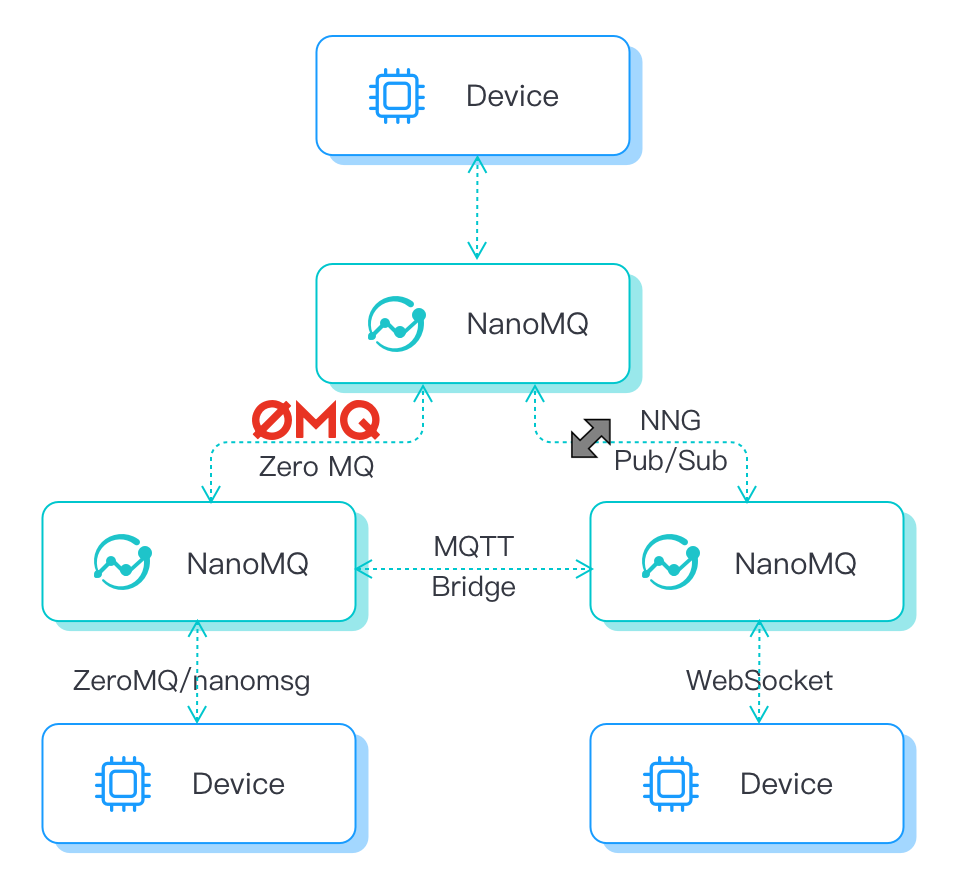

# Introduction

[NanoMQ](https://nanomq.io/) is an open-source edge computing project released in Jan 2021 and it is the next generation of lightweight, high-performance **MQTT** messaging broker for the IoT edge computing scenario.

Github repository address: [https://github.com/emqx/nanomq](https://github.com/emqx/nanomq)

**NanoMQ** in collaboration with **NNG**. Relying on **NNG**'s excellent network API design, **NanoMQ** can focus on **MQTT** broker performance and more extended features. The goal is to provide better SMP support and a high performance-price ratio in edge devices and MECs. There are plans to add other IoT protocols such as ZMQ, NanoMSG, and SP in the future.

## Key Features

Fully MQTT 5.0 Compliant: Fully support MQTT 5.0/3.1.1, Compatible with all standard open-source MQTT SDKs.

[**MQTT Bridges supported**](./bridges/introduction.md): Bridging message from edge to multiple clouds. In-line connections to Global cloud services.

[**Rule Engine**](./rule/introduction.md): Unlock the flexibility of data with a SQL-based rule engine. Integrates with eKuiper to bring stream processing to the edge.

[**Message Persistence**](./rule/config-file.md#data-persistence-with-sqlite): Preserve your business-critical data with built-in data persistence, and resume uploading automatically when the connection is restored.

[**Integrability**](./api/introduction.md): Reduce the cost of integrating edge computing applications with event-driven WebHooks. Easy to maintain with EdgeOps friendly HTTP APIs.

[**Multi-Language Protocol**](./gateway/introduction.md): Support multiple protocols such as ZeroMQ/nanomsg/NNG/WebSocket. Enabling flexible and diverse routing topology on edge with. Secure your IoT connections with TLS/SSL.
[**MQTT STREAM**](./mqtt-stream/introduction.md): MQTT messages for the same topic can be viewed as a data stream, and this data stream can be stored and queried. For some poor network environment, it provides a solution for the integrity and reliability of data.

## Why NanoMQ

**Ultra-lightweight**: The booting footprint is less than 200Kb in the minimum feature set.

**Asynchronous I/O**: Parallelize computation for IoT & MQTT with a built-in actor model.

**Multi-threading**: Scale out easily to engage multiple cores with less CPU usage in the modern SMP system.

**Blazing Fast**: Achieve million-level TPS. Up to 10 times faster than Mosquitto on a multi-core CPU.

**Cross-platform**: Highly compatible and portable with any POSIX-based platform.

**Interoperability**: Transparent and customizable data flow. EdgeOps friendly.
