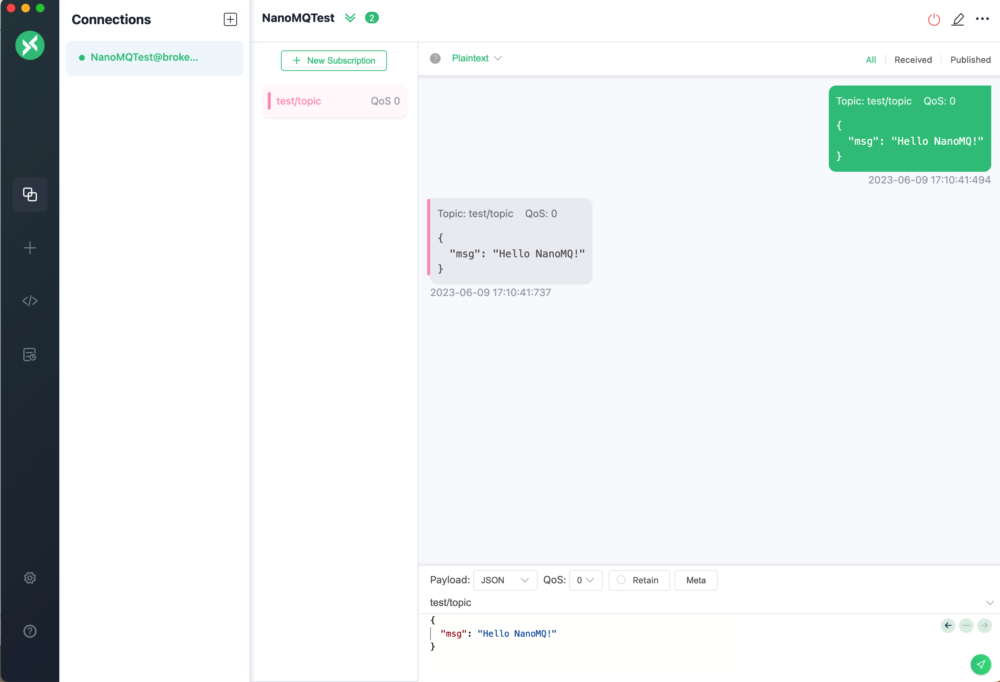
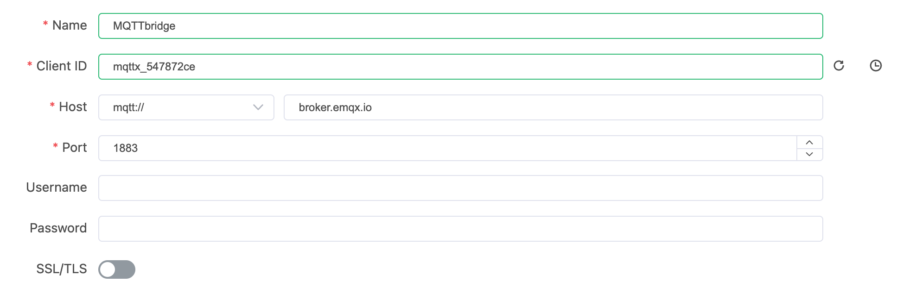

# Quick Start

NanoMQ MQTT Broker (NanoMQ) is a lightweight and blazing-fast MQTT Broker for the IoT Edge platform. This guide will use Docker deployment as an example to show you how to speedily get started with NanoMQ. 

## Run NanoMQ using Docker

Run the command below to speedily run NanoMQ with Docker:

```bash
docker run -d --name nanomq -p 1883:1883 -p 8083:8083 -p 8883:8883 emqx/nanomq:latest
```

For more information about NanoMQ official Docker image, see [Docker Hub - nanomq](https://hub.docker.com/r/emqx/nanomq)

## Experience the NanoMQ Services

Now the NanoMQ is started with Docker, exposing ports1883, 8083, and 8883 for MQTT traffic, MQTT over WebSockets, and MQTT over SSL/TLS for secure communication respectively. This section guides you through how to use the MQTTX client tool to experience the messaging services. 

### Setup the MQTTX Client

Install MQTTX on your machine if you haven't done so. You can download it from the [official site](https://mqttx.app/). After installing, open the MQTTX application.

### Connect to NanoMQ

Click on **New Connection** on the home page. In the **General** panel, set as follows:


1. In the **Name** field, give your connection a name.
2. MQTTX will automatically fill in a Client ID.
3. Choose MQTT as the protocol and fill in `localhost` (or the IP where your Docker is running).
4. Set **Port** with `1883` (or any other exposed port depending on your needs).

Then click **Connect** in the top-right corner. A prompt will pop up indicating the connection is successfully set up.

### Subscribe to a Topic

On the **Connections** page, Click on the **+ New Subscription** button, then act as follows:

- Enter the topic you want to subscribe to, in this case, `test/topic`. For the rest, you can keep the default setting. 
- Click on **Confirm**.

### Publish a Message

On the **Connections** page, act as follows:

- Specify the topic to which you want to publish. For instance, use `test/topic`.
- Enter the message payload you want to send, for instance, "Hello NanoMQ".
- Click on publish icon.

A message will appear in the dialog box area, indicating the message is successfully published to the NanoMQ broker and forwarded to the subscribed topic. 




In the following sections, this tutorial will guide you through how to create an MQTT over TCP with the [free public MQTT bridge](https://www.emqx.com/en/mqtt/public-mqtt5-broker) broker.emqx.io.

## Configure an MQTT over TCP Data Bridge

### Pull the NanoMQ Docker Image

Pull the latest NanoMQ image from Docker Hub:

```bash
docker pull emqx/nanomq:latest
```

### Create a NanoMQ Configuration File

Create a new configuration file on your local machine. This will hold the settings for the NanoMQ broker, including the bridge configuration.

You can use a text editor to create a new file named `nanomq.conf`, and then copy the following bridge configuration into the file:

```bash
bridges.mqtt {
    nodes = [ 
        {
            name = emqx
            enable = true
            connector {
                server = "mqtt-tcp://broker.emqx.io:1883"
                proto_ver = 4
                clean_start = true
                keepalive = 60s
            }
            forwards = ["forward1/#","forward2/#"]
            subscription = [
                {
                    topic = "recv/topic1"
                    qos = 1
                },
                {
                    topic = "recv/topic2"
                    qos = 2
                }
            ]
            congestion_control = cubic
            parallel = 2
            max_send_queue_len = 1024
            max_recv_queue_len = 1024
        }
    ]
}
```

### Start NanoMQ with the Configuration File

Now you can start the Docker container, and use the `-v` flag to mount your local configuration file into the Docker container:

```bash
docker run -d -p 1883:1883 \
           -v /path/to/your/nanomq.conf:/etc/nanomq.conf \
           --name nanomq emqx/nanomq:latest
```

Replace `/path/to/your/nanomq.conf` with the actual path to your `nanomq.conf` file on your local machine.

### Test bridging

This section will continue using the MQTTX client tool to test the MQTT data bridge you created.You will create 2 clients for connecting NanoMQ and the MQTT bridge and verify the messaging services between NanoMQ and the MQTT bridge. 

**Client connecting NanoMQ**


**Client connecting MQTT bridge**



**Verify messging from NanoMQ to MQTT bridge**

On your client connecting the MQTT bridge, `MQTTbridge` in this example, subscribe to the `forward1/#` topic.

On your client connecting NanoMQ, `NanoMQTest` in this example, publish a message to the `forward1/msg` topic, for example, `Hello from NanoMQ`

Verify that you received the message that was published from the local broker.


**Verify messaging from MQTT to NanoMQ**

On your client connecting NanoMQ, `NanoMQTest` in this example, subscribe to the `recv/topic1` topic.

On your client connecting the MQTT bridge, `MQTTbridge` in this example, publish a message to the `recv/topic1` topic, for example, `Hello from broker.emqx.io`

Verify that you received the message that was published from broker.emqx.io.


