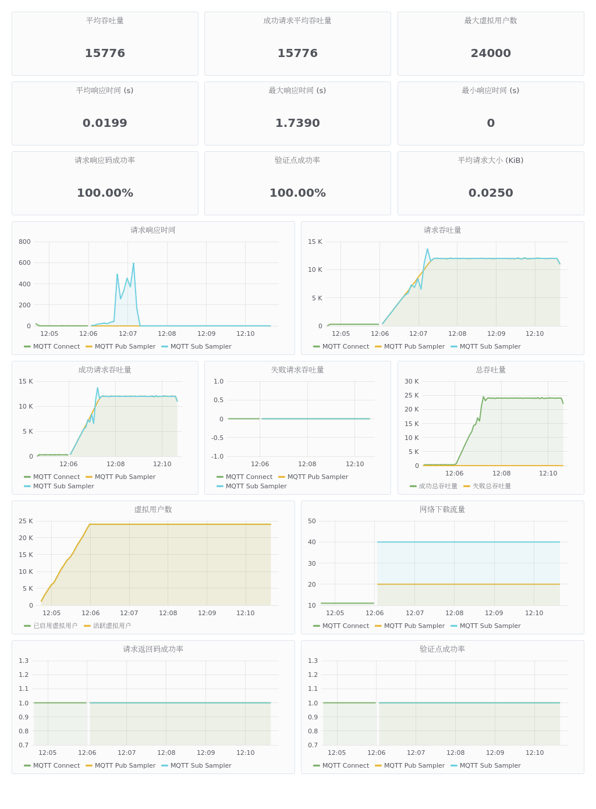

# NanoMQ Test Report

## About NanoMQ

[NanoMQ](https://nanomq.io/) is an open source project for edge computing that started in July 2020 and is the next generation of lightweight, high-performance MQTT messaging broker for the IoT edge computing scenario.

Github repository address: <https://github.com/emqx/nanomq>

NanoMQ aims to deliver simple and powerful message-centric services for different edge computing platforms; strives to remove the gap between hardware development and cloud computing; connects the physical world and digital intelligence from the open source community; thus popularizing edge computing applications and helping to connect everything.

NanoMQ in collaboration with NNG. Relying on NNG's excellent network API design, NanoMQ can focus on MQTT broker performance and more extended features.The goal is to provide better SMP support and high performance-price ratio in edge devices and MECs. There are plans to add other IOT protocols such as ZMQ, NanoMSG and SP in the future.

NanoMQ currently has the following functions and features:

Full support for the MQTT 3.1.1/5.0 protocol. High compatibility and portability as the project relies only on the native POSIX API and is developed purely in C. NanoMQ is internally fully asynchronous IO and multi-threaded parallelism, so there is good support for SMP while achieving low latency and high throughput. It is cost-effective in terms of resource usage and is suitable for all types of edge computing platforms.

## Overview of the test results

To ensure consistency and reliability of test results. Not tested for specific hardware devices.

The tests were conducted on the Huawei Cloud/Mobile platform and focused on broadcast and one-to-one sending and receiving MQTT message throughput tests. The relevant test results are shown below.

***Note: If not specified, all connections are set up for 300 seconds of ping message packets by default.***

## Testing tools

- XMeter Enterprise 2.0.1: <https://www.xmeter.net>

XMeter is a performance test management platform, based on the open source JMeter performance testing tool. XMeter can support large-scale, highly concurrent performance tests, such as the implementation of 10 million levels of MQTT concurrent connection tests. In addition to testing the MQTT protocol, it can also support tests for mainstream applications such as HTTP/HTTPS.

- JMeter-MQTT plugin: mqtt-xmeter-1.13 – <https://github.com/emqx/mqtt-jmeter>

It is an open source MQTT performance testing plugin implemented by XMeter and is used in many projects. It is currently the most popular MQTT plugin in the JMeter community.

- JMeter5.0 – <https://jmeter.apache.org>
- emqtt-benchmark-tools: <https://github.com/emqtt/emqtt_benchmark>

A test tool implemented by EMQ to simulate a mass of MQTT connections.

## Test environment

This test was done separately for low and high configurations and for mobile platforms. Therefore, there are 3 sets of environments.

The test deployment diagram in Huawei Cloud is shown below. EMQ Benchmark Tools was used to simulate a large number of MQTT connections in this test. XMeter provides a test tool based on the JMeter MQTT plugin to simulate business test scenarios. XMeter has built-in tools for monitoring the resource usage of servers running nanomq and comparing the information that comes with the operating system.

Test architecture diagram

### Server environment\*1

- NanoMQ 0.2.5

- Machine under test (1)

  - Operating system: CentOS Linux release 7.4.1708
  - CPU: 8 cores 16 threads Intel(R) Xeon(R) Gold 6266C CPU @ 3.00GHz
  - RAM: 16 G
  - Disk: 120 GB

- Presses
  - 10 units for XMeter to connect to NanoMQ and simulate business data sending and receiving
    - Operating system: CentOS Linux release 7.4.1708
    - CPU: 8 cores
    - RAM: 16 G
    - Disk: 120 GB

- Network connection: Huawei Cloud intranet connection

The test environment performs the following test scenarios:

- One-to-one sending and receiving message test
- Broadcast message testing

### Server environment\*2

- NanoMQ 0.2.5

- Machine under test (1)

  - Operating system: CentOS Linux release 7.4.1708
  - CPU: 1 core 1 thread Intel(R) Xeon(R) Gold 6278C CPU @ 2.60GHz
  - RAM: 2 G
  - Disk: 120 GB

- Five presses

  - Operating system: CentOS Linux release 7.4.1708
  - CPU: 8 cores
  - RAM: 16 G
  - Disk: 120 GB

- Network connection: Huawei Cloud intranet connection

The test environment performs the following test scenarios:

- One-to-one sending and receiving message test

- Broadcast message testing

### Server environment\*3

- NanoMQ 0.2.5

- The machine under test: 1 mobile edge computing server

  - Operating system: Ubuntu 20.04
  - CPU: 6 cores 12 threads
  - RAM: 16 G
  - Disk: 256 GB

- Two presses

  - Operating system: Ubuntu 20.04
  - CPU: 6 cores 12 threads Intel(R) Core(TM) i7-10710U CPU @ 1.10GHz
  - RAM: 16 G
  - Disk: 256 GB

- Network connection: Intranet connection

The test environment performs the following test scenarios:

- Million-level throughput broadcast tests

### Many-to-many broadcast scenarios

### Test scenario information

In server environment 1, 500 clients subscribe to 3 different topics at the same time, and 20 clients broadcast QoS 0 messages to each of the 3 topics subscribed to by 500 clients at a frequency of 20ms or 50 msg/sec per pub client. This means a theoretical throughput of 20 x 50 x 500 = 500000 msg/sec.

Server environment 2 is a low configuration scenario. 500 clients are set up to subscribe to 3 different topics at the same time. Ten clients broadcast QoS 0 messages to each of the three topics subscribed to by 500 clients at a frequency of 25ms or 40 msg/sec per pub client. This means a theoretical throughput of 10 x 40 x 500 = 200000 msg/sec.

NanoMQ configuration:

-DNNG_RESOLV_CONCURRENCY=1 -DNNG_NUM_TASKQ_THREADS=16 -DNNG_MAX_TASKQ_THREADS=16 -NNG_ENABLE_STATS=OFF -DNOLOG=1 -DPARALLEL=16 -DNANO_MSQ_LEN=25600 -DDEBUG=0 ..

1. Parallel number set to 16
2. Maximum number of worker threads set to 16
3. Disable statistics/log/debug tracing
4. Message cache queue length of 25600

This configuration takes up around 1400 kb of memory on startup.

The configuration of nanomq is the same in both environments tested.

### Report Analysis

The XMeter performance test report is divided into three main sections as shown in the diagram below. The results of the later reports are interpreted similarly, so if there is nothing special about them, we won't go into them again.

1. Overview: The test report in this area calculates the results of all the test steps returned. If the test script has more than one step (e.g. contains connection and message publishing), then the results here are calculated based on the results of both parts of the test.

   1. Avg throughput

   2. Avg success throughput

   3. Avg failed throughput

   4. Max virtual user num

   5. Avg response time(s)

   6. Max response time(s)

   7. Min response time(s)

   8. Response code succ rate

   9. Verification point succ rate

   10. Avg request size(KiB)

2. Chart Area

   1. 1. Response time

   2. Throughput

   3. Succ Throughput

   4. Virtual User

   5. Response code succ rate

   6. Download bytes

3. Detailed data

    1. Page

    2. Hit num

    3. Max resp time (s)

    4. Min resp time (s)

    5. Avg resp time(s)

    6. Avg throughput

    7. Avg succ throughput

    8. Avg failure throughput

    9. Avg request size(KiB)

    10. Response code succ rate

   11. Check point succ rate

   12. Check point failure

   13. Avg deviation

   14. 90th percentile(s)

   15. Avg 90%(s)

### Test results

### Server environment 1

As you can see above, the script runs for a certain amount of time to establish a connection (as shown by the green line "MQTT Connect" above) and then starts sending messages. The test ran for 5min after hitting 500,000/sec throughput. The throughput was very stable and all responses were successful. **For this test Sub Sampler received 10 responses and counted them once, the graph shows throughput x 10 as the actual throughput.**

The results of NanoMQ monitoring are as follows:

### Test result analysis

As a result, the advantages of multi-core + multi-threaded parallelism are maximized in the broadcast scenario, and nanomq can run stably under 500,000 throughput pressures. The process memory consumption is around 10M and each CPU only consumes around 80%, with the workload evenly distributed to each core. The test resources were limited, so only 50W of throughput pressure was tested. In other scenarios, it is possible to reach 80W or a million.

#### Server environment 2

The results of NanoMQ monitoring are as follows:

### Test result analysis

Therefore, in a low configuration single-core environment, the benefits of NanoMQ are not obvious, multi-threading does not reflect its performance advantages, and response time message latency is improved. However, in the hardware environment tested it is still able to support a stable 20W and can support up to 25W of throughput pressure.

### Millions of throughput scenarios

### Test scenario information

This scenario was tested on a mobile platform.

500 clients subscribe to the same topic at the same time, and 10 clients broadcast QoS 0/1/2 messages to 500 clients subscribed to the topic, with each pub client sending messages at a frequency of 5ms or 200 msg/sec, sending a total of 50,000 messages. This means a theoretical throughput of 20 x 50 x 500 = 1000000 msg/sec.

NanoMQ configuration:

-DNNG_RESOLV_CONCURRENCY=1 -DNNG_NUM_TASKQ_THREADS=12 -DNNG_MAX_TASKQ_THREADS=12 -NNG_ENABLE_STATS=OFF -DNOLOG=1 -DPARALLEL=64 -DNANO_MSQ_LEN=65535 -DDEBUG=0 ..

1. Parallel number set to 64
2. The maximum number of threads to work on is 12
3. Disable statistics/log/debug tracing
4. Message cache queue length is 65535

This configuration takes up around 3000 kb of memory on startup.

### Test results

Publishing the message side

/emqtt_bench pub -h 192.168.24.221 -c 10 -I 5 -i 30 -p 1883 -t msg -q 0 -V 4 -s 16 -L 50000

connected: 8

sent(1001): total=1377, rate=1377(msg/sec)

connected: 10

sent(2001): total=3274, rate=1897(msg/sec)

sent(3001): total=5274, rate=2000(msg/sec)

sent(4000): total=7273, rate=1999(msg/sec)

sent(5001): total=9274, rate=2001(msg/sec)

sent(6001): total=11274, rate=2000(msg/sec)

sent(7001): total=13274, rate=2000(msg/sec)

sent(8001): total=15275, rate=2001(msg/sec)

sent(9010): total=17158, rate=1883(msg/sec)

sent(10001): total=19274, rate=2116(msg/sec)

sent(11006): total=21271, rate=1997(msg/sec)

sent(12003): total=23274, rate=2003(msg/sec)

sent(13001): total=25275, rate=2001(msg/sec)

sent(14001): total=27274, rate=1999(msg/sec)

sent(15002): total=29273, rate=1999(msg/sec)

sent(16001): total=31273, rate=2000(msg/sec)

sent(17001): total=33274, rate=2001(msg/sec)

sent(18001): total=35274, rate=2000(msg/sec)

sent(19001): total=37274, rate=2000(msg/sec)

sent(20002): total=39272, rate=1998(msg/sec)

sent(21001): total=41275, rate=2003(msg/sec)

sent(22002): total=43275, rate=2000(msg/sec)

sent(23001): total=45275, rate=2000(msg/sec)

sent(24001): total=47274, rate=1999(msg/sec)

sent(25001): total=50000, rate=2001(msg/sec)

Receiving the message side

./emqtt_bench sub -h 192.168.24.221 -c 500 -i 10 -p 1883 -t msg -q 0 -V 4

connected: 500

recv(10001): total=37, rate=37(msg/sec)

recv(11006): total=210641, rate=210604(msg/sec)

recv(12010): total=522560, rate=311919(msg/sec)

recv(13002): total=1013036, rate=490476(msg/sec)

recv(14004): total=1381182, rate=368146(msg/sec)

recv(15004): total=1688852, rate=307670(msg/sec)

recv(16001): total=2040868, rate=352016(msg/sec)

recv(17004): total=2238127, rate=197259(msg/sec)

recv(18001): total=2569661, rate=331534(msg/sec)

recv(19001): total=2974621, rate=404960(msg/sec)

recv(20004): total=3464964, rate=490343(msg/sec)

recv(21017): total=3723682, rate=258718(msg/sec)

recv(22001): total=4102825, rate=379143(msg/sec)

recv(23003): total=4834845, rate=732020(msg/sec)

recv(24057): total=5219351, rate=384506(msg/sec)

recv(25001): total=5535802, rate=316451(msg/sec)

recv(26029): total=6071575, rate=535773(msg/sec)

recv(27070): total=6498595, rate=427020(msg/sec)

recv(28005): total=6809700, rate=311105(msg/sec)

recv(29002): total=7339673, rate=529973(msg/sec)

recv(30011): total=7832727, rate=493054(msg/sec)

recv(31046): total=8412849, rate=580122(msg/sec)

recv(32004): total=8948213, rate=535364(msg/sec)

recv(33001): total=9194270, rate=246057(msg/sec)

recv(34006): total=9503511, rate=309241(msg/sec)

recv(35000): total=9934346, rate=430835(msg/sec)

recv(36014): total=10667489, rate=733143(msg/sec)

recv(37001): total=11628229, rate=960740(msg/sec)

recv(38002): total=12522417, rate=894188(msg/sec)

recv(39009): total=13568225, rate=1045808(msg/sec)

recv(40032): total=14121329, rate=553104(msg/sec)

recv(41009): total=15202832, rate=1081503(msg/sec)

recv(42036): total=16224750, rate=1021918(msg/sec)

recv(43025): total=17333056, rate=1108306(msg/sec)

recv(44007): total=18091782, rate=758726(msg/sec)

recv(45013): total=19083855, rate=992073(msg/sec)

recv(46037): total=19882085, rate=798230(msg/sec)

recv(47007): total=20985636, rate=1103551(msg/sec)

recv(48008): total=21915818, rate=930182(msg/sec)

recv(49015): total=22866695, rate=950877(msg/sec)

recv(50030): total=23662209, rate=795514(msg/sec)

recv(51064): total=24866633, rate=1204424(msg/sec)

recv(52000): total=25000000, rate=133367(msg/sec)

QoS 1

connected: 500

recv(16068): total=234571, rate=234571(msg/sec)

recv(17007): total=580577, rate=346006(msg/sec)

recv(18075): total=990000, rate=409423(msg/sec)

recv(19043): total=1316734, rate=326734(msg/sec)

recv(20062): total=1738198, rate=421464(msg/sec)

recv(21054): total=2113999, rate=375801(msg/sec)

recv(22001): total=2514734, rate=400735(msg/sec)

recv(23061): total=2829772, rate=315038(msg/sec)

recv(24047): total=3233621, rate=403849(msg/sec)

recv(25295): total=3755035, rate=521414(msg/sec)

recv(26018): total=4035549, rate=280514(msg/sec)

recv(27001): total=4420410, rate=384861(msg/sec)

recv(28018): total=4786483, rate=366073(msg/sec)

recv(29044): total=5190002, rate=403519(msg/sec)

recv(30062): total=5593588, rate=403586(msg/sec)

recv(31040): total=5928794, rate=335206(msg/sec)

recv(32004): total=6252908, rate=324114(msg/sec)

recv(33065): total=6650944, rate=398036(msg/sec)

recv(34037): total=7022249, rate=371305(msg/sec)

recv(35092): total=7418393, rate=396144(msg/sec)

recv(36070): total=7798223, rate=379830(msg/sec)

recv(37340): total=8231688, rate=433465(msg/sec)

recv(38052): total=8485779, rate=254091(msg/sec)

recv(39310): total=8973357, rate=487578(msg/sec)

recv(40534): total=9424077, rate=450720(msg/sec)

recv(41049): total=9627670, rate=203593(msg/sec)

recv(42010): total=9995229, rate=367559(msg/sec)

recv(43039): total=10320080, rate=324851(msg/sec)

recv(44022): total=10644721, rate=324641(msg/sec)

recv(45036): total=10971436, rate=326715(msg/sec)

recv(46264): total=11430028, rate=458592(msg/sec)

recv(47136): total=11744901, rate=314873(msg/sec)

recv(48052): total=12045896, rate=300995(msg/sec)

recv(49259): total=12487698, rate=441802(msg/sec)

recv(50038): total=12777479, rate=289781(msg/sec)

recv(51025): total=13081431, rate=303952(msg/sec)

recv(52058): total=13445032, rate=363601(msg/sec)

recv(53151): total=13825563, rate=380531(msg/sec)

recv(54004): total=14149866, rate=324303(msg/sec)

recv(55025): total=14510314, rate=360448(msg/sec)

recv(56104): total=14889650, rate=379336(msg/sec)

recv(57070): total=15211645, rate=321995(msg/sec)

recv(58045): total=15569365, rate=357720(msg/sec)

recv(59045): total=15891692, rate=322327(msg/sec)

recv(60064): total=16242078, rate=350386(msg/sec)

recv(61179): total=16623045, rate=380967(msg/sec)

recv(62033): total=16969277, rate=346232(msg/sec)

recv(63002): total=17327152, rate=357875(msg/sec)

recv(64016): total=17670625, rate=343473(msg/sec)

recv(65019): total=18065061, rate=394436(msg/sec)

recv(66001): total=18503602, rate=438541(msg/sec)

recv(67043): total=18849277, rate=345675(msg/sec)

recv(68024): total=19364693, rate=515416(msg/sec)

recv(69064): total=19831186, rate=466493(msg/sec)

recv(70046): total=20283983, rate=452797(msg/sec)

recv(71057): total=20781558, rate=497575(msg/sec)

recv(72054): total=21267065, rate=485507(msg/sec)

recv(73035): total=21721098, rate=454033(msg/sec)

recv(74002): total=22210875, rate=489777(msg/sec)

recv(75040): total=22621468, rate=410593(msg/sec)

recv(76652): total=23375782, rate=754314(msg/sec)

recv(77303): total=23729486, rate=353704(msg/sec)

recv(78090): total=24134737, rate=405251(msg/sec)

recv(79047): total=24579191, rate=444454(msg/sec)

recv(80001): total=24994829, rate=415638(msg/sec)

recv(81001): total=24998319, rate=3490(msg/sec)

recv(82001): total=25000000, rate=1681(msg/sec)

### System monitoring information

System resource consumption was essentially the same as in Server Environment 1, with final memory consumption of 200M and all CPU cores are running at almost full capacity.

### Test result analysis

Therefore, NanoMQ receives all messages in full and runs all cores to allow each core to share the task in a balanced way. Total memory consumption was 200Mb. Throughput performance was more erratic due to the power limitations of the mobile platform. The average throughput was 80W/s, releasing the full platform performance. NanoMQ can reach 100W msg/s throughput capacity when sending messages in parallel after the task of publishing messages.

### One-to-one receive and send scenarios

### Test scenario information

This scenario was tested in Server Environments 1 and 2

In server environment 1, there are 2 groups of 14,000 clients each, one subscribing to 14,000 different topics and the other publishing QoS 0 messages to each of the 14,000 topics at a rate of 1msg/sec per pub client. This means a theoretical throughput of 14,000 msg/sec.

In server environment 1, there are 2 groups of 14,000 clients each, one subscribing to 14,000 different topics and the other publishing QoS 0 messages to each of the 14,000 topics at a rate of 1msg/sec per pub client. This means a theoretical throughput of 14,000 msg/sec.

NanoMQ configuration:

-DNNG_RESOLV_CONCURRENCY=1 -DNNG_NUM_TASKQ_THREADS=16 -DNNG_MAX_TASKQ_THREADS=16 -NNG_ENABLE_STATS=OFF -DNOLOG=1 -DPARALLEL=16 -DNANO_MSQ_LEN=64 -DDEBUG=0 ..

1. Parallel number set to 1024
2. The maximum number of threads to work on is 16
3. Disable statistics/log/debug tracing
4. Message cache queue length is 64

This configuration takes up around 3000 kb of memory on startup.

### Test results

Server environment 1

As you can see, after the connection is complete, there is a slight fluctuation when the message is being sent at first, and then it stabilizes at 14k msg/s throughput.

### Test result analysis

As can be seen, the CPU usage is 30% and the memory consumption is around 200MB. Throughput is stable at 14k/s.

| Pages            | Run Times | Maximum Response Time(s) | Maximum Successful Response Time(s) | Minimum Response Time(s) | Minimum Successful Response Time(s) | Average Response Time(s) | Average Successful Response Time(s) | Average Throughput(/s) | Average Successful Throughput(/s) | Average Failure Throughput(/s) | Average Request Size (bytes) | Response Code Success Rate | Number of Successful Validation Points | Success Rate of Validation Points | Number of Incorrect Validation Points | Average Standard Deviation | 90th Percentile Response Time (s) | 90% Average Response Time(s) |
| ---------------- | --------- | ------------------------ | ----------------------------------- | ------------------------ | ----------------------------------- | ------------------------ | ----------------------------------- | ---------------------- | --------------------------------- | ------------------------------ | ---------------------------- | -------------------------- | -------------------------------------- | --------------------------------- | ------------------------------------- | -------------------------- | --------------------------------- | ---------------------------- |
| MQTT Connect     | 24000     | 0.347                    | 0.347                               | 0                        | 0                                   | 0.0024                   | 0.0024                              | 282.3529               | 282.3529                          | 0                              | 0.0107                       | 1                          | 24000                                  | 1                                 | 0                                     | 4.5017                     | 0.001                             | 0.0009                       |
| MQTT Pub Sampler | 2867350   | 0.117                    | 0.117                               | 0                        | 0                                   | 0                        | 0                                   | 10240.536              | 10240.536                         | 0                              | 0.0195                       | 1                          | 2867350                                | 1                                 | 0                                     | 0.4397                     | 0                                 | 0                            |
| MQTT Sub Sampler | 2867071   | 1.739                    | 1.739                               | 0                        | 0                                   | 0.0512                   | 0.0512                              | 10239.539              | 10239.539                         | 0                              | 0.0391                       | 1                          | 2867071                                | 1                                 | 0                                     | 175.524                    | 0.016                             | 0.0008                       |

Note: Currently NanoMQ can support up to 65535 connections, but as the performance of subscription relationship queries needs to be enhanced, a topic count of over 20k in a 1-to-1 scenario can cause throughput instability.

Server environment 2

### Test result analysis

As can be seen, the user state time of the CPU becomes significantly more in single-core scenarios. This is because NanoMQ's multi-threaded optimization for multi-core scenarios has been specifically made to support SMP, which significantly reduces the number of CPU context switches. However, the large number of individually sent and received tasks in single-core scenarios does not fully exploit this advantage.

## Summary

NanoMQ architecture diagram

The bottom layer of NanoMQ reads the network data in the kernel through single-threaded Epoll, and handles the parsing of link messages and the production of asynchronous messages at the transport layer. Quickly reply to QoS messages after performing IO Batch at the same time. After the Connect package processing is completed and the PIPE is established, the message is forwarded to the protocol layer for processing through asynchronous IO. The protocol layer is responsible for the management of the message queue and the triggering of the timer. Finally, the asynchronous message is passed through AIO and then global logical processing and message routing are performed at the application layer.
