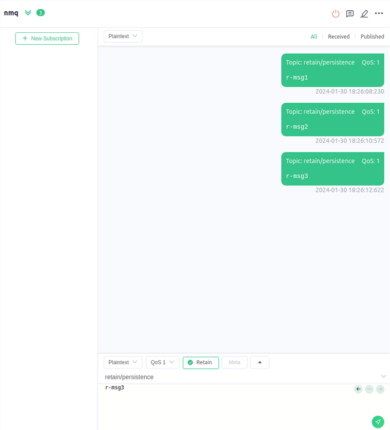
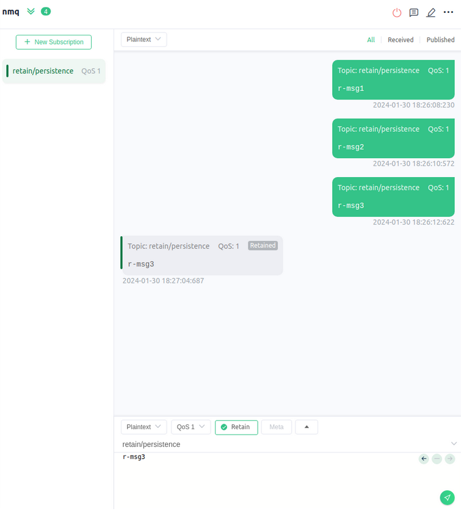

# Retain Message Persistance Tutorial

## Configure SQLite for NanoMQ

NanoMQ uses SQLite to implement message persistence. Add following section to your configration.

```hcl
sqlite {
    disk_cache_size = 102400  # Max number of messages for caching
    mounted_file_path="/tmp/" # Mounted file path 
    flush_mem_threshold = 3   # The threshold number of flushing messages to flash
    resend_interval = 5000    # Resend interval (ms)
}
```
Check [configration](../config-description/broker.md#cache) for more detail about every configration item. To simplify the tutorial we set `flush_mem_threshold = 3`. You should set this item according to your usage scenario.

## Test Retain message persistence

This section will guide you in testing retain message perisistence using the [MQTTX Client Tool](https://mqttx.app/). We will use one conection for publish and subscribe.

**Start NanoMQ**

```bash
$ nanomq start --conf nanomq.conf
```

**Connect to NanoMQ**


**Send retain messages**

Publish 3 different retain messages to reach the threshold for flushing.



**Restart NanoMQ**

Use `ctrl+c` to exit. Then restart NanoMQ.

**Sub for retain message**

Subscribe the topic where we have send retain messages to. We can see that the retain meassage is still available.


