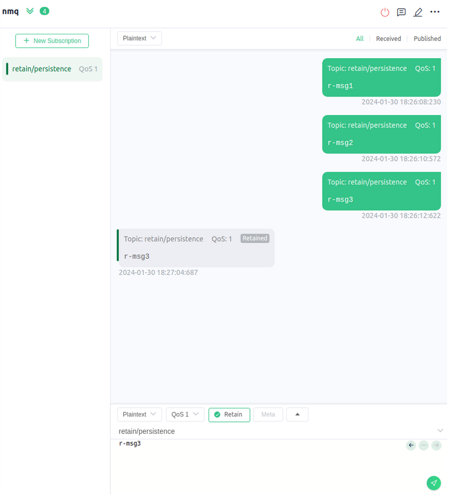

# Retain Message Persistance Tutorial

## Configure SQLite for NanoMQ

NanoMQ uses SQLite to implement message persistence. Add following section to your configration.

```hcl
sqlite {
    disk_cache_size = 102400       # Max number of messages for caching
    mounted_file_path="/tmp/"      # Mounted file path 
    retain_flush_threshold = 1000  # Batch trigger for retained messages
    flush_interval = 1000          # Longest a buffered write may wait (ms)
    resend_interval = 5000         # Resend interval (ms)
}
```
Check [configration](../config-description/broker.md#cache) for more detail about every configration item.

Retained messages are written in batches: a retained publish reaches the database at most `flush_interval` milliseconds after it is published, sooner once `retain_flush_threshold` topics are pending, or when the broker exits. We set `flush_interval` to its minimum of 1000 ms so the write lands about a second after publishing. Note that `retain_flush_threshold` counts pending *topics*: while it stays above the number of pending topics, lowering it will not make a single-topic test flush any sooner. Stopping NanoMQ normally commits the pending batch, so the messages survive the restart below.

## Test Retain message persistence

This section will guide you in testing retain message perisistence using the [MQTTX Client Tool](https://mqttx.app/). We will use one conection for publish and subscribe.

**Start NanoMQ**

```bash
$ nanomq start --conf nanomq.conf
```

**Connect to NanoMQ**


**Send retain messages**

Publish 3 retain messages.


**Restart NanoMQ**

Use `ctrl+c` to exit. Then restart NanoMQ.

**Sub for retain message**

Subscribe the topic where we have send retain messages to. We can see that the retain meassage is still available.


