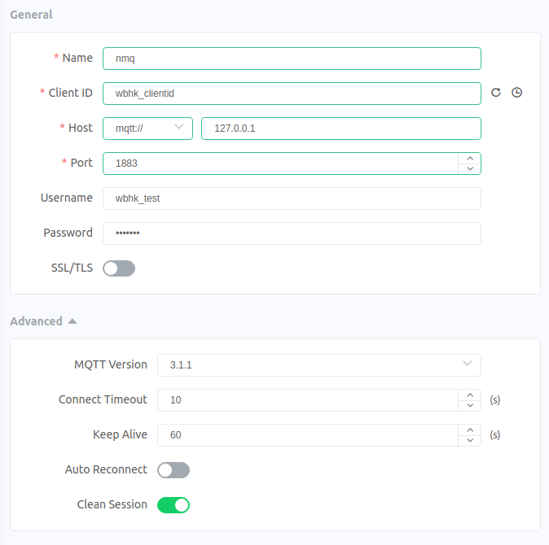

# WebHook
This section will guide you to enable the webhook feature in NanoMQ.

## Configure for WebHook

NanoMQ now support three events: `on_client_connack`, `on_client_disconnected`, `on_message_publish`. We will enable all of them in this turial. You can add the follwing section in your configure file. For more detail of every item, you can check [configuration](../config-description/webhook.md) and [webhook](../rule/web-hook-0.19.md).

```
webhook {
	url = "http://127.0.0.1:8888"
	headers.content-type = "application/json"
	body.encoding = plain
	pool_size = 32
	
	events = [
		{ 
			event = "on_message_publish"
			topic = "nmq/pub"
		}
		{
			event = "on_client_connack"
		}
        {
            event = "on_client_disconnected"
        }
	]
}
```

## Test WebHook

**Start NanoMQ & HTTP server**

For test purpose the HTTP server we use will just print every HTTP reqest and send back `ok`.

```bash
$ nanomq start --conf nanomq.conf
```

**on_client_connack**

We use the [MQTTX Client Tool](https://mqttx.app/) to trigger the three events above.

First we connect to NanoMQ with the configuration blow.



HTTP server should receieve a request contain the following content:
```
header: content-type: [application/json]
Received: {"proto_ver":4,"keepalive":60,"conn_ack":"success","username":"wbhk_test","clientid":"wbhk_clientid","action":"client_connack"}
```

**on_message_publish**

As we publish a message to topic `nmq/pub`:

HTTP server should receieve a request like:
```
header: content-type: [application/json]
Received: {"ts":1706703724960,"topic":"nmq/pub","retain":true,"qos":1,"action":"message_publish","from_username":"wbhk_test","from_client_id":"wbhk_clientid","payload":"Hello World!"}
```

::: tip

Wildcard is supported in `topic`. So you can set `topic = 'nmq/#'`, then topics like `nmq/pub1` or `nmq/pub2` can both trriger webhook.

:::

**on_client_disconnected**

We disconnect from NanoMQ, HTTP server will receieve:

```
header: content-type: [application/json]
Received: {"reason":"normal","username":"wbhk_test","clientid":"wbhk_clientid","action":"client_disconnected"}
```