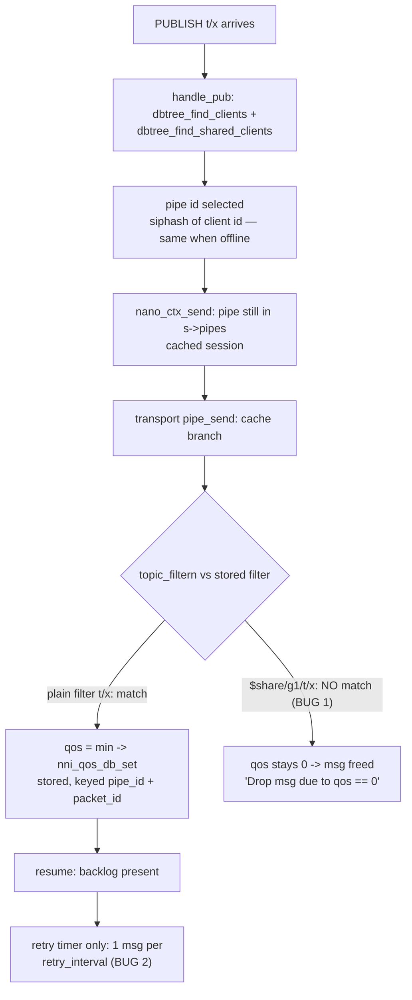

# Offline QoS-1 Redelivery for Persistent Sessions - Plan

## Goal Capsule

- **Objective:** Fix issue nanomq/nanomq#2355 — with persistence enabled, QoS-1 messages published while a `clean_start=false` client is offline are (a) never redelivered when the subscription is a shared subscription (`$share/<group>/<filter>`), and (b) redelivered only one per `retry_interval` for plain subscriptions. After this plan, both subscription types store the offline backlog and drain it promptly on session resume.
- **Authority:** This plan's Planning Contract and Implementation Units govern the approach; repo conventions (`CONTRIBUTING.md`: signed-off commits, small commits, C99, clang-format) govern style and process.
- **Stop conditions:** Stop and re-verify if implementation contradicts the root-cause evidence (e.g., the offline shared-sub message is *not* dropped at the transport cache branch's `topic_filtern` re-filter, or plain-sub drip is *not* timer-bound). Stop if the CONNACK-dispatch drain trigger in KTD3 cannot be implemented as described (e.g., the CONNACK cannot be identified in the send path) — surface the blocker rather than substituting a timer-delay kick-off, which cannot deliver the R4 ordering guarantee.
- **Execution profile:** All production code changes land inside the `nng/` directory, which is the NanoNNG git submodule; integration tests land in the parent repo. See Operational Notes for the landing strategy.

---

## Product Contract

### Summary

NanoMQ persists QoS messages for offline persistent sessions (SQLite `nano_qos_db` or in-memory id-map), but two defects break the resume experience reported in #2355. First, the transport-level offline cache branch re-filters the publish topic against the raw stored subscription filter without stripping the `$share/<group>/` prefix, so shared-subscription messages resolve to QoS 0 and are freed instead of stored — 0 of N redelivered, ever. Second, redelivery is driven exclusively by the periodic retry timer, which fetches exactly one stored message per `retry_interval` tick, so even correctly stored backlogs drain at ~1 message per interval instead of a prompt burst. This plan fixes the store path in all three broker transports (TCP, TLS, WebSocket) and adds an ACK-clocked drain that starts at session resume.

### Problem Frame

A subscriber using `clean_start=false` with a session expiry expects to catch up on QoS-1 messages published during a brief disconnect — standard MQTT persistent-session behavior that Mosquitto delivers immediately for both plain and shared subscriptions. NanoMQ resumes the session (`session_present=true`) but delivers nothing for shared subscriptions and drips plain-subscription backlog at the retry cadence, which reads as message loss in any realistic observation window. This blocks users who subscribe via `$share/...` for future horizontal scaling while relying on offline catch-up.

### Requirements

**Shared-subscription offline persistence**

- R1. QoS ≥ 1 messages published to a topic matched by a shared subscription of an offline persistent session are stored in that session's QoS store instead of dropped — on TCP, TLS, and WebSocket transports, with both SQLite and in-memory backends.
- R2. On session resume, the stored shared-subscription backlog is redelivered to the client, reaching parity with plain subscriptions.

**Prompt backlog drain on resume**

- R3. On session resume, the stored QoS backlog (plain and shared) drains at ACK-round-trip rate — a backlog of N messages completes in roughly N ACK round-trips after CONNACK, not ~N × `retry_interval`.
- R4. CONNACK is sent before any redelivered PUBLISH (MQTT v5 normative statement MQTT-3.2.0-1).
- R5. Redelivered messages carry the DUP flag and their originally assigned packet ids.
- R6. With the SQLite backend, redelivery follows storage order (FIFO by insertion).
- R7. MQTT v5 Receive Maximum is respected during drain: no wire writes beyond the send quota; quota-blocked messages stay stored and drain as quota returns.

**Regression safety**

- R8. QoS 0 messages published to offline sessions are still not stored or delivered (unchanged).
- R9. `clean_start=true` sessions and all online delivery paths behave exactly as before.
- R10. The periodic retry timer still re-sends unacknowledged in-flight messages at `retry_interval` cadence (unchanged safety net).

### Acceptance Examples

- AE1. **Given** a SQLite-enabled broker and a persistent session subscribed to `$share/g1/t/x` at QoS 1 that then disconnects, **when** 5 QoS-1 messages are published to `t/x` and the client reconnects with the same client id and `clean_start=false`, **then** all 5 messages arrive within a few seconds, without re-subscribing. (Today: 0/5.)
- AE2. **Given** the same setup with a plain `t/x` subscription, **when** the client reconnects, **then** all 5 messages arrive within a few seconds rather than one per `retry_interval`. (Today: 5/5 spread over ~5 × `retry_interval`.)
- AE3. **Given** the same setup publishing QoS-0 messages while offline, **when** the client reconnects, **then** 0 messages arrive (unchanged drop rule).

### Scope Boundaries

**Deferred to Follow-Up Work**

- Preferring connected group members in shared-subscription round-robin (`iterate_shared_client`, `nng/src/supplemental/nanolib/mqtt_db.c`): today an offline persistent member still receives its round-robin share even when other members are online. Post-fix those messages queue instead of vanishing, but delivery is delayed; smarter member selection is a separate behavior change.
- Multi-in-flight burst drain (a send window up to Receive Maximum): requires SQLite cursor iteration (`packet_id` filter + wrap-around termination) and adds duplicate/ordering risk. ACK-clocked drain (one in flight) already meets R3.
- Preset-session (`preset.session`) packet-id hazard: `nano_ctx_send`'s dead-pipe fallback stores with a static `tmp_id` counter (`nng/src/sp/protocol/mqtt/nmq_mqtt.c:39`) that can collide with pipe packet ids and delete stored rows via the duplicate-pid check. Adjacent to #2320, not part of this issue's runtime-client path.
- Consolidating the six existing online `$share` strip sites onto the new helper (U1): touches hot online paths for no behavior change; do only if trivially safe, otherwise defer.
- Answering the reporter's documentation question by documenting shared-sub offline semantics: mooted by fixing the behavior.

---

## Planning Contract

### Key Technical Decisions

- **KTD1 — Fix the shared-sub drop at the transport cache branch by stripping the `$share/<group>/` prefix before `topic_filtern`, via a small shared helper.** Root cause (very high confidence): the offline cache branch in each transport's `pipe_send` re-matches the publish topic against the raw stored filter `$share/g1/t/x`; `topic_filtern` has no `$share` awareness, so `qos` stays 0 and the message is freed (`log_info("Drop msg due to qos == 0")`, `nng/src/sp/transport/mqtt/broker_tcp.c:1666`). Every *online* send path already strips the prefix inline (e.g., `broker_tcp.c:1095-1105`). Applying the same strip in the three offline cache branches is the minimal symmetric fix. The alternative — storing a pre-stripped filter plus `is_share` flag in `struct subinfo` at `nmq_subinfo_decode` — changes six consumers plus UNSUBSCRIBE matching and is higher risk for no additional behavior.
- **KTD2 — Drain the backlog ACK-clocked from the protocol layer, not via a resume-time loop or the `rlmq` queue.** On PUBACK/PUBCOMP the transport has already deleted the ACKed row before the protocol layer runs (`broker_tcp.c:887-912`), so fetching "one stored message" at that point naturally returns the *next* backlog message on both backends with no DB-API changes. Chaining fetch-and-send there (reusing the timer callback's existing fetch block) drains N messages in ~N RTTs, inherently respecting ordering, ACK semantics, and v5 flow control. Rejected alternatives: stuffing the backlog into `rlmq` (its send-completion chaining zeroes the aio's packet-id signal at `nmq_mqtt.c:1007`, so drained messages would get fresh packet ids and be re-stored — double-store + orphaned rows); looping the retry timer faster (each pass increments `ka_refresh` and would spuriously trip the keepalive kick, `nmq_mqtt.c:243-257`).
- **KTD3 — Kick off the drain from the CONNACK's own send completion (causal trigger), not from "first post-resume send completion".** "First completed send after resume" is NOT guaranteed to be the CONNACK: `nano_pipe_start` registers the resumed pipe in `s->pipes` and releases the lock before the CONNACK is handed up via `aio_recv` and echoed back down asynchronously, so a live publish routed to the pipe in that window can win the first-send race. Instead, make the trigger causal: mark pending-resume in `nano_pipe_start`'s `clean_start==0` branch; when the protocol send path dispatches the CONNACK message for that pipe (identifiable by cmd type), transition to drain-armed tied to that specific send; fire the first backlog fetch from that send's completion in `nano_pipe_send_cb`. This makes CONNACK-before-PUBLISH ordering (R4) hold by causality for the drain itself (a racing live publish may still precede CONNACK today — pre-existing behavior, out of scope). Do not fire the timer with delay 0 at resume (same race, worse odds). The shortened-first-timer variant (`nmq_mqtt.c:813`) is a latency safety net only — a delayed timer does not order itself after CONNACK and must not be treated as delivering the R4 guarantee.
- **KTD4 — Let drain-mode fetches bypass the age gate via a flag on `nmq_req`.** The resend fetch (`NMQ_OPT_MQTT_GET_QOS_RESEND` in each transport's `getopt`) only returns messages older than `qos_duration * 1250` ms (`broker_tcp.c:1778`), which is correct for retry but hides freshly stored backlog from a resume drain. Add a drain flag to the request struct that skips the age check; the periodic timer keeps the gate.
- **KTD5 — Make SQLite fetch order deterministic.** `nni_mqtt_qos_db_get_one`'s SQL has no `ORDER BY` (`nng/src/supplemental/mqtt/mqtt_qos_db.c:641-675`); add `ORDER BY main.id` so drain order is insertion order (R6). The in-memory backend keeps its existing cursor semantics (`nni_id_get_min` starting at `p->rid`).
- **KTD6 — Test at two levels.** C unit tests for the strip helper and SQLite ordering (existing suites `mqtt_parser_test.c`, `mqtt_qos_db_test.c`); a Python integration regression mirroring the issue repro, following the per-issue precedent `.github/scripts/test_issue_2246.py`, wired in via `.github/scripts/test.py` (import-and-call, mirroring the existing `issue_2246_test` import — `function_test.yml`'s only test step is `python3 .github/scripts/test.py`).

### High-Level Technical Design

Offline publish path — where each symptom lives:



Resume + ACK-clocked drain (target behavior):

```mermaid
sequenceDiagram
  participant C as Client
  participant P as protocol nmq_mqtt.c
  participant T as transport (tcp/tls/ws)
  participant DB as nano_qos_db
  C->>P: CONNECT clean_start=0
  P->>P: nano_pipe_start: restore session,\nmark pending-resume
  P->>C: CONNACK (session_present=1)
  Note over P: CONNACK dispatch arms the drain;\nits send completion -> first fetch
  P->>T: getopt GET_QOS_RESEND (drain: skip age gate)
  T->>DB: get_one (FIFO)
  P->>C: PUBLISH (DUP, original packet id)
  C->>P: PUBACK
  Note over T: transport recv_cb already removed\nthe ACKed row from DB
  P->>T: fetch next (chain on PUBACK, if !busy)
  P->>C: PUBLISH ... repeat until store empty
```

### Assumptions

- Both symptoms ship as one coherent change set; the issue reports them together and they share the verification harness.
- All three broker transports are in scope — the missing strip exists identically in `broker_tcp.c`, `broker_tls.c`, `nmq_websocket.c` cache branches; fixing only TCP would leave the bug live on TLS/WS.
- Both persistence backends are in scope; the drip is backend-independent (timer-driven), so the drain applies to SQLite and in-memory alike.
- ACK-clocked drain (one in flight) satisfies the reporter's need — 5 messages in ~5 RTTs versus 25+ s today; a Receive-Maximum-sized window is deferred.
- MQTT v5 spec grounding is cited from model knowledge, not fetched documents. Note the spec's actual latitude: 4.8.2 permits the server to queue shared-subscription messages for a disconnected persistent session or select another group member — this plan chooses queueing, which is the only viable option when the offline member is the sole group member (the issue's scenario) and matches Mosquitto. CONNACK-before-PUBLISH (MQTT-3.2.0-1) is normative.

### Sources & Research

Code evidence (all verified in this working tree at `nng` submodule commit 374210bc):

- Drop site (bug 1): `nng/src/sp/transport/mqtt/broker_tcp.c:1620-1673` (`tcptran_pipe_send` cache branch); TLS twin `nng/src/sp/transport/mqtts/broker_tls.c:1646-1682`; WS twin `nng/src/sp/transport/mqttws/nmq_websocket.c:1228-1265`. Online strip precedent: `broker_tcp.c:1095-1105` and five sibling sites.
- Timer-only delivery (bug 2): `nng/src/sp/protocol/mqtt/nmq_mqtt.c:169-284` (`nano_pipe_timer_cb`), fetch handler `broker_tcp.c:1738-1788` (LIMIT 1 + age gate `qos_duration * 1250`), first fire at `qos_duration * 1500` (`nmq_mqtt.c:813`). No resume-time flush exists; `nni_mqtt_qos_db_foreach` is test-only.
- Store/resume correctness (not the bug): pipe id = `nanomq_siphash_32(clientid)` (`broker_tcp.c:189-190`); session cache in `nano_pipe_close` (`nmq_mqtt.c:861-928`); resume re-attach `tcptran_pipe_peer` copies `packet_id` and `nano_qos_db` (`broker_tcp.c:2272-2273`); `nni_qos_db_set_pipe` rebinds the clientid row (`nmq_mqtt.c:773`).
- ACK removal keyed by (pipe id, packet id) in transport recv: `broker_tcp.c:887-912`; protocol layer then only advances `p->rid` (`nmq_mqtt.c:1185-1191`).
- v5 Receive Maximum: parsed at `mqtt_parser.c:480-482`, quota init `broker_tcp.c:422`, enforcement `broker_tcp.c:1518-1531` (quota-exhausted QoS sends complete without wire write; row survives for retry), quota returned on ACK `broker_tcp.c:898`.
- Test precedent: `.github/workflows/function_test.yml` → `.github/scripts/test.py` (broker launched with `--qos_duration 1`), per-issue regression `.github/scripts/test_issue_2246.py`, shared-sub online test `mqtt_test_v5.py:66-90`; C suites `nng/src/sp/protocol/mqtt/mqtt_parser_test.c`, `nng/src/supplemental/mqtt/mqtt_qos_db_test.c`.

---

## Implementation Units

### U1. Shared-subscription prefix-strip helper

- **Goal:** One reusable function that maps a subscription filter to its match-effective topic filter — returns the substring after `$share/<group>/` for shared filters, the input unchanged otherwise.
- **Requirements:** R1 (foundation).
- **Dependencies:** none.
- **Files:** `nng/src/sp/protocol/mqtt/mqtt_parser.c` (implementation, next to `topic_filtern`), the header where `topic_filtern` is declared; `nng/src/sp/protocol/mqtt/mqtt_parser_test.c` (tests).
- **Approach:** Mirror the inline strip already used in the online paths (`broker_tcp.c:1095-1105`): if the filter starts with `$share/`, skip two `/` separators; defensively return the original filter when the shape is malformed (missing second `/`). Pure function, no allocation.
- **Patterns to follow:** Existing helpers and naming in `mqtt_parser.c`; test style of `test_topic_filtern` (`mqtt_parser_test.c:159-180`).
- **Test scenarios:**
  - `$share/g1/t/x` → `t/x`; combined with `topic_filtern`, matches publish topic `t/x`.
  - `$share/g1/#` and `$share/g1/t/+` strip to the wildcard filters and match accordingly.
  - Plain `t/x` and `$sys/...` filters pass through unchanged.
  - Malformed `$share/g1` (no trailing filter) does not crash and does not match `t/x`.
- **Verification:** New parser unit tests pass; existing `mqtt_parser_test` cases unchanged.

### U2. Store offline shared-subscription messages in all three transports

- **Goal:** The offline cache branch computes the effective QoS using the stripped filter, so shared-sub QoS ≥ 1 messages are stored instead of freed.
- **Requirements:** R1, R2, R8.
- **Dependencies:** U1.
- **Files:** `nng/src/sp/transport/mqtt/broker_tcp.c` (`tcptran_pipe_send` cache branch, ~1630-1640), `nng/src/sp/transport/mqtts/broker_tls.c` (`tlstran_pipe_send`, ~1646-1656), `nng/src/sp/transport/mqttws/nmq_websocket.c` (`wstran_pipe_send`, ~1228-1238).
- **Approach:** In each cache branch's `NNI_LIST_FOREACH` over `subinfol`, pass the U1-stripped `info->topic` to `topic_filtern`. QoS resolution (`min(qos_pac, info->qos)`) and the existing QoS-0 drop stay as-is.
- **Patterns to follow:** The online strip usage in the same files.
- **Test scenarios:** (behavioral proof lands in U5's integration test; C-level coverage of these branches has no existing harness)
  - Covers AE1 storage half: offline publish to `$share/g1/t/x` subscriber results in a stored row (SQLite: visible in `t_main`; log no longer prints `Drop msg due to qos == 0`).
  - Covers AE3: QoS-0 offline publish still takes the drop branch.
  - Plain-filter offline publish stores exactly as before (no double strip).
- **Verification:** Manual repro from the issue against a locally built SQLite broker shows the stored rows; U5 automates it.

### U3. Deterministic FIFO fetch order for the SQLite store

- **Goal:** `nni_mqtt_qos_db_get_one` returns the oldest stored row first.
- **Requirements:** R6.
- **Dependencies:** none (parallel to U1/U2).
- **Files:** `nng/src/supplemental/mqtt/mqtt_qos_db.c` (`nni_mqtt_qos_db_get_one`), `nng/src/supplemental/mqtt/mqtt_qos_db_test.c`.
- **Approach:** Add `ORDER BY main.id` to the `LIMIT 1` select. No schema change.
- **Patterns to follow:** Existing statements in the same file.
- **Test scenarios:**
  - Insert three messages with distinct packet ids for one pipe; `get_one` returns them oldest-first as each is removed in turn.
  - `set_pipe`/`update_all_pipe(0)` rebinding still resolves rows after a simulated restart (guards the resume path U4 relies on).
- **Verification:** `mqtt_qos_db_test` passes with SQLite enabled.

### U4. ACK-clocked backlog drain on session resume

- **Goal:** A resumed persistent session drains its stored backlog at ACK rate, starting right after CONNACK, on both backends and all three transports.
- **Requirements:** R3, R4, R5, R7, R9, R10.
- **Dependencies:** U2 (shared-sub rows exist to drain), U3 (drain order).
- **Files:** `nng/src/sp/protocol/mqtt/nmq_mqtt.c` (`nano_pipe` struct, `nano_pipe_start`, `nano_pipe_send_cb`, `nano_pipe_recv_cb`, `nano_pipe_timer_cb`); the `nmq_req`/getopt handlers in `nng/src/sp/transport/mqtt/broker_tcp.c` (~1738-1788), `nng/src/sp/transport/mqtts/broker_tls.c` (~1759), `nng/src/sp/transport/mqttws/nmq_websocket.c` (~1565); the header defining `nmq_req` / `NMQ_OPT_MQTT_GET_QOS_RESEND`.
- **Approach:** Three cooperating pieces, per KTD2/KTD3/KTD4:
  1. Drain kick-off (per KTD3): mark pending-resume in `nano_pipe_start`'s `clean_start==0` branch; arm the drain when the CONNACK for that pipe is dispatched into the send path; fire the first backlog fetch from that CONNACK send's completion in `nano_pipe_send_cb` (when `rlmq` is empty).
  2. Chain on ACK, bounded by an explicit draining state: in `nano_pipe_recv_cb`'s PUBACK/PUBCOMP case (after `p->rid` update), when the pipe is in draining state and `!p->busy`, run the same fetch-and-send block the timer uses (DUP flag, original packet id via aio prov_data). The draining state is set at kick-off and cleared when a fetch returns nothing or returns a row stored after the resume time; after clearing, ACKs no longer chain and redelivery reverts to timer-only (today's behavior). Without this disarm, drain-mode fetches after the backlog empties would return rows for messages already on the wire awaiting ACK (the store has no in-flight marker — the age gate is what normally protects them) and resend them as DUP on every PUBACK under pipelined online QoS-1 traffic — a permanent duplication regression (R9).
  3. Drain flag on the fetch request: extend `nmq_req` so drain-mode fetches (those issued while draining) skip the `qos_duration * 1250` age gate in all three transports; timer-mode fetches keep it.
  Factor the fetch-and-send block shared by timer/ACK/kick-off into a small static helper in `nmq_mqtt.c` rather than duplicating it three times.
- **Execution note:** Recorded hazards to design against — do not route backlog through `rlmq` (send_cb zeroes prov_data at `nmq_mqtt.c:1007`; messages would get fresh packet ids and be re-stored); do not drain by re-arming the timer rapidly (`ka_refresh` inflation trips the keepalive kick); quota-exhausted v5 sends complete without wire writes and the row survives, so the drain must not spin on quota exhaustion — the ACK that returns quota also triggers the next fetch, which is self-correcting. Verify during implementation: (a) the chain-on-ACK getopt from `nano_pipe_recv_cb` relies on the transport releasing its mutex before `nni_aio_finish_sync` (confirmed for `broker_tcp.c:993-996`; re-check the TLS and WS twins before wiring); (b) the pending-resume/draining state must survive or reset cleanly on a second reconnect arriving before the first drain completes; (c) chaining on PUBACK/PUBCOMP only is the intended scope — QoS-2 intermediate states (PUBREC awaiting PUBCOMP) need no separate handling because rows are removed only on the terminal ack.
- **Test scenarios:**
  - Covers AE2. Plain sub, SQLite: 5 offline messages arrive within a few seconds of reconnect, in publish order, each with DUP set and distinct packet ids.
  - Covers AE1. Shared sub, SQLite: same, via `$share/g1/t/x`.
  - In-memory backend (no `sqlite` block in conf): same burst behavior.
  - Unacked in-flight message still retries at `retry_interval` (timer path intact; R10).
  - Client that never ACKs: drain stalls at one in-flight message; no tight loop, no keepalive-kick disconnect, broker stays healthy.
  - v5 client with small Receive Maximum (e.g., 2): all messages eventually arrive; never more than quota on the wire unacked.
  - Sustained pipelined online QoS-1 traffic after the drain completes: zero duplicate deliveries (draining state disarmed; ACKs no longer trigger fetches of in-flight rows).
  - Reconnect with `clean_start=true`: no redelivery, session dropped (R9).
  - Broker restart between publish and reconnect (SQLite): backlog survives and drains on resume (exercises `update_all_pipe(0)` + `set_pipe` rebind).
- **Verification:** U5 integration tests pass; existing `nanomq/tests` and nng test suites pass; no keepalive regressions in `.github/scripts/test.py` runs.

### U5. Integration regression tests for issue #2355

- **Goal:** Automated end-to-end proof of AE1-AE3 in CI, following the per-issue test precedent.
- **Requirements:** R1-R4, R6, R8; AE1, AE2, AE3.
- **Dependencies:** U2, U4.
- **Files:** `.github/scripts/test_issue_2355.py` (new), `.github/scripts/test.py` (wire-in: import and call the new test, mirroring the existing `issue_2246_test` import), `.github/workflows/function_test.yml` (build step: add `-DNNG_ENABLE_SQLITE=ON` — `NNG_ENABLE_SQLITE` defaults OFF, so without this the CI broker has no SQLite backend and the SQLite half of the matrix silently tests nothing), plus a minimal SQLite-enabled conf fixture if the script doesn't generate one inline (follow `test_issue_2246.py`'s conf handling).
- **Approach:** paho-mqtt v5 client, fixed client id, `clean_start=False`, `SessionExpiryInterval=3600`: subscribe QoS 1 → disconnect → publish 5 QoS-1 messages → reconnect. Launch this test's broker instance with a LARGE retry interval (e.g., `--qos_duration 60`) and assert all 5 distinct messages arrive within a few seconds of reconnect — this makes timer-paced drip physically unable to pass (it would need ~5 minutes), so the assertion actually falsifies bug 2; the small `--qos_duration 1` precedent stays for the unrelated suites in `test.py`. Assert on distinct payloads/packet ids (tolerating DUP-flagged repeats) rather than raw message count. Run the matrix: {plain filter, `$share/g1/` filter} × {SQLite conf, in-memory}; plus the QoS-0 control (expect 0). Note: enabling SQLite in the shared CI build changes the configuration under which ALL existing function tests run — the full suite must stay green under the new flag.
- **Patterns to follow:** `.github/scripts/test_issue_2246.py` structure and its `test.py` import wiring; `mqtt_test_v5.py:test_shared_subscription` for shared-sub client mechanics.
- **Test scenarios:** The script *is* the scenario set (AE1, AE2, AE3, in-memory variant). Keep each case independently reported so a partial regression is attributable.
- **Verification:** Script passes locally against a `-DNNG_ENABLE_SQLITE=ON` build and in the `function_test.yml` job.

---

## Verification Contract

| Gate | Command / method | Proves |
|---|---|---|
| Build (SQLite on) | `cmake -B build -DNNG_ENABLE_SQLITE=ON -DNANOMQ_TESTS=ON -DDEBUG=ON -DASAN=ON && cmake --build build -j` | Code compiles across the touched transports with the persistence feature on |
| C unit tests | `ctest --test-dir build --output-on-failure` (includes `mqtt_parser_test`; `mqtt_qos_db_test` needs the nng test targets enabled — mirror how nng registers `nng_test_if(NNG_ENABLE_SQLITE mqtt_qos_db_test)`) | U1 strip semantics, U3 FIFO order |
| Integration regression | `python3 .github/scripts/test_issue_2355.py` against the local build (this test's broker runs with a large `--qos_duration`, e.g. 60, so drip cannot masquerade as drain) | AE1, AE2, AE3 end-to-end on both backends |
| Existing function tests | `.github/scripts/test.py` suite as run by `function_test.yml`, with `-DNNG_ENABLE_SQLITE=ON` added to the workflow build step (full suite must stay green under the new flag) | R9/R10 no regression (keepalive, online paths, existing shared-sub online test) |
| Manual issue repro (optional) | Docker repro from #2355 with `retry_interval = 5s` | Real-world confirmation matching the report |

ASAN in the build gate is the memory-safety check for the new free/store paths (the fix moves messages from a free to a store; refcount errors would surface here).

---

## Definition of Done

- All five units implemented; every Verification Contract gate green.
- AE1 and AE2 demonstrably fixed: 5/5 delivery for both subscription types within seconds of reconnect on a SQLite-enabled build; AE3 unchanged.
- No regression in existing C test suites or `.github/scripts` function tests.
- Diff contains no abandoned experiments or debug logging; commits are signed off (`git commit -s`) per `CONTRIBUTING.md`.
- The submodule/parent split is honored: NanoNNG changes committed inside `nng/`, parent repo carries the integration test and the submodule pointer bump (see Operational Notes).

---

## Risks & Dependencies

- **Submodule landing (high, process):** All production code lives in the `nng/` submodule (upstream `nanomq/NanoNNG`). A parent-repo commit cannot carry those file changes — only a pointer bump. Shipping requires a commit/branch inside `nng/` plus a parent commit bumping the pointer and adding tests. An upstream contribution ultimately means a NanoNNG PR and a follow-up nanomq PR; a nanomq-only PR cannot contain the fix.
- **Send-path concurrency (medium):** The drain adds send triggers in `recv_cb`/`send_cb` alongside the existing timer and `rlmq` chaining, all gated by `p->busy`. Wrong gating risks double-send on one aio or a stalled drain. Mitigation: single shared fetch-and-send helper, strict `!p->busy` checks, the never-ACKing-client and small-Receive-Maximum test scenarios, ASAN builds.
- **Behavioral surprise for existing deployments (low):** Shared-sub offline messages now consume the persistence store (`disk_cache_size` bounds apply), and resumed sessions receive prompt bursts where they previously dripped. Both match spec expectations and other brokers; note in the changelog.
- **WebSocket transport divergence (low):** `nmq_websocket.c` mirrors the TCP transport but historically lags; verify its cache branch and getopt handler shapes match before assuming line-level symmetry.

## Operational Notes

- Landing strategy: branch in the parent repo for tests + pointer bump; matching branch inside `nng/` for the code fix. PR description should link #2355 and note the NanoNNG upstream requirement.
- The log line `Drop msg due to qos == 0` at the transport cache branch is the field-diagnostic for bug 1; after U2 it no longer fires for shared-sub QoS-1 traffic — worth mentioning in the changelog for users who grepped their logs.
- Changelog entry: fixes offline QoS-1 redelivery for shared subscriptions and adds prompt backlog drain on session resume (previously one message per `retry_interval`).
