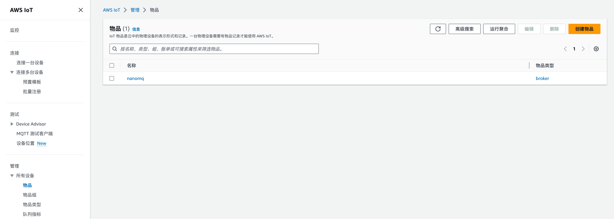
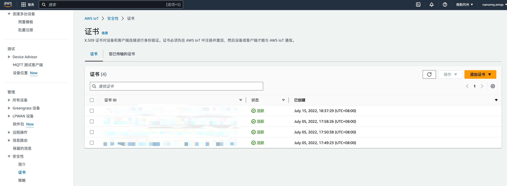
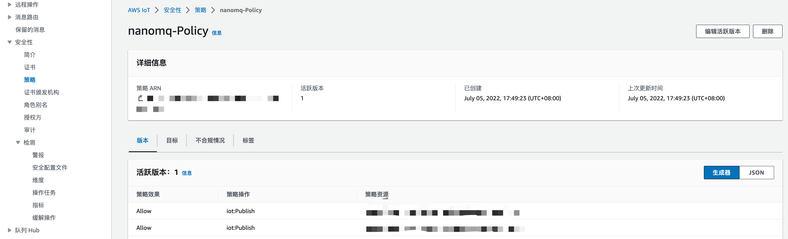
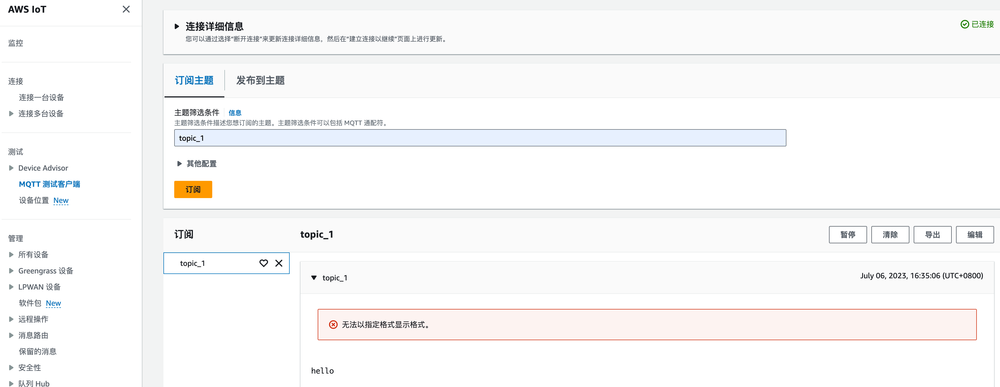

# AWS IoT Core 桥接

[AWS IoT Core](https://docs.aws.amazon.com/zh_cn/iot/latest/developerguide/protocols.html) 是在欧美广泛使用的公有云 IoT 服务之一。但由于其与标准 MQTT 协议多有不同，且不支持 QoS 2 消息，因此许多使用标准 MQTT SDK 的客户端设备无法无缝兼容。

NanoMQ 现已内置 AWS IoT Core 桥接功能，帮助用户解决兼容性问题。**NanoMQ** 负责将接收到的指定 *topic* 的数据转发到远端 **AWS IoT MQTT Broker**，同时也从该 Broker 订阅特定 *topic*，以便接收数据并转发到本地。

由于 AWS IoT SDK 与 NanoMQ 的 QUIC 依赖项-MsQUIC 在 OpenSSL 引用版本上冲突，故 NanoMQ 并未将此桥接功能默认开启和打包进入标准发行包。如希望启用 AWS IoT Core 桥接，请通过编译方式安装 NanoMQ，本部分文档将介绍如何启用 AWS IoT Core、通过配置文件 `nanomq.conf` 进行配置以及对新建桥接进行测试。

## 安装 AWS IoT Core 桥接

首先，在开发环境中安装 AWS 的 IoT Device SDK。

### 安装 AWS SDK

```awk
## 下载源码
wget https://github.com/aws/aws-iot-device-sdk-embedded-C/releases/download/202108.00/aws-iot-device-sdk-embedded-C-202108.00.zip

## 解压
unzip aws-iot-device-sdk-embedded-C-202108.00.zip

## 编译
cd aws-iot-device-sdk-embedded-C
mkdir build && cd build
cmake -G Ninja -DBUILD_DEMOS=OFF -DCMAKE_C_STANDARD=99 -DINSTALL_TO_SYSTEM=ON ..
ninja

## 安装到系统
sudo ninja install 
sudo cp ../demos/logging-stack/logging_*.h  /usr/local/include/aws/
sudo ldconfig
```

关于 AWS SDK 的更多信息请参考 [GitHub 页面](https://github.com/aws/aws-iot-device-sdk-embedded-C)

### 编译安装 NanoMQ

```bash
git clone https://github.com/emqx/nanomq.git 
## 拉取 NanoNNG submodule，可以不拉取 MsQUIC
cd nanomq git submodule update --init --recursive
mkdir build && cd build 
## 编译选项支持AWS桥接 (需确保关闭QUIC桥接)
cmake -G Ninja -DENABLE_AWS_BRIDGE=ON -DNNG_ENABLE_QUIC=OFF .. 
sudo ninja install
```

## 配置 AWS IoT Core

此处介绍如何在 AWS IoT Core 侧进行相关配置。注意：配置信息可能由于 AWS 服务的更新和修改而失效。详细配置方式请参考[官方页面](https://aws.amazon.com/cn/iot-core/resources/)。

1. 在 **管理** -> **所有设备** -> **物品** 界面创建您的物品组和物品，以及对应的证书/主题/设备影子等等。

   

   

2. 在 **安全性** -> **证书** 处下载相关的 CRT 证书，并将策略附加到证书上，证书附加到物品上。

   

   

3. 在 **安全性**-> **策略** 处创建对应的 MQTT 客户端行为鉴权策略，此处需要定义 NanoMQ 桥接所需要的客户端标识和发布/订阅的主题。

   


## 配置 NanoMQ MQTT 桥接

启动 AWS IoT Core 桥接功能模块后，您需要在配置文件中修改桥接功能和对应的参数和主题，例如，在下面的配置文件中，我们定义了 AWS IoT Core 桥接的服务器域名、连接凭证、连接参数、消息转发规则、订阅主题和队列长度等内容。注意：在配置文件中的 MQTT ClientID，证书文件和订阅/发布主题需要与在 AWS IoT Core 侧定义的策略定义相匹配，否则会出现数据不通和连接被拒绝的情况。

:::: tabs type:card

::: tab HOCON 配置格式

希望使用 HOCON 配置格式的用户，可参考以下格式，将配置写入 `nanomq.conf`文件，相关设置将在 NanoMQ 重启后生效。

- 完整的配置项列表，可参考 [配置说明](../config-description/bridges.md)

- NanoMQ 0.14 ~ 0.18 版本用户，可参考 [配置说明 - v0.14](../config-description/v014.md)

```bash
# # c1 is the node name, you can setup multiple bridging targer with different node name
bridges.aws.c1 {
	server = "$HOST_URL:8883"
	proto_ver = 4
	clientid = "aws_bridge_client"
	keepalive = 60s
	clean_start = true
	
	ssl {
	# # Ssl key password
	# # String containing the user's password. Only used if the private keyfile
	# # is password-protected.
	# #
	# # Value: String
	# key_password = "yourpass"
	# # Ssl keyfile
	# # Path of the file containing the client's private key.
	keyfile = "/etc/certs/key.pem"
	# # Ssl cert file
	# # Path of the file containing the client certificate.
	certfile = "/etc/certs/cert.pem"
	# # Ssl ca cert file
	# # Path of the file containing the server's root CA certificate.  
	# # This certificate is used to identify the AWS IoT server and is publicly
	# # available.
	cacertfile = "/etc/certs/cacert.pem"
	}
	forwards = [
		{
			remote_topic = "fwd/topic1"
			local_topic = "topic1"
		},
		{
			remote_topic = "fwd/topic2"
			local_topic = "topic2"
		}
	]

	subscription = [
		{
			remote_topic = "cmd/topic1"
			local_topic = "topic3"
			qos = 0
		},
		{
			remote_topic = "cmd/topic2"
			local_topic = "topic4"
			qos = 1
		}
	]
	max_parallel_processes = 2
}
```

:::

::: tab 经典 KV 配置格式

希望使用 KV 配置格式的用户，可参考以下格式，将配置写入 `nanomq_old.conf `文件，相关设置将在 NanoMQ 重启后生效。

完整的配置项列表，可参考 [经典 KV 格式配置说明](../config-description/v013.md)

```bash
aws.bridge.mqtt.aws.host=$YOUR_HOST_URL
aws.bridge.mqtt.aws.port=8883
aws.bridge.mqtt.aws.proto_ver=4
aws.bridge.mqtt.aws.bridge_mode=true
aws.bridge.mqtt.aws.clientid=aws_bridge_client
aws.bridge.mqtt.aws.keepalive=60
aws.bridge.mqtt.aws.clean_start=true
aws.bridge.mqtt.aws.forwards.1.remote_topic=fwd/topic_1
aws.bridge.mqtt.aws.forwards.1.local_topic=topic_1
aws.bridge.mqtt.aws.subscription.1.remote_topic=cmd/topic1
aws.bridge.mqtt.aws.subscription.1.local_topic=topic1
aws.bridge.mqtt.aws.subscription.1.qos=1
aws.bridge.mqtt.aws.parallel=2
aws.bridge.mqtt.aws.tls.enable=true
## aws.bridge.mqtt.aws.tls.key_password=yourpass
aws.bridge.mqtt.aws.tls.keyfile=$PATH_TO_YOUR_KEY.pem.key
aws.bridge.mqtt.aws.tls.certfile=$PATH_TO_YOUR_CERT.pem.crt
aws.bridge.mqtt.aws.tls.cacertfile=$PATH_TO_YOUR_CA.pem
aws.bridge.mqtt.aws.tls.verify_peer=false
aws.bridge.mqtt.aws.tls.fail_if_no_peer_cert=false
```

:::

::::

::: tip 

不同于标准 MQTT Broker，AWS IoT Core 强制要求开启 SSL/TLS 加密验证，且证书和客户端标识符需与云端配置对应。

:::

**关键配置项：**

- `aws.bridge.mqtt.aws.host`：远端 AWS IoT Core 服务URL，需从 AWS IoT Core Dashboard 获取。
- `aws.bridge.mqtt.aws.clientid`：桥接客户端的标识符，需要与安全性策略中的 ` iot:Connect`  里规定的 client 相匹配。
- 当你在 NanoMQ 中设置发布/订阅的 Topic 和 QoS 时，要确保它们与你在 AWS IoT 安全策略中设定的 `iot:Subscribe`，`iot:Publish`，`iot:Receive`，`iot:RetainPublish` 一致。否则，可能会因为权限不匹配，而导致消息不能正常发送或接收，相关配置项如下：
  - 发布主题：`aws.bridge.mqtt.aws.forwards.1.remote_topic`
  - 远端主题对应的本地主题：`aws.bridge.mqtt.aws.forwards.1.local_topic`
  - 订阅主题：`aws.bridge.mqtt.aws.subscription.1.remote_topic`
  - 远端主题对应的本地主题：`aws.bridge.mqtt.aws.subscription.1.local_topic`
  - 消息 QoS：`aws.bridge.mqtt.aws.subscription.1.qos`

- 当你在 NanoMQ 中配置 SSL/TLS 证书时，需要保证这些证书文件与在 AWS IoT Core Dashboard 中创建的物品类型所需要的证书相匹配，相关配置项如下：
  - `aws.bridge.mqtt.aws.tls.keyfile`
  - `aws.bridge.mqtt.aws.tls.certfile`
  - `aws.bridge.mqtt.aws.tls.cacertfile`


### 启动 NanoMQ 开始桥接

启动 NanoMQ 时使用 `--conf` 指定配置文件路径（若配置文件已放置于系统路径 `etc` 则无需在命令行指定）。

:::: tabs type:card

::: tab Hocon 配置格式

```bash
$ nanomq start --conf nanomq.conf
```

:::

::: tab 经典 KV 配置格式

```bash
$ nanomq start --old_conf nanomq.conf
```

:::

::::

## 测试桥接

用户可以在 AWS IoT Core 的 MQTT 测试客户端工具上验证桥接是否成功。

如在本地向 NanoMQ 的桥接主题 `topic1`发布一条消息 `hello`：

```bash
$ ./nanomq_cli pub -h "local.broker.address"  -t "topic1" -m "hello" -q 1
```

即可在AWS 界面看到：



NanoMQ 相关运行 Log：

```bash
establish_mqtt_session: MQTT connection successfully established with broker.
subscribe_to_topic: SUBSCRIBE to broker successfully.
event_cb: Subscribed to the topic successfully.

```

