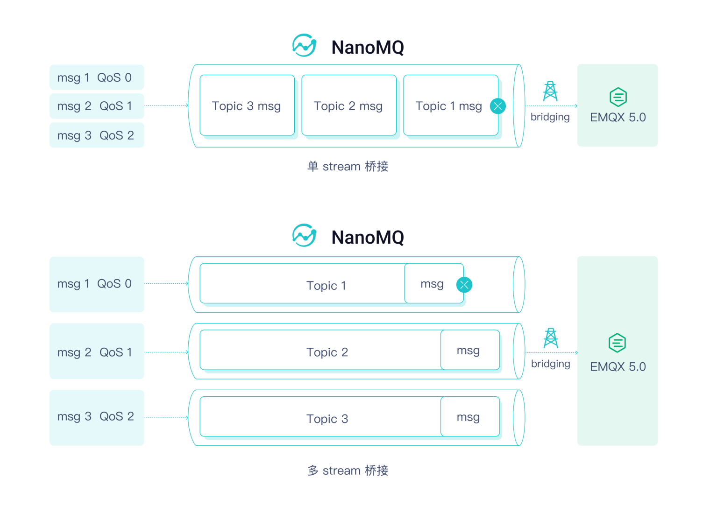

# MQTT over QUIC 桥接

NanoMQ 已支持 MQTT over QUIC 桥接，用户可以使用 QUIC 作为 MQTT 协议的传输层来与 EMQX 5.0 消息服务建立桥接进行数据同步，从而为无法集成或找到合适的 MQTT over QUIC SDK 的端侧设备和难以修改固件的嵌入式设备提供在 IoT 场景利用 QUIC 协议优势的捷径。依靠 EMQX+NanoMQ 的云边一体化的消息架构，用户能够快速且低成本的在泛物联网场景中完成跨时空地域的数据采集和同步需求。


QUIC 桥接具有以下独特的优势和特性：

- 多流传输 ： 自动创建 主题-流 的配对，避免 TCP 的队头阻塞问题。
- 混合桥接模式 ： 能够根据 QUIC 传输层的连接情况自动降级到 TCP 以保证通道可用。
- QoS 消息优先传输：能够给 QoS 消息赋予高优先级，使其在网络带宽有限的情况下优先得到传输。
- 0-RTT 快速重连： QUIC 连接断开时，能够以 0-RTT （Round Trip Time）的低时延快速重连。

## 启用 MQTT over QUIC 桥接

NanoMQ 的 QUIC 模组处于默认关闭状态，如希望使用 MQTT over QUIC 桥接，请通过[编译方式安装 NanoMQ](../installation/build-options.md)，并在编译时启用 QUIC 模组：

```bash
$ git clone https://github.com/emqx/nanomq.git
$ cd nanomq 
## 使用国内网络拉取 MSQUIC submodule 可能耗时较久
$ git submodule update --init --recursive
$ mkdir build && cd build
## 默认编译`msquic`为动态库，如需设置编译目标为静态库则添加 cmake 编译选项 `-DQUIC_BUILD_SHARED=OFF`
$ cmake -G Ninja -DNNG_ENABLE_QUIC=ON ..
$ sudo ninja install
```

::: tip

对于 macOS 系统，只可以通过 `make` 进行编译，并且设置单线程模式，命令如下：

```bash
$ git clone https://github.com/emqx/nanomq.git
$ cd nanomq 
$ git submodule update --init --recursive
$ mkdir build && cd build
$ cmake -DNNG_ENABLE_QUIC=ON ..
$ make -j1
```

:::

### 配置 MQTT over QUIC 桥接

### 前置准备

配置 MQTT over QUIC 桥接前，应先安装 EMQX 5 来提供消息服务，有关如何在 EMQX 中启用 QUIC 桥接，可参考 [EMQX - MQTT over QUIC 教程](https://docs.emqx.com/zh/enterprise/v5.0/mqtt-over-quic/getting-started.html)。

### 配置桥接 

启动 QUIC 模组后，您需要在 `nanomq.conf ` 文件中配置 MQTT over QUIC 桥接功能和对应的主题，例如，在下面的配置文件中，我们定义了 MQTT over QUIC 桥接的服务器地址、连接凭证、连接参数、消息转发规则、订阅主题和队列长度等内容：

:::: tabs type:card

::: tab Hocon 配置格式

希望使用 HOCON 配置格式的用户，可参考以下格式，将配置写入 `nanomq.conf`文件，相关设置将在 NanoMQ 重启后生效。

- 完整的配置项列表，可参考[配置说明 - v019](../config-description/bridges.md)

- NanoMQ 0.14 ~ 0.18 版本用户，可参考 [配置说明 - v0.14](../config-description/v014.md)

```bash
bridges.mqtt.name {
	## TCP URL 格式:  mqtt-tcp://host:port
	## TLS URL 格式:  tls+mqtt-tcp://host:port
	## QUIC URL 格式: mqtt-quic://host:port
	server = "mqtt-quic://your_server_address:port"
	proto_ver = 4
	username = emqx
	password = emqx123
	clean_start = true
	keepalive = 60s
	forwards = [
		{
			remote_topic = "fwd/topic1"
			local_topic = "topic1"
			qos = 1
		},
		{
			remote_topic = "fwd/topic2"
			local_topic = "topic2"
			qos = 2
		}
	]
    ## 如果通过 TLS 桥接将下面的代码取消注释
    ## ssl {
    ##     keyfile = "/etc/certs/key.pem"
    ##     certfile = "/etc/certs/cert.pem"
    ##     cacertfile = "/etc/certs/cacert.pem"
    ## }

	quic_keepalive = 120s
	quic_idle_timeout = 120s
	quic_discon_timeout = 20s
	quic_handshake_timeout = 60s
	hybrid_bridging = false
	subscription = [
		{
			remote_topic = "cmd/topic1"
			local_topic = "topic3"
			qos = 1
		},
		{
			remote_topic = "cmd/topic2"
			local_topic = "topic4"
			qos = 2
		}
	]
	max_parallel_processes = 2 
	max_send_queue_len = 1024
	max_recv_queue_len = 1024
}
```

:::

::: tab 经典 KV 配置格式

希望使用 KV 配置格式的用户，可参考以下格式，将配置写入 `nanomq_old.conf `文件，相关设置将在 NanoMQ 重启后生效。

完整的配置项列表，可参考[经典 KV 格式配置说明](../config-description/v013.md)

```bash
bridge.mqtt.emqx.bridge_mode=true
bridge.mqtt.emqx.address=mqtt-quic://your_server_address:port
bridge.mqtt.emqx.proto_ver=4
bridge.mqtt.emqx.quic_keepalive=120
bridge.mqtt.emqx.quic_idle_timeout=120
bridge.mqtt.emqx.hybrid_bridging=false
bridge.mqtt.emqx.quic_multi_stream=false
bridge.mqtt.emqx.clientid=bridge_client
bridge.mqtt.emqx.clean_start=false
bridge.mqtt.emqx.forwards=topic1/#,topic2/#
bridge.mqtt.emqx.subscription.1.topic=cmd/topic1
bridge.mqtt.emqx.subscription.1.qos=1
bridge.mqtt.emqx.parallel=2
bridge.mqtt.emqx.max_send_queue_len=32
bridge.mqtt.emqx.max_recv_queue_len=128
```

:::

::::

::: tip 

使用 `mqtt-quic` 作为 URL 前缀即是采用 QUIC 作为 MQTT 的传输层。

:::

**关键配置项：**

- 远端 broker 地址: `bridges.mqtt.name.server`
- 转发远端 Topic 数组（支持 MQTT 通配符）:  `bridges.mqtt.name.forwards`
- 订阅远端 Topic 数组（支持 MQTT 通配符）: `bridges.mqtt.name.subscription`

**QUIC 专用配置项**

- 混合桥接模式开关：`bridges.mqtt.name.hybrid_bridging`
- 多流桥接开关: `bridges.mqtt.name.multi_stream`


具体配置参数请参考桥接 [Hocon 版本配置](../config-description/bridges.md) 或 [旧版本配置](../config-description/v013.md) (*不推荐*)

如使用 Hocon 版本配置项 NanoMQ 版本在 0.19 及以上，除将相关配置直接写入  `nanomq.conf ` 中外，您也可单独为桥接定义一份配置文件，如 `nanomq_bridge.conf` ，然后通过 HOCON 的 `include` 语法在 `nanomq.conf` 中引用此文件：

示例：

```shell
include "path/to/nanomq_bridge.conf" 
```

如需查看运行过程中更多日志数据，可以在配置文件中设置日志等级 `log.level`

## 启动 NanoMQ

启动 NanoMQ 时使用`--conf` 指定配置文件路径（若配置文件已放置于系统路径 `/etc/nanomq.conf` 则无需在命令行指定）。

:::: tabs type:card

::: tab Hocon 配置格式

```bash
$ nanomq start --conf nanomq.conf
```

:::

::: tab 经典 KV 配置格式

```bash
$ nanomq start --old_conf nanomq.conf
```

:::

::::

## 测试桥接

本节将通过 NanoMQ 自带的客户端工具测试测试新建的 MQTT over QUIC 桥接，我们将新建 2 个连接，分别连接到 NanoMQ 和 MQTT over QUIC 数据桥接，用于验证 NanoMQ 和数据桥接的消息收发服务。

### 测试消息转发

1. 为远端 EMQX Broker 订阅消息主题：

   为 **EMQX** 订阅转发主题 “`forward1/#`”，用于接收由 **NanoMQ **转发的数据：

   新建一个命令行窗口，前往 build 文件夹下的 nanomq_cli 文件夹，执行以下命令进行订阅：

   ```bash
   ## -h {host} 
   ## -p {端口号，如不指定将使用默认端口号 1883（MQTT）或 14567（QUIC）}
   ## -t {主题名称}
   ## --quic {开启 quic}
   ## -q {消息 QoS，可选值 0、1、2}
   ## -m {消息 payload}
   ## -u {用户名} 
   ## -P {密码}
   $ ./nanomq_cli sub --quic -h "remote.broker.address"  -t "forward1/#" -q 2
   ```

2. 新建一个命令行窗口，发布消息到 **NanoMQ** Broker，主题为 “`forward1/msg`”：

   ```bash
   $ ./nanomq_cli pub -h "local.broker.address"  -t "forward1/msg" -m "forward_msg" -q 2
   ```

3. 返回第一个命令行窗口，可以看到由 NanoMQ Broker 转发到消息，例如：

   ```bash
   quic_msg_recv_cb: forward1/#: forward_msg
   ```

### 测试消息接收

1. 为本地 NanoMQ Broker 订阅消息主题：

   为 **NanoMQ** 订阅主题 “`cmd/topic1`”，用于接收 **EMQX** 发布的数据：

   在第二个命令行窗口中，前往 build 文件夹下的 nanomq_cli 文件夹，执行以下命令进行订阅：

   ```bash
   $ ./nanomq_cli sub -h "local.broker.address"  -t "recv/topic1" -q 2
   ```
   
2. 在第一个命令行窗口，发布消息到远端 **EMQX** Broker，主题为 “`cmd/topic1`”：

   ```bash
   $ ./nanomq_cli pub --quic -h "remote.broker.address" -p 14567 -t "recv/topic1" -m "cmd_msg" -q 2 -u emqx -P emqx123
   ```
   
3. 返回第二个命令行窗口，将能看到远端 **EMQX** Broker 发送的消息，例如：

   ```bash
   quic_msg_recv_cb: recv/topic1: cmd_msg
   ```

## QUIC 多流桥接

QUIC 协议相较于 TCP 的一大优势在于解决了队首阻塞的问题，但这是依赖于 QUIC 的单链接多 Stream 特性的。针对网络拥塞或者网络抖动等情况，NanoMQ 和 EMQX 5.0 一起设计和引入了 Mutli-stream QUIC 协议标准，以提供更好消息传输体验。



### 启用多流桥接 + QoS 消息优先传输

如希望使用多流桥接，只需打开对应的配置选项：

:::: tabs type:card

::: tab Hocon 格式配置

```bash
quic_multi_stream = true
quic_qos_priority=true
```

:::

::: tab 旧版本配置

```bash
## multi-stream: enable or disable the multi-stream bridging mode
## Value: true/false
## Default: false
bridge.mqtt.emqx.quic_multi_stream=true

## 在流中是否赋予Qos消息高传输优先级
## 针对每个流单独生效，非主题优先级
## Value: true/false
## Default: true
bridge.mqtt.emqx.quic_qos_priority=true
```

:::

::::

之后根据用户 Pub/Sub 的具体主题会建立对应的 Stream，可以在 log 中检查功能是否生效，如订阅 nanomq/1 主题就会自动创建一个 data stream：

```bash
quic_ack_cb: Quic bridge client subscribe to topic (QoS 1)nanomq/1.
mqtt_sub_stream: topic nanomq/1 qos 1
bridge client is connected!
quic_pipe_open: [strm][0x618000020080] Starting...
quic_pipe_open: [strm][0x618000020080] Done...
quic_strm_cb: quic_strm_cb triggered! 0
decode_pub_message: topic: [$SYS/brokers/connected], qos: 0
mqtt_sub_stream: create new pipe 0x61c000020080 for topic nanomq/1
quic_strm_cb: QUIC_STREAM_EVENT_START_COMPLETE [0x618000020080] ID: 4 Status: 0
```

之后 NanoMQ 就会自动根据 Topic 将数据包导流至不同的 Stream 发送。经过内部测试，在使用模拟 2s 延迟和 40% 丢包的弱网环境时，多流桥接可以显著降低延时。
同时，QoS 1/2 消息报文享有相较于 QoS 0 更高的优先级，用户可基于此更好地分配和管理网络带宽的使用，将有限且宝贵的带宽资源留给更有价值的数据，避免因网络拥塞导致造成的高价值数据的丢失。
