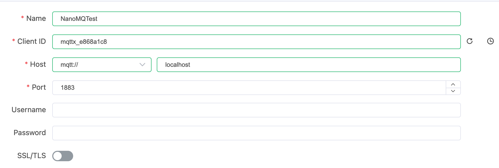
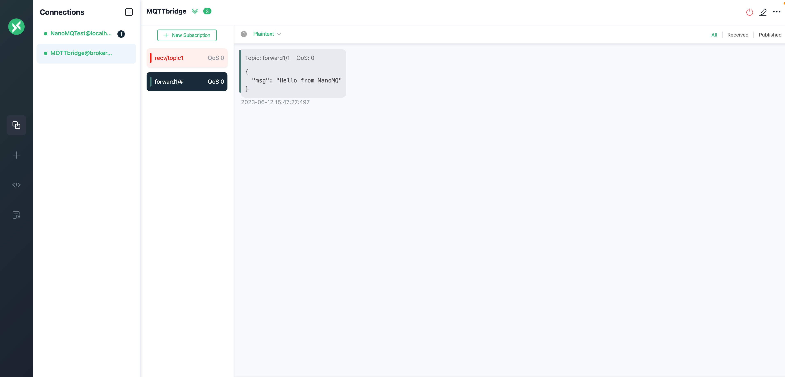
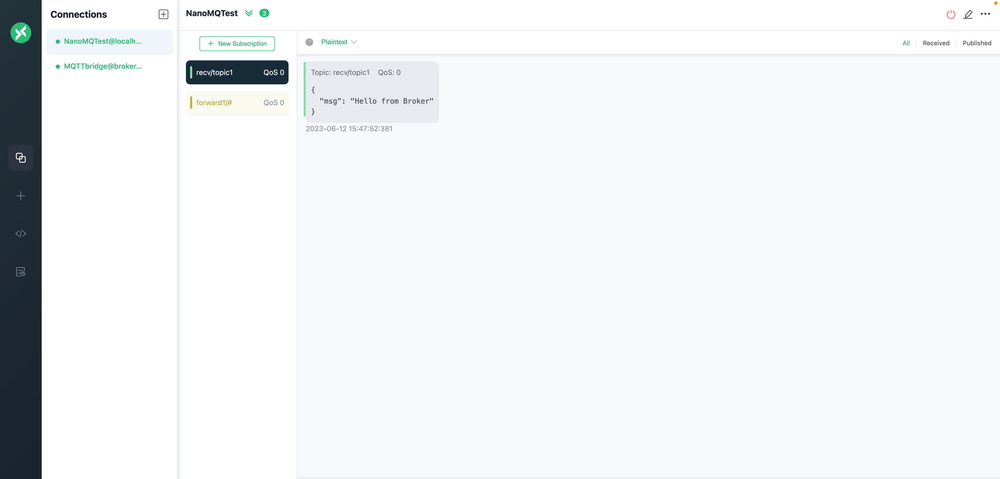

# 快速上手

NanoMQ MQTT Broker (NanoMQ) 是一款用于物联网边缘的超轻量级 MQTT 消息服务器。本指南将以 Docker 部署为例，演示如何快速上手 NanoMQ。

## 通过 Docker 运行NanoMQ

运行以下命令快速通过 Docker 运行 NanoMQ，分别指定端口 1883、8083 和 8883 用于监听 MQTT、MQTT over WebSockets 和 MQTT over SSL/TLS 流量。

```bash
docker run -d --name nanomq -p 1883:1883 -p 8083:8083 -p 8883:8883 emqx/nanomq:latest
```

更多关于 NanoMQ 官方 Docker 镜像的信息，请访问 [Docker Hub - nanomq](https://hub.docker.com/r/emqx/nanomq)

## 体验 NanoMQ 消息服务

通过 Docker 启动 NanoMQ 后，本节将演示如何通过 [MQTTX 客户端工具](https://mqttx.app/zh) 来体验 NanoMQ 的消息服务。首先，下载并安装 [MQTTX 桌面客户端](https://mqttx.app/zh/downloads)。

### 通过 MQTT X 连接 NanoMQ

打开主程序页面，点击左侧菜单栏的 `+` 按钮。如果页面为空，您也可以直接点击右侧的 **新建连接** 按钮来快速设定新的客户端连接。



1. 在**名称**字段，输入连接名称。
2. MQTTX 会自动填入一个客户端 ID。
3. 在**服务器地址**字段设置协议和服务器地址：这里将选择 MQTT 作为协议，并填入 `localhost` （或 Docker 实际运行的 IP）。
4. 将**端口**设为 1883 (或根据实际需要设置)。

然后点击右上角的**连接**，MQTTX 会通过弹窗的形式提示连接已成功建立。

### 订阅主题

连接成功后，即可进入连接的主界面。点击页面右上角的**添加订阅**按钮，在弹出的对话框中：

- 输入您想订阅的主题，如 `test/topic` ，其他字段可保留默认设置。
-  单击**确认**。

### 发布信息

在连接主界面右下角的消息对话框中，设置消息主题和内容：

- 指定你要发布的主题，例如 `test/topic` 。
- 输入你想发送的消息，例如，"Hello NanoMQ"。
- 点击发送图标。

对话框区域将出现一条消息，表明该消息已成功发布到 NanoMQ 并被转发到订阅主题。


## 快速上手数据桥接

本教程将继续演示如何搭建一个 MQTT over TCP 数据桥接。

### 拉取 NanoMQ Docker 镜像

从 Docker Hub 拉取最新的 NanoMQ 镜像：

```bash
docker pull emqx/nanomq:latest
```

### 创建 NanoMQ 配置文件

在本地新建 NanoMQ 配置文件，用于保存 NanoMQ 的订阅和桥接配置。这里将使用 EMQ 提供的[免费公共桥接 broker.emqx.io:1883](https://www.emqx.com/zh/mqtt/public-mqtt5-broker) 来构建 MQTT over TCP 数据桥接。

使用文本编辑器创建一个名为 `nanomq.conf` 的新文件， 贴入以下桥接配置：

```bash
bridges.mqtt.emqx1 {
	# # Bridge address: host:port .
	# #
	# # Value: String
	# # Example: mqtt-tcp://127.0.0.1:1883
	# #          tls+mqtt-tcp://127.0.0.1:8883
	# #          mqtt-quic://54.75.171.11:14567
	server = "mqtt-tcp://broker.emqx.io:1883"
	# # Protocol version of the bridge.
	# #
	# # Value: Enum
	# # - 5: mqttv5
	# # - 4: mqttv311
	# # - 3: mqttv31
	proto_ver = 4
	# # The ClientId of a remote bridge.
	# # Default random string.
	# #
	# # Value: String
	# clientid="bridge_client"
	# # Ping: interval of a downward bridge.
	# #
	# # Value: Duration
	# # Default: 10 seconds
	keepalive = 60s
	# # The Clean start flag of a remote bridge.
	# #
	# # Value: boolean
	# # Default: false
	# #
	# # NOTE: Some IoT platforms require clean_start
	# #       must be set to 'true'
	clean_start = false
	# # The username for a remote bridge.
	# #
	# # Value: String
	username = username
	# # The password for a remote bridge.
	# #
	# # Value: String
	password = passwd
	# # Topics that need to be forward to IoTHUB
	# #
	# # Value: String
	# # Example: topic1/#,topic2/#
	forwards = [
		{
			remote_topic = "fwd/topic1"
			local_topic = "topic1"
			qos = 1
		},
		{
			remote_topic = "fwd/topic2"
			local_topic = "topic2"
			qos = 2
		}
	]

	subscription = [
		{
			# # Need to subscribe to remote broker topics
			# #
			# # Value: String
			remote_topic = "cmd/topic1"
			local_topic = "topic3"
			# # Need to subscribe to remote topics QoS.
			# # Please set QoS for each subscription topic
			# # otherwise topic is invalid, NanoMQ won't sub to any topic
			# # Value: Number
			qos = 1
		},
		{
			remote_topic = "cmd/topic2"
			local_topic = "topic4"
			qos = 2
		}
	]
	# # max_parallel_processes
	# # Handle a specified maximum number of outstanding requests
	# #
	# # Value: 1-infinity
	max_parallel_processes = 2
	# # max send queue length
	# # Handle a specified maximum number of message send queue length
	# #
	# # Value: 1-infinity
	max_send_queue_len = 32
	# # max receive queue length
	# # Handle a specified maximum number of message receive queue length
	# #
	# # Value: 1-infinity
	max_recv_queue_len = 128
}
```

### 通过配置文件启动 NanoMQ

通过 Docker 启动 NanoMQ，其中通过 `-v` 将本地配置文件加载到 Docker：

```bash
docker run -d -p 1883:1883 \
           -v /path/to/your/nanomq.conf:/etc/nanomq.conf \
           --name nanomq emqx/nanomq:latest
```

::: tip

将 `/path/to/your/nanomq.conf` 替换为 `nanomq.conf` 文件的实际路径。

:::

### 客户端上线/下线事件消息

由于 NanoMQ 内置的 Actor 模型和全异步 I/O， 可以支持事件驱动的消息模式。可以通过订阅系统事件主题来获取上下线的消息。桥接通道的上下线也会在此系统事件主题中发布对应的消息，只需根据桥接客户端ID来分辨即可。

上线消息：

```bash
Topic: $SYS/brokers/connected
Message: {"username":"hello", "ts":1691225605933,"proto_name":"MQTT","keepalive":60,"return_code":"0","proto_ver":4,"client_id":"nanomq-8a2a5c2e","clean_start":1, "IPv4":"127.0.0.1"}
```

下线消息：

```bash
Topic: $SYS/brokers/disconnected
Message: {"username":"hello","ts":1691225608391,"reason_code":"8b","client_id":"nanomq-8a2a5c2e","IPv4":"127.0.0.1"}
```

### 测试桥接

本节将继续使用 MQTTX 客户端工具来测试新建的 MQTT 数据桥接，我们将新建 2 个连接，分别连接到 NanoMQ 和 MQTT 数据桥接，用于验证 NanoMQ 和数据桥接的消息收发服务。

**连接到 NanoMQ**


**连接到数据桥接**


**验证 NanoMQ 到数据桥接的消息服务**

在连接数据桥接的客户端 `MQTTbridge` 中，订阅 `forward1/#` 主题。

在连接 NanoMQ 的客户端 `NanoMQTest` 中，向 `forward1/#` 主题发送消息 ，如 `Hello from NanoMQ` 。

可以看到，消息被成功转发到 MQTT 数据桥接。



**验证数据桥接到  NanoMQ 的消息服务**

在连接 NanoMQ 的客户端 `NanoMQTest` 中，订阅 `recv/topic1` 主题。

在连接数据桥接的客户端 `MQTTbridge` 中，向 `recv/topic1` 主题发布信息，例如： `Hello from broker.emqx.io` 。

验证是否收到了 broker.emqx.io 发布的消息。


