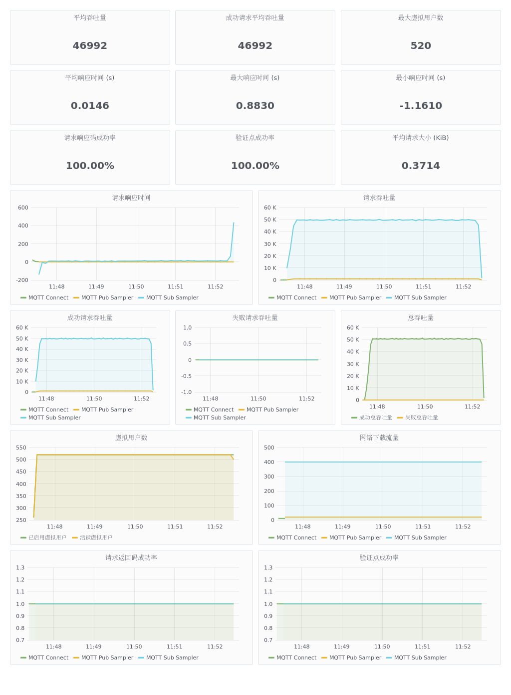
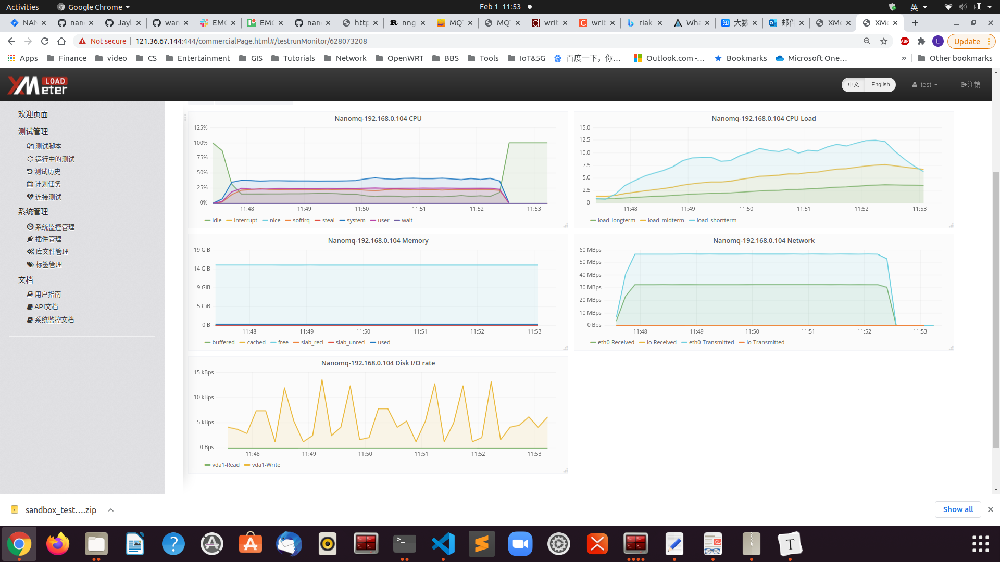
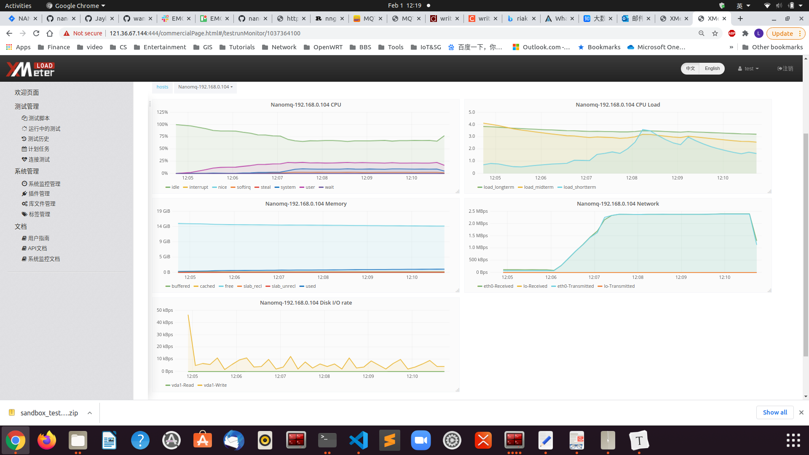

# NanoMQ 测试报告

## 关于NanoMQ

NanoMQ是于2020年7月开始开发的边缘计算开源项目，是面向物联网边缘计算场景的下一代轻量级高性能MQTT消息服务器。

NanoMQ目标致力于为不同的边缘计算平台交付简单且强大的消息中心服务；站在物联网的十字路口，努力弥和硬件开发与云计算的隔阂；从开源社区出发，连接物理世界和数字智能；从而普及边缘计算应用，助力万物互联愿景。

NanoMQ与NNG深度合作，NanoMQ基于NNG异步IO和多线程模型面向MQTT协议深度优化后诞生。依靠NNG出色的网络API设计，所以NanoMQ自身可以专注于MQTT服务器性能和更多的拓展功能。目标在边缘设备和MEC提供更好的SMP支持和极高的性能性价比。

目前NanoMQ具有的功能和特性有：

完整支持MQTT 3.1.1协议。 由于项目只依赖原生POSIX API， 纯C/C++开发，从而具有极高兼容性和高度可移植性。NanoMQ内部为全异步IO和多线程并行，所以对SMP有良好支持，同时做到了低延时和高吞吐。对于资源利用具有高性价比，适用于各类边缘计算平台。

## 测试结果概述

为保证测试结果一致性和可信度。未针对特定硬件设备测试。

本次测试在华为云/移动端平台上进行，主要进行了广播和一对一收发的 MQTT 消息吞吐测试，相关的测试结果如下所示。

***注：如果不做特别说明，所有的连接默认都设置了******300******秒的******Ping*** ***消息包。***

## 测试工具

- XMeter企业版2.0.1： [https://www.xmeter.net](https://www.xmeter.net/)

XMeter 是一个性能测试管理平台，基于开源的 JMeter 性能测试工具。XMeter可以支持大规模、高并发的性能测试，比如实现千万级别的MQTT 并发连接测试。除了测试 MQTT 协议之外，还可以支持 HTTP/HTTPS 等主流的应用的测试。

- JMeter-MQTT插件：mqtt-xmeter-1.13 – <https://github.com/emqx/mqtt-jmeter>

由 XMeter 实现的开源MQTT 性能测试插件，在众多的项目中得到了使用，目前是JMeter 社区中流行度最高的MQTT插件。

- JMeter版本:  JMeter5.0 – <https://jmeter.apache.org>
- emqtt-benchmark-tools: <https://github.com/emqtt/emqtt_benchmark>

由EMQ 实现的用于模拟大量 MQTT 连接的测试工具。

## 测试环境

本次测试针对低配置和高配置以及移动端平台分别作了测试。故环境有3套。

华为云中的测试部署图如下所示，本次测试中使用了 EMQ Benchmark Tools 来模拟大量的 MQTT 连接；而 XMeter 提供的基于 JMeter MQTT 插件的测试工具来模拟业务测试场景；XMeter 内置支持的监控工具用于监控运行nanomq的服务器资源使用情况，同时对比操作系统自带的信息。

图

### 测试平台

#### 服务器环境\*1

- NANOMQ版本: 0.2.5
- 被测试机（1台）  
  - 操作系统：CentOS Linux release 7.4.1708
  - CPU：8核16线程  Intel(R) Xeon(R) Gold 6266C CPU @ 3.00GHz
  - 内存：16 G
  - 磁盘：120GB
- 压力机

  - 10台用于XMeter连接NANOMQ，模拟业务数据收发

  - 操作系统：CentOS Linux release 7.4.1708
    - CPU：8核
    - 内存：16 G
    - 磁盘：120GB

- 网络连接：华为云内网连接

该测试环境执行了以下的测试场景：

- Pub消息测试
- 广播消息测试

#### 服务器环境\*2

- NANOMQ版本: 0.2.5
- 被测试机: 1台  

  - 操作系统：CentOS Linux release 7.4.1708
  - CPU：1核2线程
  - 内存：2G
  - 磁盘：120GB

- 压力机： 4台

  - 操作系统：CentOS Linux release 7.4.1708
  - CPU：8核
  - 内存：16G
  - 磁盘：120GB

- 网络连接：华为云内网连接

该测试环境执行了以下的测试场景：

- Pub消息测试
- 广播消息测试

#### 服务器环境\*3

- NANOMQ版本: 0.2.5
- 被测试机: 1台  移动端边缘计算服务器

  - 操作系统：Ubuntu 20.04
  - CPU：6核12线程
  - 内存：16 G
  - 磁盘：256GB

- 压力机： 2台

  - 操作系统：Ubuntu 20.04
  - CPU：6核12线程  Intel(R) Core(TM) i7-10710U CPU @ 1.10GHz
  - 内存：16 G
  - 磁盘：256GB

- 网络连接：内网连接

该测试环境执行了以下的测试场景：

- 百万吞吐广播测试

### 多对多广播场景

#### 测试场景信息

500个客户端同时订阅3个不同的主题，由20个客户端向500个客户端订阅的3个主题分别发布广播QOS 0 消息，每个pub客户端发布消息的频率为20ms或50 msg/sec。即理论吞吐为20 x 50 x 500 = 500000 msg/sec

NANOMQ配置：

-DNNG_RESOLV_CONCURRENCY=1 -DNNG_NUM_TASKQ_THREADS=16 -DNNG_MAX_TASKQ_THREADS=16 -NNG_ENABLE_STATS=OFF -DNOLOG=1 -DPARALLEL=16 -DNANO_MSQ_LEN=25600 -DDEBUG=0 ..

1. 并行数设置为 16
2. 最大工作线程数为16
3. 关闭统计功能/日志/debug追踪
4. 消息缓存队列长度为25600

此配置启动占用内存约为1400 kb左右

#### 报告解析

如下图所示，XMeter 的性能测试报告分成三大部分。后面报告的结果解读方式都类似，如果没有特别之处，我们不再赘述。

1. ​ 概览：此区域的测试报告将测试步骤中所有的返回结果进行计算。如果测试脚本中有多个步骤（比如包含了连接和消息发布），那么这里的结果是基于这两部的测试结果计算得到。

   1. Avg   throughput 所有请求平均吞吐量
   2. Avg success   throughput 所有请求平均成功吞吐量
   3. Avg failed   throughput 所有请求平均失败吞吐量
   4. Max virtual   user num 最大虚拟用户数
   5. Avg response   time(s) 所有请求平均响应时间
   6. Max response   time(s) 所有请求最大响应时间
   7. Min response   time(s) 所有请求最小请求时间
   8. Response code   succ rate 所有请求成功率
   9. Verification   point succ rate 所有请求验证点成功率
   10. Avg request   size(KiB) 所有请求平均大小

2. 图表区域

   1. Response time   每个请求响应时间
   2. Throughput   每个请求所有吞吐量
   3. Succ   Throughput 每个请求成功吞吐量
   4. Virtual User   虚拟用户数
   5. Response code   succ rate 响应码成功率
   6. Download   bytes 响应数据大小

3. 详细数据（Detailed data 表格）

   1. Page 请求名称
   2. Hit num 运行次数
   3. Max resp time   (s) 最大响应时间
   4. Min resp time   (s) 最小响应时间
   5. Avg resp   time(s) 平均响应时间
   6. Avg   throughput 所有平均吞吐量
   7. Avg succ   throughput 成功平均吞吐量
   8. Avg failure   throughput 失败平均吞吐量
   9. Avg request   size(KiB) 平均大小
   10. Response code   succ rate 响应码成功率
   11. Check point   succ rate 验证点成功率
   12. Check point   failure 验证点错误数
   13. Avg deviation   平均标准差
   14. 90th   percentile(s) 90分位响应时间
   15. Avg 90%(s)    90%平均响应时间

#### 测试结果

如上图所示，脚本的运行过程是在一定时间内完成连接建立（如上图绿色折线“MQTT Connect”所示），然后开始进行消息发送。测试在进入50万/秒吞吐量之后，持续运行5min。吞吐量非常稳定，所有响应都成功。**本测试Sub Sampler收到10次响应统计一次，图表显示吞吐量×10为实际吞吐量。**

| 页面             | 运行次数 | 最大响应时间(s) | 最大成功响应时间(s) | 最小响应时间(s) | 最小成功响应时间(s) | 平均响应时间(s) | 平均成功响应时间(s) | 平均吞吐量(/s) | 平均成功吞吐量(/s) | 平均失败吞吐量(/s) | 平均请求大小(bytes) | 响应码成功率 | 验证点成功数 | 验证点成功率 | 验证点错误数 | 平均标准差 | 90分位响应时间(s) | 90%平均响应时间(s) |
| ---------------- | -------- | --------------- | ------------------- | --------------- | ------------------- | --------------- | ------------------- | -------------- | ------------------ | ------------------ | ------------------- | ------------ | ------------ | ------------ | ------------ | ---------- | ----------------- | ------------------ |
| MQTT Connect     | 520      | 0.05            | 0.05                | 0.001           | 0.001               | 0.0091          | 0.0091              | 34.6667        | 34.6667            | 0                  | 0.0107              | 1            | 520          | 1            | 0            | 9.5076     | 0.003             | 0.002              |
| MQTT Pub Sampler | 285640   | 0.007           | 0.007               | 0               | 0                   | 0               | 0                   | 952.1334       | 952.1334           | 0                  | 0.0195              | 1            | 285640       | 1            | 0            | 0.1432     | 0                 | 0                  |
| MQTT Sub Sampler | 14281227 | 0.883           | 0.883               | -1.161          | -1.161              | 0.0148          | 0.0148              | 47604.09       | 47604.09           | 0                  | 0.3906              | 1            | 14281227     | 1            | 0            | 108.6137   | -                 | -                  |

NANOMQ监控如下

#### 测试结果分析

可见，在广播场景中，nanomq在50万的吞吐压力下能够稳定运行。过程内存消耗为10M左右，每颗CPU只消耗80%左右，工作任务平均分散至每个核心。

#### 测试场景信息

此场景在移动端平台测试。

500个客户端同时订阅同1个主题，由10个客户端向500个客户端订阅的主题发布广播QOS 0/1/2 消息，每个pub客户端发布消息的频率为5ms或200 msg/sec，一共发送50000条消息。即理论吞吐为20 x 50 x 500 = 1000000 msg/sec

NANOMQ配置：

-DNNG_RESOLV_CONCURRENCY=1 -DNNG_NUM_TASKQ_THREADS=12 -DNNG_MAX_TASKQ_THREADS=12 -NNG_ENABLE_STATS=OFF -DNOLOG=1 -DPARALLEL=64 -DNANO_MSQ_LEN=65535 -DDEBUG=0 ..

1. 并行数设置为 64
2. 最大工作线程数为12
3. 关闭统计功能/日志/debug追踪
4. 消息缓存队列长度为65535

此配置启动占用内存约为3000 kb左右

#### 测试结果

发布消息端

/emqtt_bench pub -h 192.168.24.221 -c 10 -I 5 -i 30 -p 1883 -t msg -q 0 -V 4 -s 16 -L 50000

connected: 8

sent(1001): total=1377, rate=1377(msg/sec)

connected: 10

sent(2001): total=3274, rate=1897(msg/sec)

sent(3001): total=5274, rate=2000(msg/sec)

sent(4000): total=7273, rate=1999(msg/sec)

sent(5001): total=9274, rate=2001(msg/sec)

sent(6001): total=11274, rate=2000(msg/sec)

sent(7001): total=13274, rate=2000(msg/sec)

sent(8001): total=15275, rate=2001(msg/sec)

sent(9010): total=17158, rate=1883(msg/sec)

sent(10001): total=19274, rate=2116(msg/sec)

sent(11006): total=21271, rate=1997(msg/sec)

sent(12003): total=23274, rate=2003(msg/sec)

sent(13001): total=25275, rate=2001(msg/sec)

sent(14001): total=27274, rate=1999(msg/sec)

sent(15002): total=29273, rate=1999(msg/sec)

sent(16001): total=31273, rate=2000(msg/sec)

sent(17001): total=33274, rate=2001(msg/sec)

sent(18001): total=35274, rate=2000(msg/sec)

sent(19001): total=37274, rate=2000(msg/sec)

sent(20002): total=39272, rate=1998(msg/sec)

sent(21001): total=41275, rate=2003(msg/sec)

sent(22002): total=43275, rate=2000(msg/sec)

sent(23001): total=45275, rate=2000(msg/sec)

sent(24001): total=47274, rate=1999(msg/sec)

sent(25001): total=50000, rate=2001(msg/sec)

接收消息端

./emqtt_bench sub -h 192.168.24.221 -c 500 -i 10 -p 1883 -t msg -q 0 -V 4

connected: 500

recv(10001): total=37, rate=37(msg/sec)

recv(11006): total=210641, rate=210604(msg/sec)

recv(12010): total=522560, rate=311919(msg/sec)

recv(13002): total=1013036, rate=490476(msg/sec)

recv(14004): total=1381182, rate=368146(msg/sec)

recv(15004): total=1688852, rate=307670(msg/sec)

recv(16001): total=2040868, rate=352016(msg/sec)

recv(17004): total=2238127, rate=197259(msg/sec)

recv(18001): total=2569661, rate=331534(msg/sec)

recv(19001): total=2974621, rate=404960(msg/sec)

recv(20004): total=3464964, rate=490343(msg/sec)

recv(21017): total=3723682, rate=258718(msg/sec)

recv(22001): total=4102825, rate=379143(msg/sec)

recv(23003): total=4834845, rate=732020(msg/sec)

recv(24057): total=5219351, rate=384506(msg/sec)

recv(25001): total=5535802, rate=316451(msg/sec)

recv(26029): total=6071575, rate=535773(msg/sec)

recv(27070): total=6498595, rate=427020(msg/sec)

recv(28005): total=6809700, rate=311105(msg/sec)

recv(29002): total=7339673, rate=529973(msg/sec)

recv(30011): total=7832727, rate=493054(msg/sec)

recv(31046): total=8412849, rate=580122(msg/sec)

recv(32004): total=8948213, rate=535364(msg/sec)

recv(33001): total=9194270, rate=246057(msg/sec)

recv(34006): total=9503511, rate=309241(msg/sec)

recv(35000): total=9934346, rate=430835(msg/sec)

recv(36014): total=10667489, rate=733143(msg/sec)

recv(37001): total=11628229, rate=960740(msg/sec)

recv(38002): total=12522417, rate=894188(msg/sec)

recv(39009): total=13568225, rate=1045808(msg/sec)

recv(40032): total=14121329, rate=553104(msg/sec)

recv(41009): total=15202832, rate=1081503(msg/sec)

recv(42036): total=16224750, rate=1021918(msg/sec)

recv(43025): total=17333056, rate=1108306(msg/sec)

recv(44007): total=18091782, rate=758726(msg/sec)

recv(45013): total=19083855, rate=992073(msg/sec)

recv(46037): total=19882085, rate=798230(msg/sec)

recv(47007): total=20985636, rate=1103551(msg/sec)

recv(48008): total=21915818, rate=930182(msg/sec)

recv(49015): total=22866695, rate=950877(msg/sec)

recv(50030): total=23662209, rate=795514(msg/sec)

recv(51064): total=24866633, rate=1204424(msg/sec)

recv(52000): total=25000000, rate=133367(msg/sec)

QoS 1：

connected: 500

recv(16068): total=234571, rate=234571(msg/sec)

recv(17007): total=580577, rate=346006(msg/sec)

recv(18075): total=990000, rate=409423(msg/sec)

recv(19043): total=1316734, rate=326734(msg/sec)

recv(20062): total=1738198, rate=421464(msg/sec)

recv(21054): total=2113999, rate=375801(msg/sec)

recv(22001): total=2514734, rate=400735(msg/sec)

recv(23061): total=2829772, rate=315038(msg/sec)

recv(24047): total=3233621, rate=403849(msg/sec)

recv(25295): total=3755035, rate=521414(msg/sec)

recv(26018): total=4035549, rate=280514(msg/sec)

recv(27001): total=4420410, rate=384861(msg/sec)

recv(28018): total=4786483, rate=366073(msg/sec)

recv(29044): total=5190002, rate=403519(msg/sec)

recv(30062): total=5593588, rate=403586(msg/sec)

recv(31040): total=5928794, rate=335206(msg/sec)

recv(32004): total=6252908, rate=324114(msg/sec)

recv(33065): total=6650944, rate=398036(msg/sec)

recv(34037): total=7022249, rate=371305(msg/sec)

recv(35092): total=7418393, rate=396144(msg/sec)

recv(36070): total=7798223, rate=379830(msg/sec)

recv(37340): total=8231688, rate=433465(msg/sec)

recv(38052): total=8485779, rate=254091(msg/sec)

recv(39310): total=8973357, rate=487578(msg/sec)

recv(40534): total=9424077, rate=450720(msg/sec)

recv(41049): total=9627670, rate=203593(msg/sec)

recv(42010): total=9995229, rate=367559(msg/sec)

recv(43039): total=10320080, rate=324851(msg/sec)

recv(44022): total=10644721, rate=324641(msg/sec)

recv(45036): total=10971436, rate=326715(msg/sec)

recv(46264): total=11430028, rate=458592(msg/sec)

recv(47136): total=11744901, rate=314873(msg/sec)

recv(48052): total=12045896, rate=300995(msg/sec)

recv(49259): total=12487698, rate=441802(msg/sec)

recv(50038): total=12777479, rate=289781(msg/sec)

recv(51025): total=13081431, rate=303952(msg/sec)

recv(52058): total=13445032, rate=363601(msg/sec)

recv(53151): total=13825563, rate=380531(msg/sec)

recv(54004): total=14149866, rate=324303(msg/sec)

recv(55025): total=14510314, rate=360448(msg/sec)

recv(56104): total=14889650, rate=379336(msg/sec)

recv(57070): total=15211645, rate=321995(msg/sec)

recv(58045): total=15569365, rate=357720(msg/sec)

recv(59045): total=15891692, rate=322327(msg/sec)

recv(60064): total=16242078, rate=350386(msg/sec)

recv(61179): total=16623045, rate=380967(msg/sec)

recv(62033): total=16969277, rate=346232(msg/sec)

recv(63002): total=17327152, rate=357875(msg/sec)

recv(64016): total=17670625, rate=343473(msg/sec)

recv(65019): total=18065061, rate=394436(msg/sec)

recv(66001): total=18503602, rate=438541(msg/sec)

recv(67043): total=18849277, rate=345675(msg/sec)

recv(68024): total=19364693, rate=515416(msg/sec)

recv(69064): total=19831186, rate=466493(msg/sec)

recv(70046): total=20283983, rate=452797(msg/sec)

recv(71057): total=20781558, rate=497575(msg/sec)

recv(72054): total=21267065, rate=485507(msg/sec)

recv(73035): total=21721098, rate=454033(msg/sec)

recv(74002): total=22210875, rate=489777(msg/sec)

recv(75040): total=22621468, rate=410593(msg/sec)

recv(76652): total=23375782, rate=754314(msg/sec)

recv(77303): total=23729486, rate=353704(msg/sec)

recv(78090): total=24134737, rate=405251(msg/sec)

recv(79047): total=24579191, rate=444454(msg/sec)

recv(80001): total=24994829, rate=415638(msg/sec)

recv(81001): total=24998319, rate=3490(msg/sec)

recv(82001): total=25000000, rate=1681(msg/sec)

#### 系统监控信息

### 测试结果分析

可见NANOMQ完整收到所有消息，全核跑满，总内存消耗为200Mb。受移动端平台影响，吞吐表现较为不稳定。平均吞吐为80W/s，释放了全部平台性能。且在发布消息的任务完成后，NANOMQ可以达到100W msg/s吞吐能力。

### 一对一收发场景

### 测试场景信息

此场景在服务器环境1测试得出

分别有2组各14000个客户端，一组订阅14000个不同的主题，另一组分别向14000个主题以每秒一次的频率发布QOS 0 消息，每个pub客户端发布消息的频率为1 msg/sec。即理论吞吐为 14000 msg/sec

NANOMQ配置：

-DNNG_RESOLV_CONCURRENCY=1 -DNNG_NUM_TASKQ_THREADS=16 -DNNG_MAX_TASKQ_THREADS=16 -NNG_ENABLE_STATS=OFF -DNOLOG=1 -DPARALLEL=16 -DNANO_MSQ_LEN=64 -DDEBUG=0 ..

1. 并行数设置为 1024
2. 最大工作线程数为16
3. 关闭统计功能/日志/debug追踪
4. 消息缓存队列长度为64

此配置启动占用内存约为3000 kb左右

### 测试结果

可见连接完成后，刚开始发消息时，有些许波动，之后稳定在14k msg/s吞吐。

| 页面             | 运行次数 | 最大响应时间(s) | 最大成功响应时间(s) | 最小响应时间(s) | 最小成功响应时间(s) | 平均响应时间(s) | 平均成功响应时间(s) | 平均吞吐量(/s) | 平均成功吞吐量(/s) | 平均失败吞吐量(/s) | 平均请求大小(bytes) | 响应码成功率 | 验证点成功数 | 验证点成功率 | 验证点错误数 | 平均标准差 | 90分位响应时间(s) | 90%平均响应时间(s) |
| ---------------- | -------- | --------------- | ------------------- | --------------- | ------------------- | --------------- | ------------------- | -------------- | ------------------ | ------------------ | ------------------- | ------------ | ------------ | ------------ | ------------ | ---------- | ----------------- | ------------------ |
| MQTT Connect     | 24000    | 0.347           | 0.347               | 0               | 0                   | 0.0024          | 0.0024              | 282.3529       | 282.3529           | 0                  | 0.0107              | 1            | 24000        | 1            | 0            | 4.5017     | 0.001             | 0.0009             |
| MQTT Pub Sampler | 2867350  | 0.117           | 0.117               | 0               | 0                   | 0               | 0                   | 10240.536      | 10240.536          | 0                  | 0.0195              | 1            | 2867350      | 1            | 0            | 0.4397     | 0                 | 0                  |
| MQTT Sub Sampler | 2867071  | 1.739           | 1.739               | 0               | 0                   | 0.0512          | 0.0512              | 10239.539      | 10239.539          | 0                  | 0.0391              | 1            | 2867071      | 1            | 0            | 175.524    | 0.016             | 0.0008             |

测试结果分析

可见CPU基本之战用了30%，内存消耗为200MB左右。吞吐稳定在14k/s

注：目前NANOMQ可以支持最大65535的连接，但由于订阅关系查询性能尚需加强，所以1对1场景下超过20k的主题数会造成吞吐不稳定现象。
