# NanoMQ 测试报告

## Overview

从早期泛在计算和普适计算，到现在的边缘计算和雾计算，随着物联网应用的普及，边缘计算早已萌芽。然而过去一直停留在概念阶段，缺少实际落地的应用，对「边缘」的定义也一直存在着争论。

如今，依托工业 4.0 、智能微电网、智慧交通、车联网和新能源充电桩等等场景的边缘计算需求和落地案例，边缘已不再「边缘」，其价值已经被市场所认可。EMQ 作为物联网边缘计算产业生态中的软件方案和服务提供商，从开源出发，秉持开放、兼容的理念，基于自有产品矩阵联合产业链的上下游的产品与方案，提供从端侧设备、边缘网关到 MEC 和云服务的一整套解决方案。为不同行业客户提供高可靠、低成本的集成方案，解决客户实际业务问题，推动社会效率的进步和发展，最终实现物联网产业的共赢。

秉持着这样的愿景，EMQ 已在边缘计算领域推出了 **NanoMQ** 产品，始终聚焦于边缘侧的设备多协议接入和消息与流处理场景。

## 关于 NanoMQ

NanoMQ 是于 2020 年 9 月开始开发的边缘计算开源项目，是面向物联网边缘计算场景的下一代轻量级高性能 MQTT 消息服务器。

NanoMQ 目标致力于为不同的边缘计算平台交付简单且强大的消息中心服务；站在物联网的十字路口，努力弥和硬件开发与云计算的隔阂；从开源社区出发，连接物理世界和数字智能；从而普及边缘计算应用，助力万物互联愿景。

NanoMQ 与 NNG 深度合作，NanoMQ 基于 NNG 异步 IO 和多线程模型面向 MQTT 协议深度优化后诞生。依靠 NNG 出色的网络 API 设计，所以 NanoMQ 自身可以专注于 MQTT 服务器性能和更多的拓展功能。目标在边缘设备和 MEC 提供更好的 SMP 支持和极高的性能性价比。

目前 NanoMQ 具有的功能和特性有：

完整支持 MQTT 3.1.1 协议。由于项目只依赖原生 POSIX API ，纯 C/C++开发，从而具有极高兼容性和高度可移植性。 NanoMQ 内部为全异步 IO 和多线程并行，所以对 SMP 有良好支持，同时做到了低延时和高吞吐。对于资源利用具有高性价比，适用于各类边缘计算平台。

[NanoMQ](https://nanomq.io/zh) 是 EMQ 今年刚刚发布的面向 IoT&5G 边缘计算场景的下一代轻量级高性能 MQTT 消息服务引擎，也是国内第一款开源的边缘轻量级消息引擎。NanoMQ 通过高效的内部 IPC 能力，弥合边缘硬件和云端的架构差异，连接物理世界与数字智能。接棒 EMQX Edge ，赋予边缘消息汇聚再分发能力，进而为边缘计算应用开发提供便利。

**其规划功能有：**

- 不仅支持 MQTT 5.0/3.1.1 协议，还支持边缘嵌入式设备常用的 ZMQ/Nanomsg 等等不同的消息总线协议接入。

- 强大的云端和分布式消息桥接能力。让物联网消息自由高效流转。

- 嵌入式规则引擎。

- 边缘端消息缓存，断网重传。

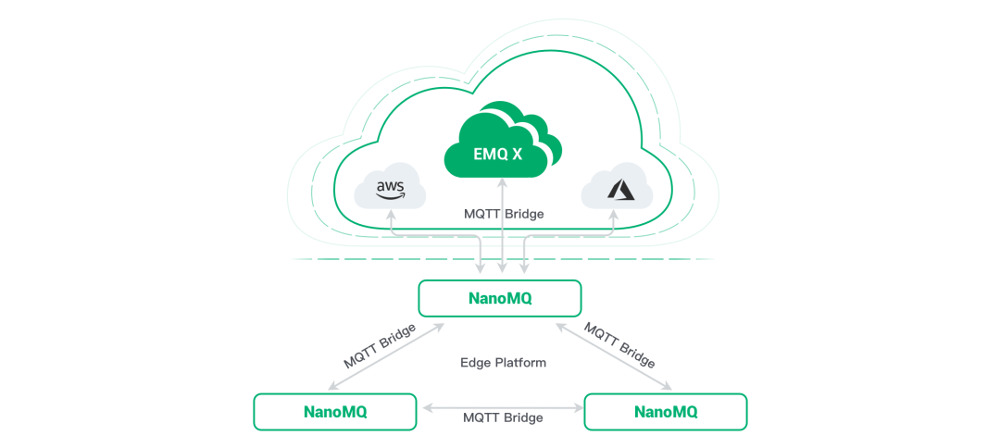

根据测试，目前 NanoMQ 最新版本能够在华为云 8 核 8 线程 3Ghz 服务器上支撑超过 50 万/s 的消息吞吐， CPU 只占用 70% ，内存消耗 200-300 mb。此外， NanoMQ 从项目诞生之初，就确定了与 nanomsg/nng 社区的合作，基于 NNG 的异步 IO 和多线程模型再面向 MQTT 协议深度优化。

**目前已具备了以下优势：**

- 资源性价比高 & 适用于边缘嵌入式平台。能以非常少的资源消耗达到高吞吐低延时的性能表现。

- 只依赖原生 POSIX & 极高兼容性。社区用户能够更简单的自定义 NanoMQ 或将其的二次开发用于不同的边缘计算应用。

- 高度可移植性。通过最小化依赖库和使用纯净 C/C++ 开发， NanoMQ 能够简单方便的移植到各类平台。

- 全异步 IO 支持和多线程支持，且对 SMP 有良好支持。 NanoMQ 基于 NNG 的异步 IO 和多线程模型再面向 MQTT 协议深度优化，从而具备了强大的多线程性能和 SMP 处理能力。

- 低延时 & 高吞吐。

## 测试结果概述

为保证测试结果一致性和可信度。未针对特定硬件设备测试。

本次测试在华为云/移动端平台上进行，主要进行了广播和一对一收发的 MQTT 消息吞吐测试，相关的测试结果如下所示。

***注：如果不做特别说明，所有的连接默认都设置了 300 秒的 Ping 消息包。**

## 测试工具

- XMeter 企业版 2.0.1 ： [https://www.xmeter.net](https://www.xmeter.net/)

XMeter 是一个性能测试管理平台，基于开源的 JMeter 性能测试工具。 XMeter 可以支持大规模、高并发的性能测试，比如实现千万级别的 MQTT 并发连接测试。除了测试 MQTT 协议之外，还可以支持 HTTP/HTTPS 等主流的应用的测试。

- JMeter-MQTT 插件： mqtt-xmeter-1.13 – <https://github.com/emqx/mqtt-jmeter>

由 XMeter 实现的开源 MQTT 性能测试插件，在众多的项目中得到了使用，目前是 JMeter 社区中流行度最高的 MQTT 插件。

- JMeter 版本: JMeter5.0 – <https://jmeter.apache.org>
- emqtt-benchmark-tools: <https://github.com/emqtt/emqtt_benchmark>

由 EMQ 实现的用于模拟大量 MQTT 连接的测试工具。

## 测试方法

本次测试环境针对每个场景都有多套，分别针对云端主机的低配置和高配置行了测试，也对移动/边缘端平台分别作了测试。其中云端测试还针对不同 Linux 内核版本和发行版分别进行了测试对比。旨在排除所有不同的环境变量，保证测试的公平有效。同时针对不同的硬件平台的性能条件，给予 NanoMQ 的负载压力也有所不同，目的是提供最好的配置和性能选型参考，找到不同条件下 NanoMQ 的性能上限。

华为云中的测试部署图如下所示，本次测试中使用了 EMQ Benchmark Tools 来模拟大量的 MQTT 连接；而 XMeter 提供的基于 JMeter MQTT 插件的测试工具来模拟业务测试场景； XMeter 内置支持的监控工具用于监控运行 nanomq 的服务器资源使用情况，同时对比操作系统自带的信息。

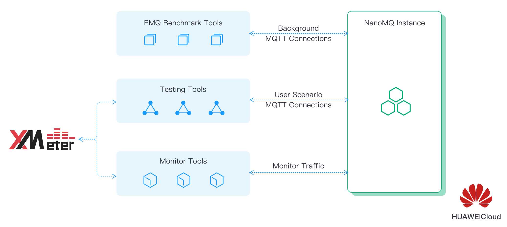

### **测试环境简介**

#### 云端服务

- NANOMQ 版本: 0.3.4
- 被测试机（ 1 台）
  - 操作系统： CentOS 7.6 / Ubuntu 20.04
  - 内核版本： 3.10/5.10
  - CPU ： 8 核 16 线程 Intel(R) Xeon(R) Gold 6266C CPU @ 3.00GHz
  - 内存： 16 G
  - 磁盘： 120GB
- 压力机
  - 用于 XMeter 连接 NANOMQ ，模拟业务数据收发
  - 操作系统： CentOS 7
  - CPU ： 8 核
  - 内存： 16 G
  - 磁盘： 120GB
- 网络连接：华为云内网连接

云端服务环境由于存在 openstack 硬件资源超分比的变量存在，且共有云主机都有做弹性伸缩，故会因为内核虚拟化策略的不同导致测试结果与实际边缘端硬件设备不一致。例如 NanoMQ 由于大部分时间运行于系统内核态而非用户态，故在云端 KVM 环境性能会弱于实际裸机测试环境。

#### 嵌入式平台

##### Arm Cortex-A53

- NANOMQ 版本: 0.3.4
- 被测试机（ 1 台）
  - 操作系统： Linux buildroot
  - 内核版本： 4.4.194
  - CPU ： Cortex-A53 4 核 CPU; max MHz: 1296.0000; min MHz: 408.0000; Boost MIPS: 48.00
  - 内存： 1 G
- 压力机
  - 用于 emqtt_bench 连接 NANOMQ ，模拟业务数据收发
  - 操作系统： Ubuntu 20.04
  - CPU ： AMD Zen3 5950X 16 核 32 线程
  - 内存： 32 G
- 网络连接：局域网千兆内网连接

##### Arm Cortex-A72

- NANOMQ 版本: 0.3.4
- 被测试机（ 1 台）
  - 操作系统： Linux buildroot
  - 内核版本： 4.4.194
  - CPU ： Cortex-A53 4 核 CPU; max MHz: 1500.0000; min MHz: 600.0000; Boost MIPS: 108.00
  - 内存： 4 G
- 压力机
  - 用于 emqtt_bench 连接 NANOMQ ，模拟业务数据收发
  - 操作系统： Ubuntu 20.04
  - CPU ： AMD Zen3 5950X 16 核 32 线程
  - 内存： 32 G
- 网络连接：局域网千兆内网连接

### **报告解析**

XMeter 的性能测试报告分成三大部分。后面报告的结果解读方式都类似，如果没有特别之处，我们不再赘述。

1.  概览：此区域的测试报告将测试步骤中所有的返回结果进行计算。如果测试脚本中有多个步骤（比如包含了连接和消息发布），那么这里的结果是基于这两部的测试结果计算得到。

   1. Avg   throughput 所有请求平均吞吐量
   2. Avg success   throughput 所有请求平均成功吞吐量
   3. Avg failed   throughput 所有请求平均失败吞吐量
   4. Max virtual   user num 最大虚拟用户数
   5. Avg response   time(s) 所有请求平均响应时间
   6. Max response   time(s) 所有请求最大响应时间
   7. Min response   time(s) 所有请求最小请求时间
   8. Response code   succ rate 所有请求成功率
   9. Verification   point succ rate 所有请求验证点成功率
   10. Avg request   size(KiB) 所有请求平均大小

2. 图表区域

   1. Response time   每个请求响应时间
   2. Throughput   每个请求所有吞吐量
   3. Succ   Throughput 每个请求成功吞吐量
   4. Virtual User   虚拟用户数
   5. Response code   succ rate 响应码成功率
   6. Download   bytes 响应数据大小

3. 详细数据（ Detailed data 表格）

   1. Page 请求名称
   2. Hit num 运行次数
   3. Max resp time   (s) 最大响应时间
   4. Min resp time   (s) 最小响应时间
   5. Avg resp   time(s) 平均响应时间
   6. Avg   throughput 所有平均吞吐量
   7. Avg succ   throughput 成功平均吞吐量
   8. Avg failure   throughput 失败平均吞吐量
   9. Avg request   size(KiB) 平均大小
   10. Response code   succ rate 响应码成功率
   11. Check point   succ rate 验证点成功率
   12. Check point   failure 验证点错误数
   13. Avg deviation   平均标准差
   14. 90th   percentile(s) 90 分位响应时间
   15. Avg 90%(s)    90% 平均响应时间

## 多对多广播场景

以下是不同硬件配置平台的测试结果对比：

### Arm Cortex-A53

Cortex-A53 是采取了 ARMv8-A 架构，能够支持 32 位的 ARMv7 代码和 64 位代码的 AArch64 执行状态。 A53 架构特点是功耗降低、能效提高。其目标是 28nm HPM 制造工艺下、运行 SPECint2000 测试时，单个核心的功耗不超过 0.13W。它提供的性能比 Cortex-A7 处理器的功率效率更高，并能够作为一个独立的主要的应用处理器。本次测试采用的为 4 核 A53 网关，这也是目前业界流行的边缘网关硬件方案。

#### 压力场景信息

QoS 0 ： 使用 Emqtt_bench ，由 10 个客户端通过同一个主题向 500 个客户端定量广播发布 5000 个 16 字节长度的 publish 报文。发送间隔为 75ms。

QoS 1 ： 使用 Emqtt_bench ，由 10 个客户端通过同一个主题向 500 个客户端定量广播发布 5000 个 16 字节长度的 publish 报文。发送间隔为 100ms。

QoS 2 ： 使用 Emqtt_bench ，由 10 个客户端通过同一个主题向 500 个客户端定量广播发布 5000 个 16 字节长度的 publish 报文。发送间隔为 100ms。

### Arm Cortex-A72

Cortex-A72 最早发布于 2015 年年初，也是基于 ARMv8-A 架构，采用台积电 16nm FinFET 制造工艺， Cortex-A72 可在芯片上单独实现性能，也可以搭配 Cortex-A53 处理器与 ARM Core Link TMCCI 高速缓存一致性互连（ Cache Coherent Interconnect ）构成 ARMbig.LITTLETM 配置，进一步提升能效。本次测试采用的是 raspberry Pi 4 ，这也是最流行的开源智能硬件平台。

#### 压力场景信息

QoS 0 ： 使用 Emqtt_bench ，由 10 个客户端通过同一个主题向 500 个客户端定量广播发布 5000 个 16 字节长度的 publish 报文。发送间隔为 75ms。

QoS 1 ： 使用 Emqtt_bench ，由 10 个客户端通过同一个主题向 500 个客户端定量广播发布 5000 个 16 字节长度的 publish 报文。发送间隔为 140ms。

QoS 2 ： 使用 Emqtt_bench ，由 10 个客户端通过同一个主题向 500 个客户端定量广播发布 5000 个 16 字节长度的 publish 报文。发送间隔为 140ms。

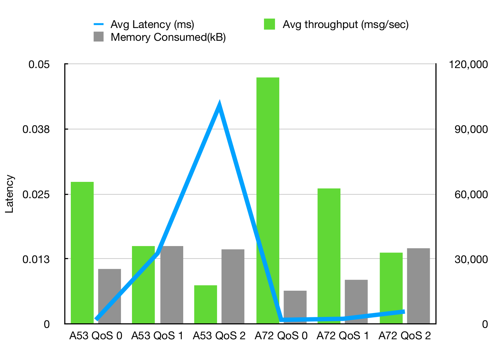

|           | Avg throughput (Msg/sec) | Avg Latency (ms) | Memory Consumed(Kb) | CPU Percentage |
| --------- | ------------------------ | ---------------- | ------------------- | -------------- |
| A53 QoS 0 | 65789                    | 0.0008           | 25648               | 100%           |
| A53 QoS 1 | 35714                    | 0.0136           | 35756               | 100%           |
| A53 QoS 2 | 17730                    | 0.042            | 84392               | 100%           |
| A72 QoS 0 | 113636                   | 0.0008           | 15260               | 100%           |
| A72 QoS 1 | 62500                    | 0.001            | 20184               | 90%            |
| A72 QoS 2 | 32894                    | 0.0024           | 44820               | 90%            |

此表中的内存记录为消息发送过程中最大使用到的内存容量， QoS 1/2 消息由于需要临时缓存，故测试过程中内存可能会有所起伏。图表中使用的是消息发送完成后的内存占用量。

NanoMQ 在 4 核嵌入式平台表现出了强大性能，其中相比与其他开源 MQTT Broker ，尤其以 QoS 消息的性能最为优秀。在压力过大，测试消息发生积压的情况下，当 pub 任务完成时，能够迅速将队列中的消息投递出去，释放内存。具有良好的拓展性/伸缩性。

以下开始是在华为云使用 Xmeter 进行测试的结果。

### 1C2G 测试结果

#### **服务器环境**

- NANOMQ 版本: 0.3.4
  - 配置选项： 1 工作线程，最大并行数设置为 6。关闭日志/统计和调试功能。消息缓存队列长度为 65535。
- 被测试机（ 1 台）
  - 操作系统： CentOS Linux release 7.6.1708
  - CPU ： 1 核 1 线程 S6 型
  - 内存： 2/4 G

#### QoS 0

由 10 个客户端通过同一个主题向 500 个客户端发布 16 字节长度的 publish 报文。

测试结果：

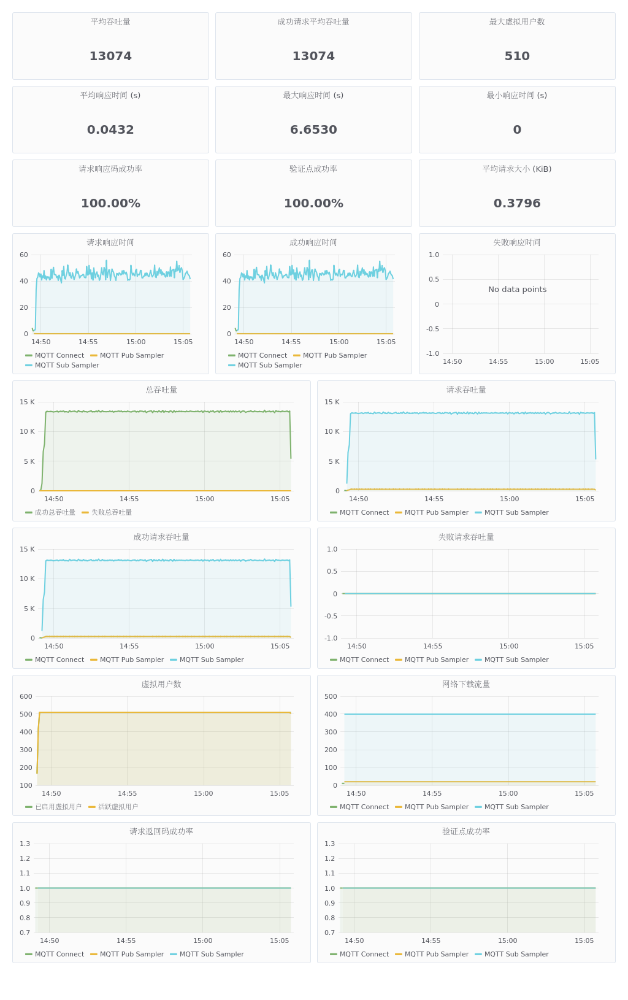

| 页面             | 运行次数 | 最大响应时间(s) | 最小响应时间(s) | 平均响应时间(s) | 平均吞吐量(/s) | 平均请求大小(bytes) | 响应码成功率 | 验证点成功数 | 验证点错误数 | 平均标准差 | 90 分位响应时间(s) | 90% 平均响应时间(s) |
| ---------------- | -------- | --------------- | --------------- | --------------- | -------------- | ------------------- | ------------ | ------------ | ------------ | ---------- | ------------------ | ------------------ |
| MQTT Connect     | 510      | 0.054           | 0.001           | 0.0029          | 34             | 0.0107              | 1            | 510          | 0            | 6.736      | 0.003              | 0.0023             |
| MQTT Pub Sampler | 257640   | 0.005           | 0               | 0               | 258.9347       | 0.0195              | 1            | 257640       | 0            | 0.1391     | 0                  | 0                  |
| MQTT Sub Sampler | 12881645 | 6.653           | 0.001           | 0.0445          | 12946.377      | 0.3906              | 1            | 12881645     | 0            | 113.1404   | 0.145              | 0.0199             |

系统监控：

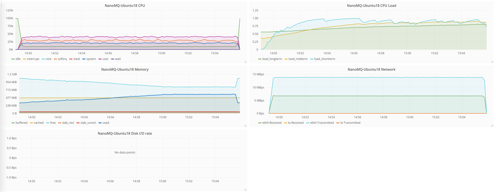

虽然 NanoMQ 的架构是针对多核优化的，但即使如此在 1C 场景仍然能有不错的性能。本测试给予的负载压力略大于平台硬件能承受范围。故消息队列有所积压，最大内存占用为 220mb。不过 NanoMQ 仍然保持了极低的消息延时。

### 2C4G 测试结果

**服务器环境**

- NANOMQ 版本: 0.3.4
  - 配置选项： 2 工作线程，最大并行数设置为 16。关闭日志/统计和调试功能。消息缓存队列长度为 65535。
- 被测试机（ 1 台）
  - 操作系统： CentOS Linux release 7.6.1708
  - CPU ： 2 核 2 线程 C6 计算增强型服务器
  - 内存： 4 G

#### QoS 0

由 5 个客户端向 250 个客户端每 5ms 广播一次长度为 16 字节的 Publish 报文。总吞吐为 250K msgs/sec

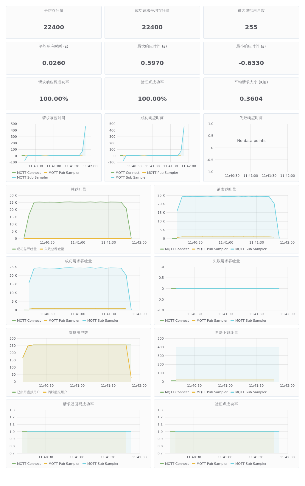

| 页面             | 运行次数 | 最大响应时间(s) | 最小响应时间(s) | 平均响应时间(s) | 平均吞吐量(/s) | 平均请求大小(bytes) | 响应码成功率 | 验证点成功数 | 验证点错误数 | 平均标准差 | 90 分位响应时间(s) | 90% 平均响应时间(s) |
| ---------------- | -------- | --------------- | --------------- | --------------- | -------------- | ------------------- | ------------ | ------------ | ------------ | ---------- | ------------------ | ------------------ |
| MQTT Connect     | 255      | 0.052           | 0.001           | 0.0036          | 25.5           | 0.0107              | 1            | 255          | 0            | 9.7474     | 0.003              | 0.0021             |
| MQTT Pub Sampler | 94789    | 0.005           | 0               | 0               | 947.89         | 0.0195              | 1            | 94789        | 0            | 0.1513     | 0                  | 0                  |
| MQTT Sub Sampler | 2368908  | 0.597           | -0.633          | 0.0272          | 22561.03       | 0.3906              | 1            | 2368908      | 0            | 24.1401    | -                  | -                  |

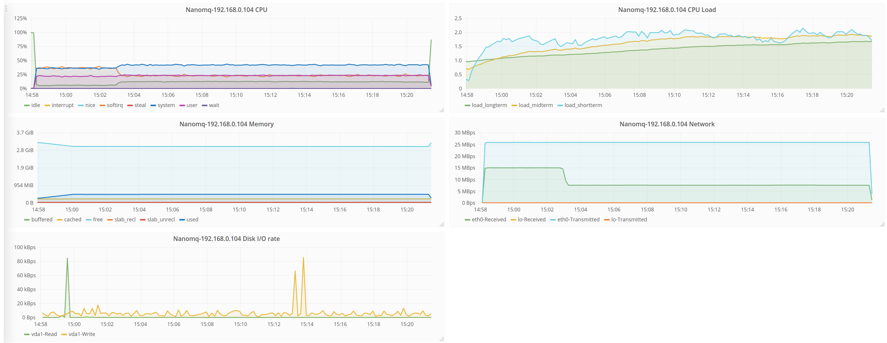

最大内存占用 200mb。

### 4C8G 测试结果

本场景针对不同内核版本和操作系统进行过测试。同时也测试了 Qos 1/2.

#### **服务器环境 1**

- NANOMQ 版本: 0.3.4
  - 配置选项： 4 线程， 64 个 context。关闭日志/统计和调试功能。
- 被测试机（ 1 台）
  - 操作系统： CentOS Linux release 7.6.1708
  - CPU ： 4 核 4 线程 C6 计算增强型服务器
  - 内存： 8 G

#### QoS 0

由 10 个客户端向 500 个客户端每 14ms 广播一次长度为 16 字节的 Publish 报文。总吞吐为 350K msgs/sec

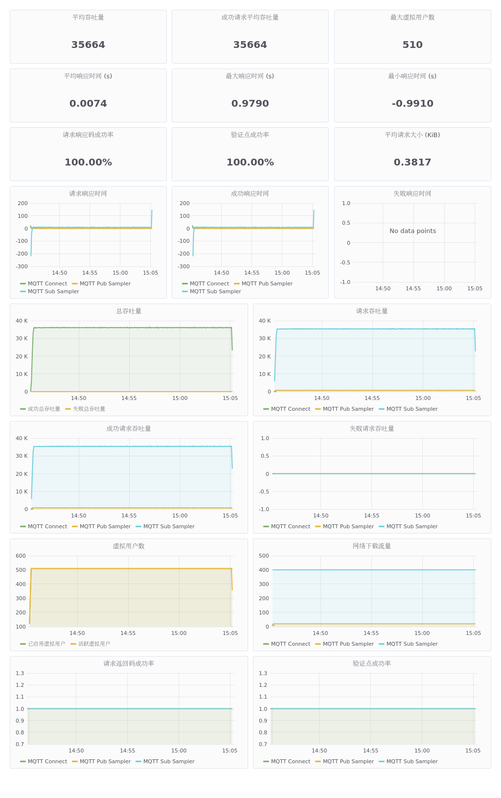

| 页面             | 运行次数 | 最大响应时间(s) | 最小响应时间(s) | 平均响应时间(s) | 平均吞吐量(/s) | 平均请求大小(bytes) | 响应码成功率 | 验证点成功数 | 验证点错误数 | 平均标准差 | 90 分位响应时间(s) | 90% 平均响应时间(s) |
| ---------------- | -------- | --------------- | --------------- | --------------- | -------------- | ------------------- | ------------ | ------------ | ------------ | ---------- | ------------------ | ------------------ |
| MQTT Connect     | 510      | 0.055           | 0.001           | 0.0096          | 25.5           | 0.0107              | 1            | 510          | 0            | 9.5388     | 0.008              | 0.0032             |
| MQTT Pub Sampler | 845490   | 0.004           | 0               | 0               | 704.575        | 0.0195              | 1            | 845490       | 0            | 0.1396     | 0                  | 0                  |
| MQTT Sub Sampler | 42128864 | 0.979           | -0.991          | 0.0074          | 35107.387      | 0.3906              | 1            | 42128864     | 0            | 34.1492    | -                  | -                  |

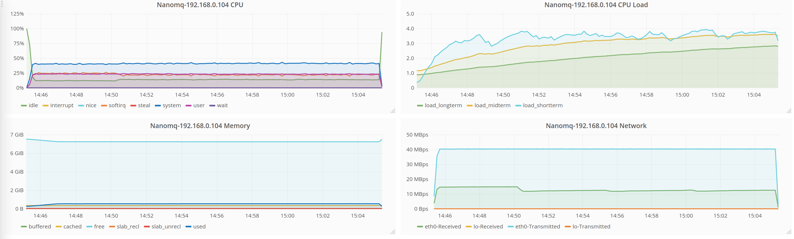

此场景最大内存占用为 260mb。

#### QoS 1

由 20 个客户端向 500 个客户端每 44ms 广播一次长度为 16 字节的 QoS1 Publish 报文。总吞吐为 350K msgs/sec

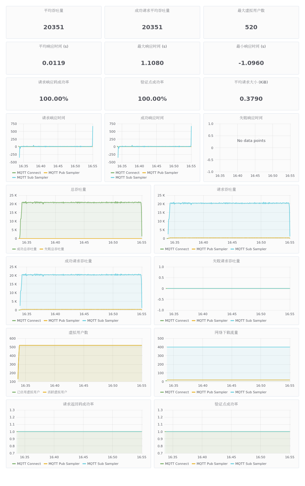

| 页面             | 运行次数 | 最大响应时间(s) | 最小响应时间(s) | 平均响应时间(s) | 平均吞吐量(/s) | 平均请求大小(bytes) | 响应码成功率 | 验证点成功数 | 验证点错误数 | 平均标准差 | 90 分位响应时间(s) | 90% 平均响应时间(s) |
| ---------------- | -------- | --------------- | --------------- | --------------- | -------------- | ------------------- | ------------ | ------------ | ------------ | ---------- | ------------------ | ------------------ |
| MQTT Connect     | 520      | 0.053           | 0.001           | 0.0094          | 26             | 0.0107              | 1            | 520          | 0            | 9.391      | 0.003              | 0.002              |
| MQTT Pub Sampler | 514768   | 0.299           | 0               | 0.0047          | 403.7396       | 0.0195              | 1            | 514768       | 0            | 1.2104     | 0.006              | 0.0046             |
| MQTT Sub Sampler | 25737950 | 1.108           | -1.096          | 0.012           | 20186.627      | 0.3906              | 1            | 25737950     | 0            | 116.9954   | -                  | -                  |

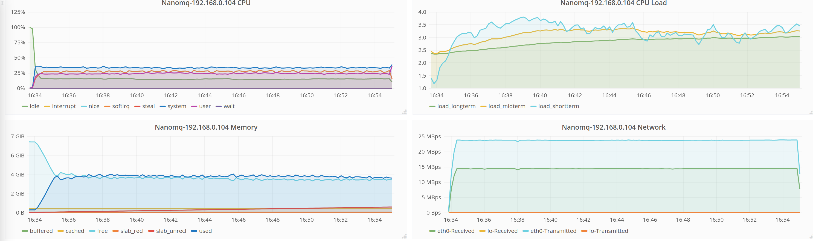

#### QoS 2

由 20 个客户端向 500 个客户端每 46ms 广播一次长度为 16 字节的 QoS1 Publish 报文。总吞吐为 350K msgs/sec

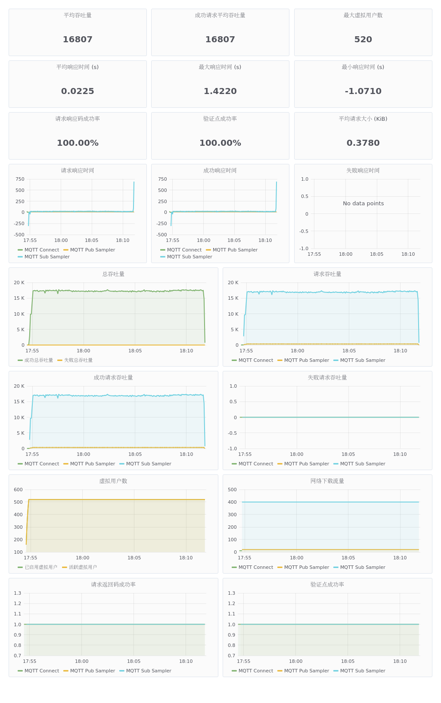

| 页面             | 运行次数 | 最大响应时间(s) | 最小响应时间(s) | 平均响应时间(s) | 平均吞吐量(/s) | 平均请求大小(bytes) | 响应码成功率 | 验证点成功数 | 验证点错误数 | 平均标准差 | 90 分位响应时间(s) | 90% 平均响应时间(s) |
| ---------------- | -------- | --------------- | --------------- | --------------- | -------------- | ------------------- | ------------ | ------------ | ------------ | ---------- | ------------------ | ------------------ |
| MQTT Connect     | 520      | 0.053           | 0.001           | 0.0078          | 26             | 0.0107              | 1            | 520          | 0            | 9.2563     | 0.003              | 0.0021             |
| MQTT Pub Sampler | 344383   | 0.418           | 0.001           | 0.0126          | 334.3524       | 0.0195              | 1            | 344383       | 0            | 3.1062     | 0.014              | 0.0124             |
| MQTT Sub Sampler | 17218860 | 1.422           | -1.071          | 0.0228          | 16717.338      | 0.3906              | 1            | 17218860     | 0            | 130.9409   | -                  | -                  |

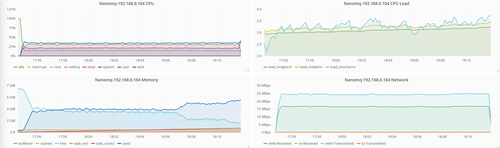

#### **服务器环境 2**

- NANOMQ 版本: 0.3.4
  - 配置选项： 4 线程， 64 个 context。关闭日志/统计和调试功能。
- 被测试机（ 1 台）
  - 操作系统： Ubuntu 20.04 kernel 5.10
  - CPU ： 4 核 4 线程 C6 计算增强型服务器
  - 内存： 8 G
  - 磁盘： 120GB

#### QoS 0

由 10 个客户端向 500 个客户端每 16ms 广播一次长度为 16 字节的 QoS0 Publish 报文。总吞吐为 310K msgs/sec

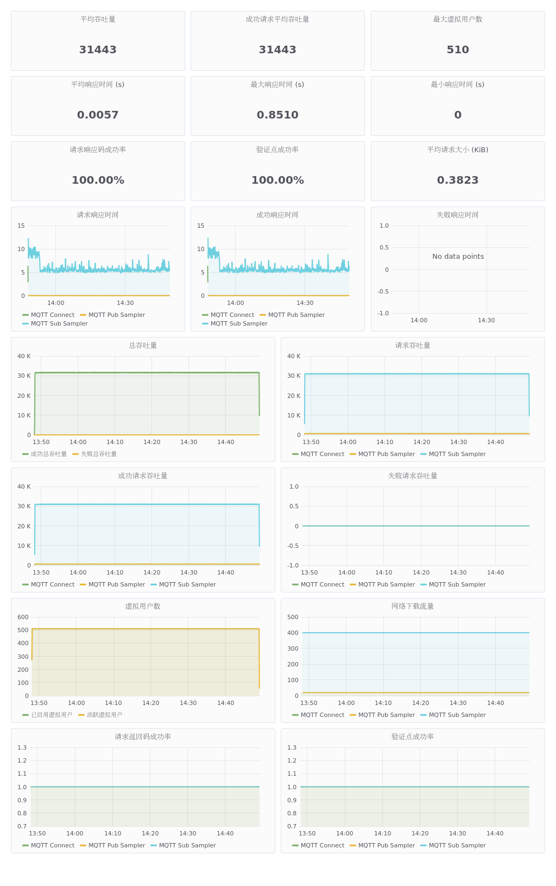

| 页面             | 运行次数 | 最大响应时间(s) | 最小响应时间(s) | 平均响应时间(s) | 平均吞吐量(/s) | 平均请求大小(bytes) | 响应码成功率 | 验证点成功数 | 验证点错误数 | 平均标准差 | 90 分位响应时间(s) | 90% 平均响应时间(s) |
| ---------------- | -------- | --------------- | --------------- | --------------- | -------------- | ------------------- | ------------ | ------------ | ------------ | ---------- | ------------------ | ------------------ |
| MQTT Connect     | 510      | 0.051           | 0.002           | 0.0046          | 51             | 0.0107              | 1            | 510          | 0            | 9.7947     | 0.004              | 0.0027             |
| MQTT Pub Sampler | 85574    | 1.373           | 0.001           | 0.0072          | 231.2811       | 0.0195              | 1            | 85574        | 0            | 14.6831    | 0.008              | 0.0067             |
| MQTT Sub Sampler | 4278350  | 1.363           | 0.001           | 0.0066          | 11563.108      | 0.3906              | 1            | 4278350      | 0            | 14.8839    | 0.008              | 0.0059             |

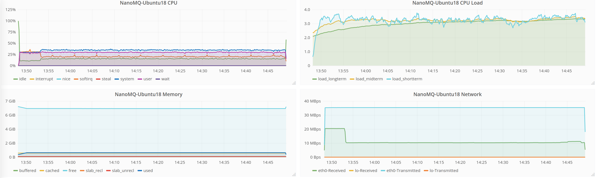

#### QoS 2

由 10 个客户端向 500 个客户端每 16ms 广播一次长度为 16 字节的 QoS2 Publish 报文。总吞吐为 120K msgs/sec

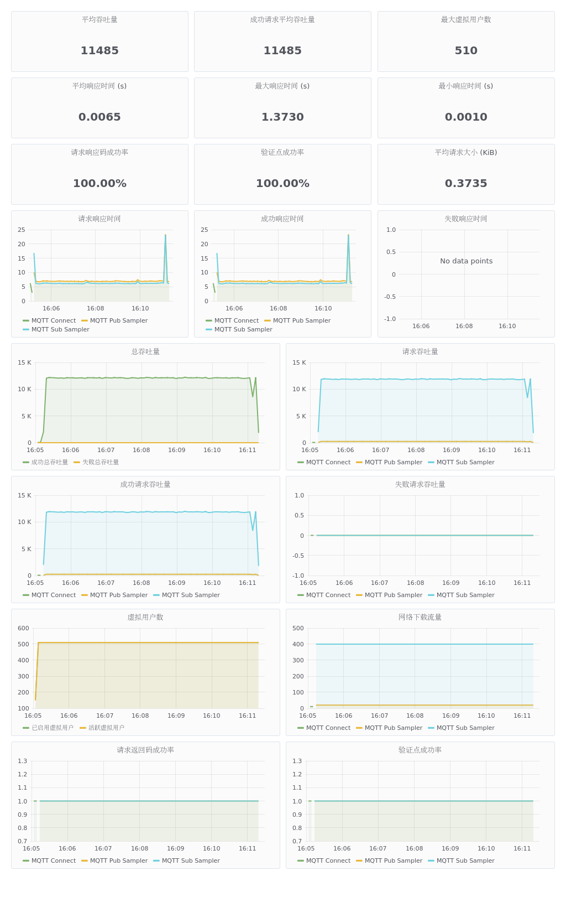

| 页面             | 运行次数 | 最大响应时间(s) | 最小响应时间(s) | 平均响应时间(s) | 平均吞吐量(/s) | 平均请求大小(bytes) | 响应码成功率 | 验证点成功数 | 验证点错误数 | 平均标准差 | 90 分位响应时间(s) | 90% 平均响应时间(s) |
| ---------------- | -------- | --------------- | --------------- | --------------- | -------------- | ------------------- | ------------ | ------------ | ------------ | ---------- | ------------------ | ------------------ |
| MQTT Connect     | 510      | 0.051           | 0.002           | 0.0046          | 51             | 0.0107              | 1            | 510          | 0            | 9.7947     | 0.004              | 0.0027             |
| MQTT Pub Sampler | 85574    | 1.373           | 0.001           | 0.0072          | 231.2811       | 0.0195              | 1            | 85574        | 0            | 14.6831    | 0.008              | 0.0067             |
| MQTT Sub Sampler | 4278350  | 1.363           | 0.001           | 0.0066          | 11563.108      | 0.3906              | 1            | 4278350      | 0            | 14.8839    | 0.008              | 0.0059             |

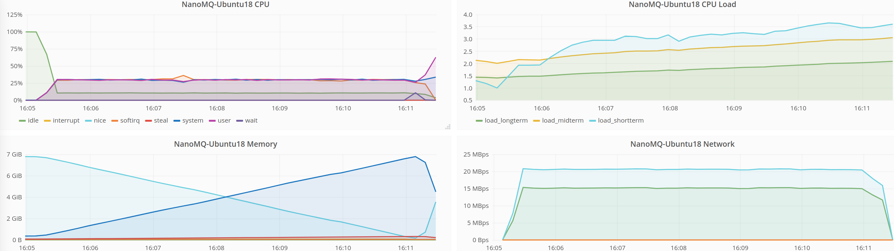

NanoMQ 在不同 OS 和内核版本都保持了较高的性能表现。在未用尽系统资源的情况下，保持了高吞吐核低时延。 QoS 1/2 由于要对消息进行本地保存所以内存消耗较大，最大内存消耗为 400Mb。性能监测图中显示的大量内存消耗为 Xmeter 所需。

### 16C32G 测试结果

本场景针对不同内核和操作系统进行过测试。

**服务器环境**

- NANOMQ 版本: 0.3.4
  - 配置选项： 16 线程， 256 个 context。关闭日志/统计和调试功能。
- 被测试机（ 1 台）
  - 操作系统： Ubuntu 20.04 kernel 5.10
  - CPU ： 16 核 16 线程 C6 计算增强型服务器
  - 内存： 32G
  - 磁盘： 120GB

#### QoS 0

由 20 个客户端向 1000 个客户端每 26ms 广播一次长度为 16 字节的 Publish 报文。总吞吐为 750K msgs/sec

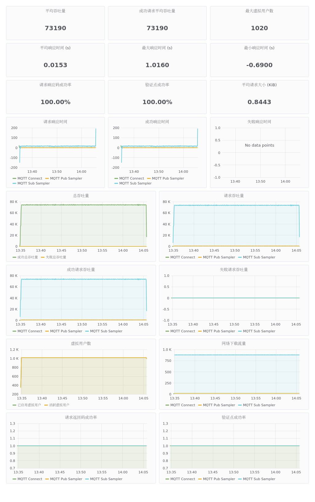

| 页面             | 运行次数  | 最大响应时间(s) | 最小响应时间(s) | 平均响应时间(s) | 平均吞吐量(/s) | 平均请求大小(bytes) | 响应码成功率 | 验证点成功数 | 验证点错误数 | 平均标准差 | 90 分位响应时间(s) | 90% 平均响应时间(s) |
| ---------------- | --------- | --------------- | --------------- | --------------- | -------------- | ------------------- | ------------ | ------------ | ------------ | ---------- | ------------------ | ------------------ |
| MQTT Connect     | 1020      | 0.055           | 0.001           | 0.0084          | 51             | 0.0107              | 1            | 1020         | 0            | 6.8456     | 0.003              | 0.0024             |
| MQTT Pub Sampler | 1355108   | 0.005           | 0               | 0               | 730.5164       | 0.0195              | 1            | 1355108      | 0            | 0.15       | 0                  | 0                  |
| MQTT Sub Sampler | 135509632 | 1.016           | -0.69           | 0.0155          | 73051.016      | 0.8594              | 1            | 135509632    | 0            | 81.3512    | -                  | -                  |

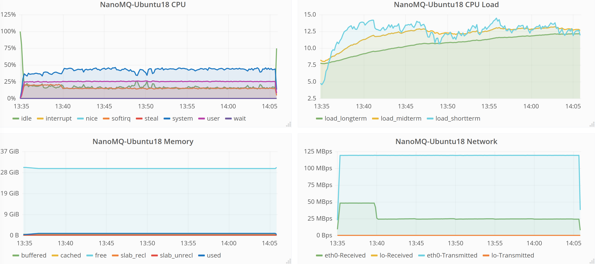

本次测试中， NanoMQ 最大内存消耗为 518Mb。在 16C32G 平台上， NanoMQ 一样能够合理利用多核资源，以很小的内存代价达到高吞吐低时延。

## 一对一消息收发测试场景

### 1C4G 测试结果

**服务器环境**

- NANOMQ 版本: 0.3.4
  - 配置选项： 1 线程， 8 个 context。关闭日志/统计和调试功能。
- 被测试机（ 1 台）
  - 操作系统： CentOS Linux release 7.6.1708 内核版本 3.10
  - CPU ： 1 核 1 线程 S6 型
  - 内存： 4 G
  - 磁盘： 120GB

#### QoS 0

由 30K 客户端订阅不同的 30K 个主题，另外 30K 个客户端以 1000ms 的间隔向这 30K 个主题发送 16kb 长度的 publish 报文。

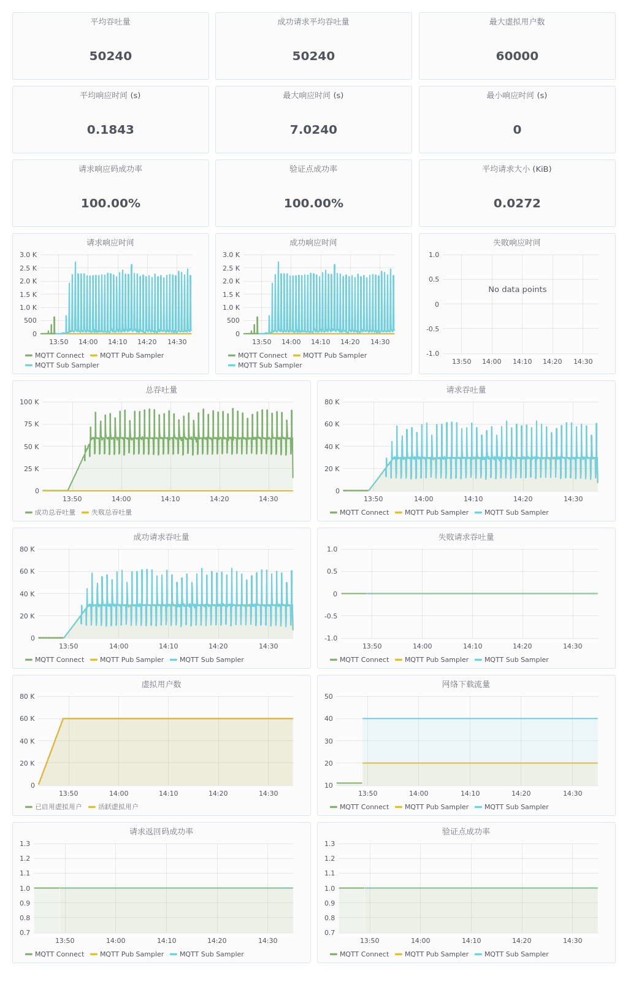

| 页面             | 运行次数 | 最大响应时间(s) | 最小响应时间(s) | 平均响应时间(s) | 平均吞吐量(/s) | 平均请求大小(bytes) | 响应码成功率 | 验证点成功数 | 验证点错误数 | 平均标准差 | 90 分位响应时间(s) | 90% 平均响应时间(s) |
| ---------------- | -------- | --------------- | --------------- | --------------- | -------------- | ------------------- | ------------ | ------------ | ------------ | ---------- | ------------------ | ------------------ |
| MQTT Connect     | 60000    | 7.024           | 0.001           | 0.027           | 196.7213       | 0.0107              | 1            | 60000        | 0            | 138.7063   | 0.007              | 0.0033             |
| MQTT Pub Sampler | 76964808 | 1.654           | 0               | 0               | 27885.8        | 0.0195              | 1            | 76964808     | 0            | 1.1448     | 0                  | 0                  |
| MQTT Sub Sampler | 76961528 | 4.201           | 0               | 0.45            | 27884.613      | 0.0391              | 1            | 76961528     | 0            | 779.4808   | 1.892              | 0.24               |

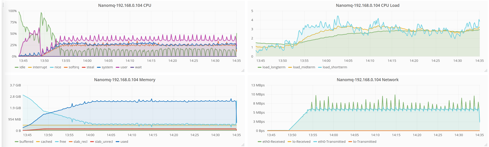

本次测试目的在于验证 NanoMQ 在极高负载压力核低硬件配置下能否保持稳定运行。 60K 连接在 1C2G 平台已经基本达到平台极限，撞到了硬件功耗墙触发了 CPU 降频，导致吞吐出现规律波动。尽管如此， NanoMQ 仍然保持了全部消息请求成功，同时保持了可以接受的消息时延。

### 2C4G 测试结果

**服务器环境**

- NANOMQ 版本: 0.3.4
  - 配置选项： 2 线程， 16 个 context。关闭日志/统计和调试功能。
- 被测试机（ 1 台）
  - 操作系统： CentOS Linux release 7.6.1708 内核版本 3.10
  - CPU ： 2 核 2 线程 C6 型
  - 内存： 4 G
  - 磁盘： 120GB

#### QoS 0

由 50K 客户端订阅不同的 30K 个主题，另外 50K 个客户端以 1000ms 的间隔向这 30K 个主题发送 16kb 长度的 publish 报文。

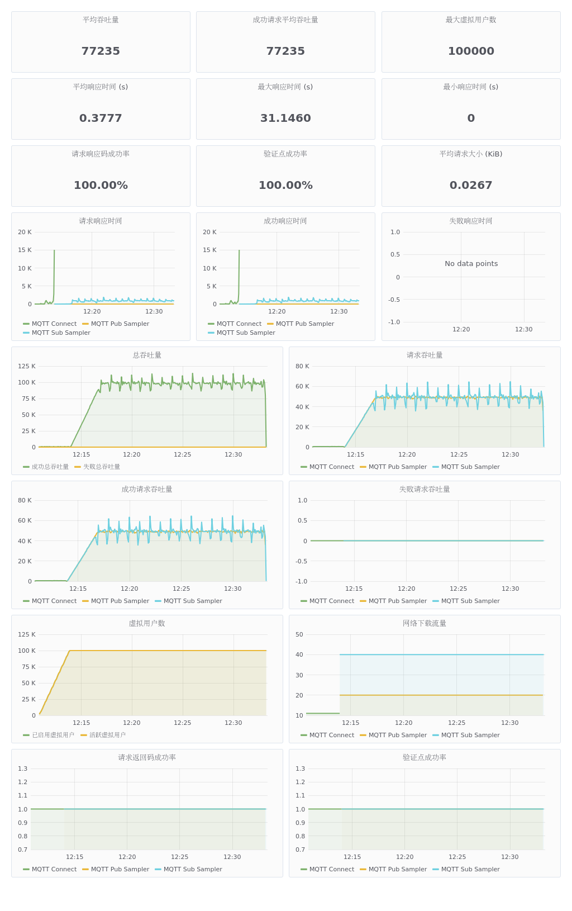

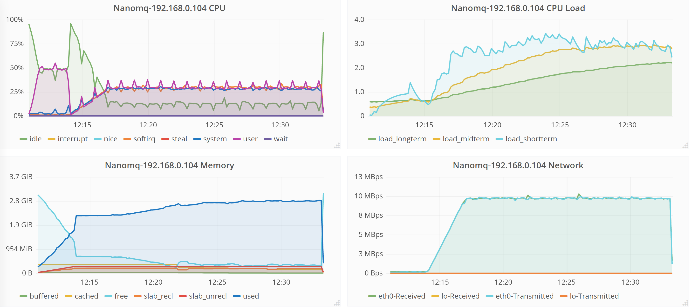

在 2C4G 情况下， NanoMQ 最大能够支持到 100k 的连接。

### 4C8G 测试结果

本场景针对不同内核版本都进行了测试。

#### **服务器环境 1**

- NANOMQ 版本: 0.3.4
  - 配置选项： 4 线程， 64 个 context。关闭日志/统计和调试功能。
- 被测试机（ 1 台）
  - 操作系统： CentOS Linux release 7.6.1708
  - CPU ： 4 核 4 线程 C6 计算增强型服务器
  - 内存： 8 G

#### QoS 0

由 60K 客户端订阅不同的 60K 个主题，另外 60K 个客户端以 1000ms 的间隔向这 60K 个主题发送 16kb 长度的 publish 报文。

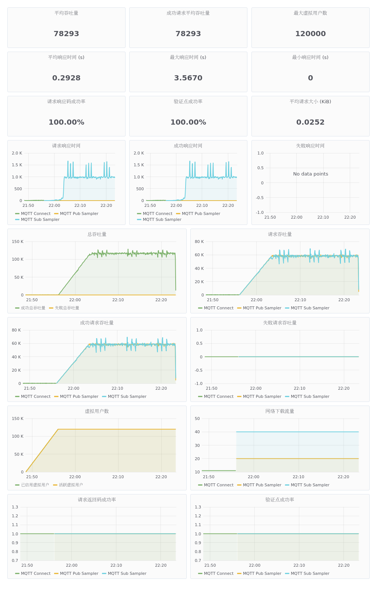

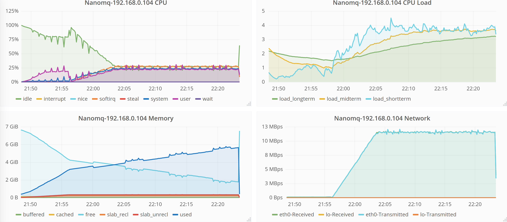

在 4C8G 主机上，最大可支撑 120K 的连接。

#### **服务器环境 2**

- NANOMQ 版本: 0.3.4
  - 配置选项： 4 线程， 128 个 context。关闭日志/统计和调试功能。
- 被测试机（ 1 台）
  - 操作系统： Ubuntu 20.04 kernel 5.10
  - CPU ： 4 核 4 线程 C6 计算增强型服务器
  - 内存： 8 G

#### QoS 0

由 50K 客户端订阅不同的 50K 个主题，另外 60K 个客户端以 1000ms 的间隔向这 50K 个主题发送 64kb 长度的 publish 报文。

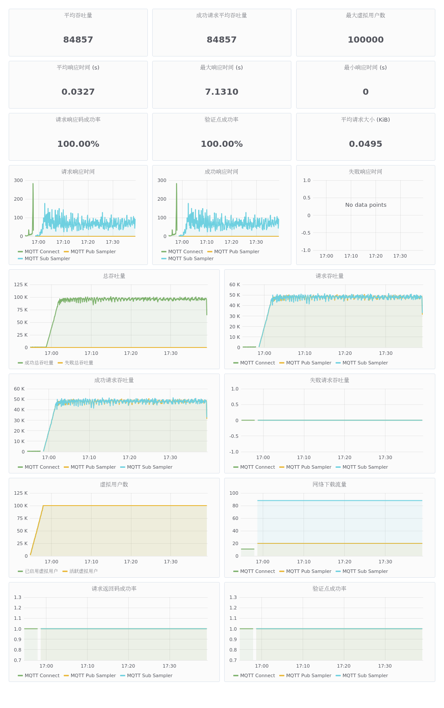

| 页面             | 运行次数  | 最大响应时间(s) | 最小响应时间(s) | 平均响应时间(s) | 平均吞吐量(/s) | 平均请求大小(bytes) | 响应码成功率 | 验证点成功数 | 验证点错误数 | 平均标准差 | 90 分位响应时间(s) | 90% 平均响应时间(s) |
| ---------------- | --------- | --------------- | --------------- | --------------- | -------------- | ------------------- | ------------ | ------------ | ------------ | ---------- | ------------------ | ------------------ |
| MQTT Connect     | 100000    | 7.131           | 0.001           | 0.0273          | 500            | 0.0107              | 1            | 100000       | 0            | 112.0276   | 0.06               | 0.0077             |
| MQTT Pub Sampler | 111537768 | 1.777           | 0               | 0               | 45900.316      | 0.0195              | 1            | 111537768    | 0            | 1.6924     | 0                  | 0                  |
| MQTT Sub Sampler | 111534960 | 2.239           | 0               | 0.0663          | 45899.16       | 0.0859              | 1            | 111534960    | 0            | 75.2116    | 0.166              | 0.0512             |

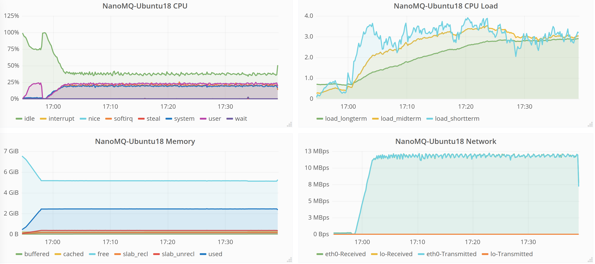

调整平台更换内核版本后，在 4C8G 的条件下， 100K 的连接负载能获得如图的性能测试结果。

### 8C16G 测试结果

**服务器环境 1**

- NANOMQ 版本: 0.3.4
  - 配置选项： 8 线程， 128 个 context。关闭日志/统计和调试功能。
- 被测试机（ 1 台）
  - 操作系统： CentOS Linux release 7.6.1708
  - CPU ： 8 核 8 线程 C6 计算增强型服务器
  - 内存： 16 G
  - 磁盘： 120GB

#### QoS 0

由 80K 客户端订阅不同的 80K 个主题，另外 60K 个客户端以 1000ms 的间隔向这 80K 个主题发送 16kb 长度的 publish 报文。

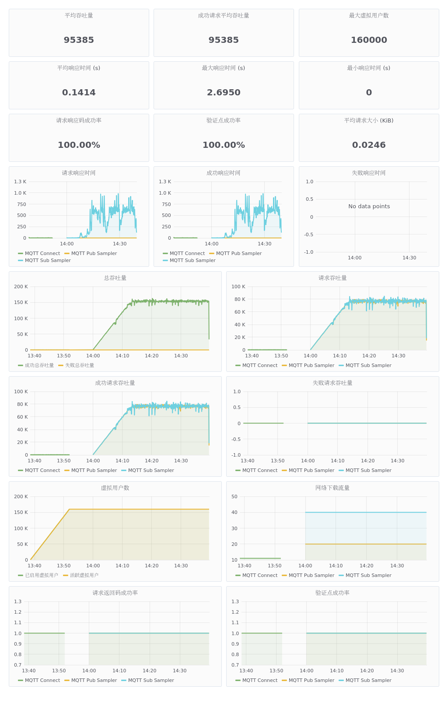

| 页面             | 运行次数  | 最大响应时间(s) | 最小响应时间(s) | 平均响应时间(s) | 平均吞吐量(/s) | 平均请求大小(bytes) | 响应码成功率 | 验证点成功数 | 验证点错误数 | 平均标准差 | 90 分位响应时间(s) | 90% 平均响应时间(s) |
| ---------------- | --------- | --------------- | --------------- | --------------- | -------------- | ------------------- | ------------ | ------------ | ------------ | ---------- | ------------------ | ------------------ |
| MQTT Connect     | 160000    | 1.828           | 0               | 0.0016          | 197.5309       | 0.0107              | 1            | 160000       | 0            | 8.3006     | 0.002              | 0.0011             |
| MQTT Pub Sampler | 152299488 | 1.868           | 0               | 0               | 63857.227      | 0.0195              | 1            | 152299488    | 0            | 1.6629     | 0                  | 0                  |
| MQTT Sub Sampler | 152295312 | 2.695           | 0               | 0.3777          | 63855.48       | 0.0391              | 1            | 152295312    | 0            | 269.0661   | 0.736              | 0.4053             |

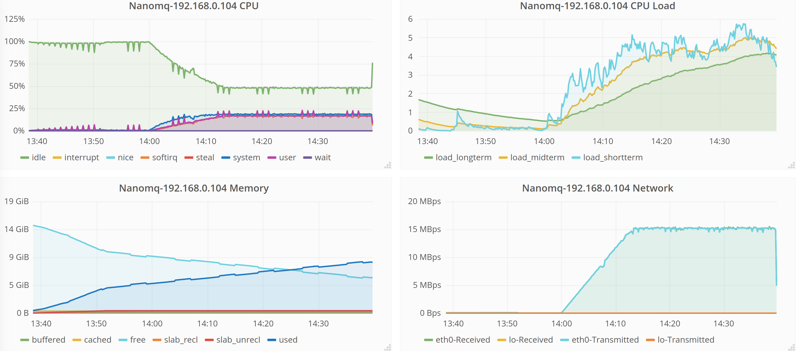

本次测试中最大内存消耗为 5135Mb。

## 总结

NanoMQ 架构图

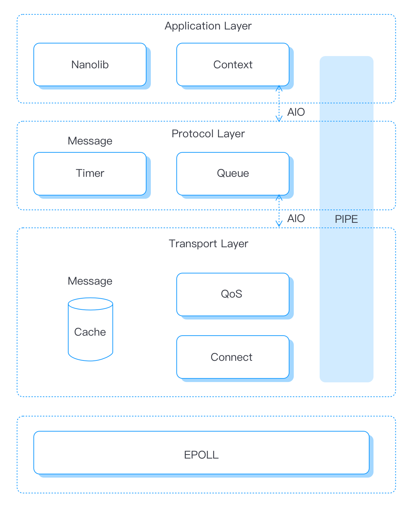

NanoMQ 底层通过单线程 Epoll 读取内核中的网络数据，在传输层处理链接报文的解析和异步消息的生产。同时进行 IO Batch 后快速回复 QoS 消息。 Connect 包处理完成建立 PIPE 后，通过异步 IO 将消息转发给协议层进行处理。协议层负责消息队列的管理和定时器的触发。最后将异步消息通过 AIO 再在应用层进行全局的逻辑处理和消息路由。
