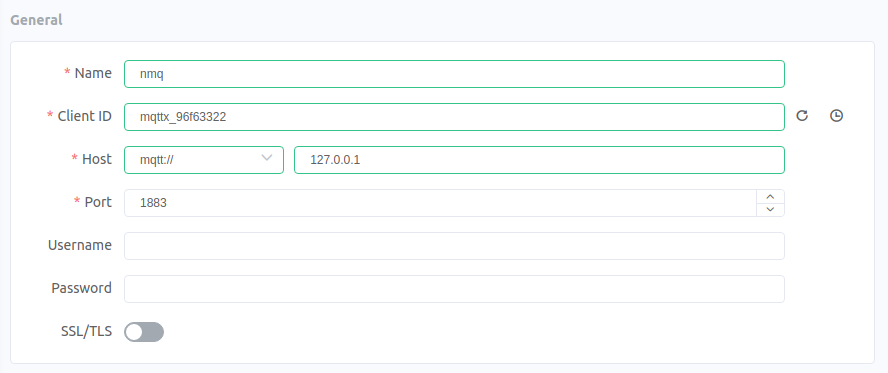

# 保留消息持久化教程

## 配置NanoMQ的SQLite选项

NanoMQ 用SQLite实现消息的持久化。将下面一部分配置加入配置文件中。

```hcl
sqlite {
    disk_cache_size = 102400  # 最大缓存消息数
    mounted_file_path="/tmp/" # 数据库文件存储路径 
    flush_mem_threshold = 3   # 内存缓存消息数阈值
    resend_interval = 5000    # 故障恢复后的重发时间间隔 (ms)
}
```
在[配置](../config-description/broker.md#cache) 中可以查看每一个配置项的细节。为了简化教程，这里设置了`flush_mem_threshold = 3`，需要根据使用场景来确定不同的值。

## 测试保留消息持久化

这一节将会使用[MQTTX客户端工具](https://mqttx.app/)来测试保留消息的持久化。在测试中我们只建立一个连接，用于发布和订阅。

**启动 NanoMQ**

```bash
$ nanomq start --conf nanomq.conf
```

**连接 NanoMQ**



**发送保留消息**

发布3个不同的保留消息以达到缓存消息的阈值。


**重启 NanoMQ**

用 `ctrl+c` 关闭NanoMQ. 然后重新启动NanoMQ.

**订阅保留消息**

订阅刚才发送了保留消息的topic。 可以看到保留消息依然可以正常发送。


