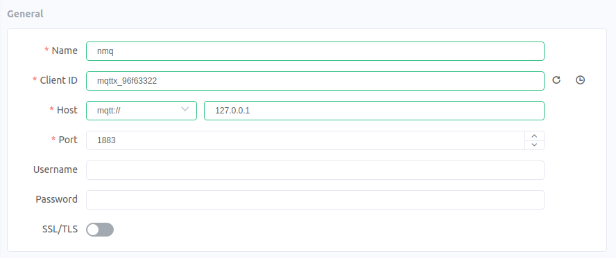
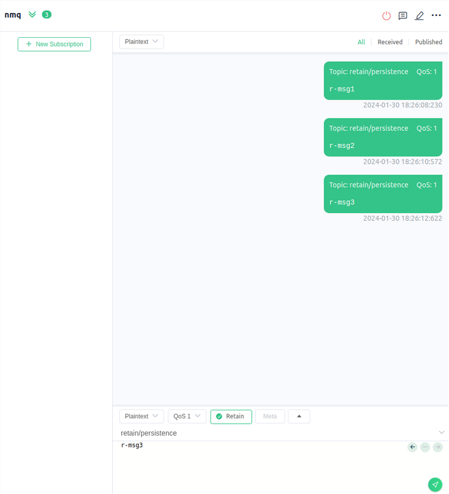

# 保留消息持久化教程

## 配置NanoMQ的SQLite选项

NanoMQ 用SQLite实现消息的持久化。将下面一部分配置加入配置文件中。

```hcl
sqlite {
    disk_cache_size = 102400       # 最大缓存消息数
    mounted_file_path="/tmp/"      # 数据库文件存储路径 
    retain_flush_threshold = 1000  # retain 消息批量写入的触发阈值
    flush_interval = 1000          # 缓冲中的 retain 消息最长等待时间 (ms)
    resend_interval = 5000         # 故障恢复后的重发时间间隔 (ms)
}
```
在[配置](../config-description/broker.md#cache) 中可以查看每一个配置项的细节。

retain 消息是批量落盘的：一次发布最多在 `flush_interval` 毫秒之后写入数据库，或在待写 topic 数达到 `retain_flush_threshold` 时更早写入，也会在 broker 退出时写入。这里把 `flush_interval` 设为其最小值 1000 ms，即发布后约 1 秒落盘。注意 `retain_flush_threshold` 统计的是待写 **topic 数**，把单 topic 测试的它调小并不会更早落盘。正常停止 NanoMQ 会提交残留的批次，因此下面的重启步骤可以正常验证持久化。

## 测试保留消息持久化

这一节将会使用[MQTTX客户端工具](https://mqttx.app/)来测试保留消息的持久化。在测试中我们只建立一个连接，用于发布和订阅。

**启动 NanoMQ**

```bash
$ nanomq start --conf nanomq.conf
```

**连接 NanoMQ**



**发送保留消息**

发布 3 条保留消息。



**重启 NanoMQ**

用 `ctrl+c` 关闭NanoMQ. 然后重新启动NanoMQ.

**订阅保留消息**

订阅刚才发送了保留消息的topic。 可以看到保留消息依然可以正常发送。


