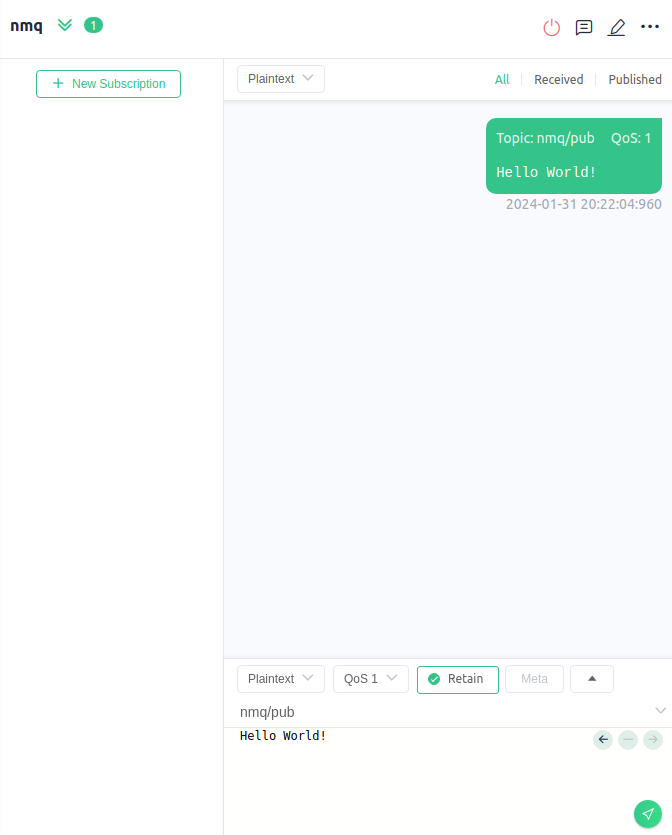

# WebHook
这一节将会指引你去使用NanoMQ中的webhook功能。

## 配置NanoMQ

NanoMQ目前支持三类事件：`on_client_connack`, `on_client_disconnected`, `on_message_publish`。 把下面的部分加入配置文件中。对于配置中的更多解释说明，请参考[配置](../config-description/webhook.md) 和 [webhook](../rule/web-hook-0.19.md)。

```
webhook {
	url = "http://127.0.0.1:8888"
	headers.content-type = "application/json"
	body.encoding = plain
	pool_size = 32
	
	events = [
		{ 
			event = "on_message_publish"
			topic = "nmq/pub"
		}
		{
			event = "on_client_connack"
		}
        {
            event = "on_client_disconnected"
        }
	]
}
```

## 测试 WebHook

**开启NanoMQ与HTTP服务器**

出于测试的目的，我们使用的HTTP服务器只会打印所有的HTTP请求，并返还一个`ok`。

```bash
$ nanomq start --conf nanomq.conf
```

**on_client_connack**

我们使用 [MQTTX 客户端工具](https://mqttx.app/) 去触发上述的三个事件。

首先我们用如下配置连接NanoMQ：


HTTP 服务器应该可以收到如下请求：
```
header: content-type: [application/json]
Received: {"proto_ver":4,"keepalive":60,"conn_ack":"success","username":"wbhk_test","clientid":"wbhk_clientid","action":"client_connack"}
```

**on_message_publish**

当我们向`nmq/pub`发布一个消息时:

HTTP 服务器应该可以收到如下请求：
```
header: content-type: [application/json]
Received: {"ts":1706703724960,"topic":"nmq/pub","retain":true,"qos":1,"action":"message_publish","from_username":"wbhk_test","from_client_id":"wbhk_clientid","payload":"Hello World!"}
```

::: tip

`topic` 选项也支持通配符。 例如，设置 `topic = 'nmq/#'`, 那么 `nmq/pub1` 以及 `nmq/pub2` 都可以触发webhook。

:::


**on_client_disconnected**

我们把对NanoMQ的连接断开，HTTP 服务器会收到：

```
header: content-type: [application/json]
Received: {"reason":"normal","username":"wbhk_test","clientid":"wbhk_clientid","action":"client_disconnected"}
```